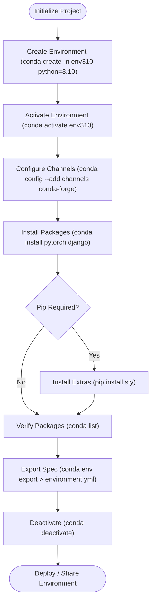

# 🐍 Comprehensive Anaconda & Conda Environment Management (`anaconda`) Master Guide

Welcome to the definitive master guide on **Anaconda & Conda Environment Management (`anaconda`)**. This guide provides a production-grade reference covering Conda virtual environment creation, activation, package installation (`conda install`, `pip`), channel priorities (`conda-forge`, `pytorch`, `defaults`), `environment.yml` configuration, range sequence package pagination, memory benchmarks ($O(1)$ space complexity), runtime introspection via `dir(range)`, and version evolutions from Python 2.7 (`env27`) to Python 3.13.

---

## 📌 Table of Contents

1. [Overview & Conda Environment Architecture](#1-overview--conda-environment-architecture)
2. [Fundamental Conda Command Workflow](#2-fundamental-conda-command-workflow)
3. [Advanced Environment Management & Export (`environment.yml`)](#3-advanced-environment-management--export-environmentyml)
4. [Range Sequence Package Pagination & Memory Benchmarks](#4-range-sequence-package-pagination--memory-benchmarks)
5. [Runtime Introspection & Reflection Matrix (`dir(range)`)](#5-runtime-introspection--reflection-matrix-dirrange)
6. [Cross-Version Evolution (Python 2.7 to Python 3.13)](#6-cross-version-evolution-python-27-to-python-313)
7. [Practical Code Examples](#7-practical-code-examples)
8. [Common Pitfalls & Best Practices](#8-common-pitfalls--best-practices)

---

## 1. Overview & Conda Environment Architecture

Anaconda and Miniconda use `conda` as an open-source package and environment management system. Unlike `venv` or `virtualenv`, Conda can manage non-Python binary dependencies (such as CUDA, C++ libraries, OpenSSL, and BLAS/MKL) alongside Python packages.

### Conda Environment Workflow Architecture



---

## 2. Fundamental Conda Command Workflow

Basic CLI operations for creating and activating environments:

### 1. Environment Creation & Activation
```bash
# Create environment named env310 with Python 3.10
conda create --name env310 python=3.10 -y

# Activate target environment
conda activate env310

# Deactivate current active environment
conda deactivate
```

### 2. Package Installation & Removal
```bash
# Install PyTorch from pytorch channel
conda install -c pytorch pytorch

# Install specific package version
conda install django=3.2

# List all installed packages in current active environment
conda list

# Remove a package
conda remove pytorch
```

---

## 3. Advanced Environment Management & Export (`environment.yml`)

Exporting and recreating environments ensures complete reproducibility across teams and CI/CD pipelines:

### 1. Environment YAML Export
```bash
# Export environment specification to YAML file
conda env export > environment.yml

# Export cross-platform spec without build hashes
conda env export --no-builds > environment.yml
```

### 2. Sample `environment.yml` Specification File
```yaml
name: env310
channels:
  - pytorch
  - conda-forge
  - defaults
dependencies:
  - python=3.10.13
  - pytorch=2.1.1
  - django=3.2.15
  - psycopg2=2.9.3
  - pip:
      - sty==1.0.0
```

### 3. Recreating Environment from YAML
```bash
conda env create -f environment.yml
```

---

## 4. Range Sequence Package Pagination & Memory Benchmarks

When listing or auditing large index feeds containing 100,000+ packages, using `range()` sequence generators maintains $O(1)$ memory footprint (~48 bytes) instead of allocating large lists in RAM:

```python
import sys
from typing import Generator, Dict, Any

def paginate_package_indices(total_packages: int, batch_size: int = 50) -> range:
    """Generates O(1) memory range sequence for package batch offsets."""
    return range(0, total_packages, batch_size)

# Memory Benchmark:
r_seq = paginate_package_indices(100_000, 50)
print(f"range sequence memory: {sys.getsizeof(r_seq)} bytes")  # ~48 bytes (O(1))

m_list = list(r_seq)
print(f"Materialized list memory: {sys.getsizeof(m_list)} bytes")  # ~16 KB (O(N))
```

---

## 5. Runtime Introspection & Reflection Matrix (`dir(range)`)

Inspecting `dir(range)` highlights attributes and methods available when paginating package offset ranges:

```python
r = range(0, 1000, 50)

print("Start Offset:", r.start)  # 0
print("Stop Limit  :", r.stop)   # 1000
print("Step Size   :", r.step)   # 50

# Methods
print("Index of 100:", r.index(100))  # 2
print("Count of 100:", r.count(100))  # 1

# Reflection matrix via dir(range):
public_members = [m for m in dir(r) if not m.startswith("__")]
print("Public Members:", public_members)
# Output: ['count', 'index', 'start', 'step', 'stop']
```

---

## 6. Cross-Version Evolution (Python 2.7 to Python 3.13)

### Version Evolution Matrix

| Python Version / Conda Env | Environment & Range Features | Key Technical Changes |
| :--- | :--- | :--- |
| **Python 2.7 (`env27`)** | Legacy Conda build, `xrange()` | Conda `env27` supported Python 2.7 legacy tools; `range()` eagerly built lists in RAM; `xrange()` used for lazy iteration. |
| **Python 3.0–3.3** | `range()` sequence restructuring | `range()` became an immutable $O(1)$ memory sequence object; `xrange()` removed. |
| **Python 3.10 (`env310`)** | OpenSSL 3.0 & Faster Dependency Solver | Anaconda 2023 release added default Python 3.10 builds, updated OpenSSL 3.0.12, and optimized channel resolution. |
| **Python 3.11** | `ExceptionGroup` & 10–60% Speedup | Enhanced error reporting when batch installing multiple Conda packages. |
| **Python 3.12–3.13**| GIL-Free CPython (PEP 703) | Free-threaded execution without GIL allows parallel multi-threaded Conda package compilation across CPU cores. |

---

## 7. Practical Code Examples

### Example 1: Conda Environment Dataclass Simulator
```python
from conda_basics import create_environment

def run_conda_demo():
    env = create_environment("env310", "3.10.13")
    print(env.activate())
    env.install_package("pytorch", "2.1.1")
    print(f"Installed packages: {env.list_packages()}")

if __name__ == "__main__":
    run_conda_demo()
```

### Example 2: Package Offset Batch Generator
```python
from range_conda_performance import simulate_conda_package_batch_fetch

def run_batch_simulation():
    for batch in simulate_conda_package_batch_fetch(total_packages=150, batch_size=50):
        print(f"Batch {batch['batch']}: Offsets {batch['start_offset']}..{batch['end_offset']}")

if __name__ == "__main__":
    run_batch_simulation()
```

---

## 8. Common Pitfalls & Best Practices

1. **Mixing `pip` and `conda` indiscriminately**:
   - *Pitfall*: Running `pip install` before `conda install` can break Conda's dependency graph.
   - *Fix*: Always run `conda install` for binary/core packages first, and use `pip` only for packages unavailable on Conda channels.

2. **Not pinning channel priorities**:
   - *Pitfall*: Unordered channels can lead to package build mismatches (e.g. mixing `defaults` and `conda-forge` C-libraries).
   - *Fix*: Use `conda config --add channels conda-forge` and `conda config --set channel_priority strict`.

3. **Materializing large range offsets**:
   - *Pitfall*: Converting `list(range(0, 1_000_000, 50))` into RAM consumes memory needlessly.
   - *Fix*: Iterate directly over the `range` generator.
