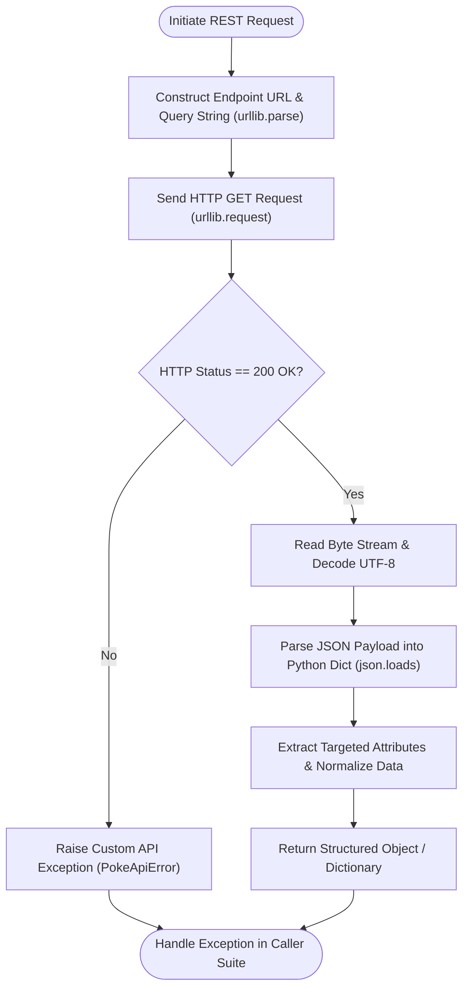

# 🌐 Comprehensive Python REST API & HTTP Client Integration (`api`) Master Guide

Welcome to the definitive master guide on **Python REST API & HTTP Client Integration (`api`)**. This guide provides a production-grade reference covering HTTP GET request handling using `urllib.request` and `requests`, JSON data parsing, query parameter encoding, object-oriented REST API client architecture, endpoint routing, custom exception hierarchies, range sequence offset pagination, memory benchmarks ($O(1)$ space complexity), runtime introspection via `dir(range)`, and version evolutions from Python 2.7 to Python 3.13.

---

## 📌 Table of Contents

1. [Overview & REST API Request Architecture](#1-overview--rest-api-request-architecture)
2. [Fundamental HTTP Request Handling](#2-fundamental-http-request-handling)
3. [Advanced REST Client Architecture](#3-advanced-rest-client-architecture)
4. [Range Sequence Pagination & Memory Benchmarks](#4-range-sequence-pagination--memory-benchmarks)
5. [Runtime Introspection & Reflection Matrix (`dir(range)`)](#5-runtime-introspection--reflection-matrix-dirrange)
6. [Cross-Version Evolution (Python 2.7 to Python 3.13)](#6-cross-version-evolution-python-27-to-python-313)
7. [Practical Code Examples](#7-practical-code-examples)
8. [Common Pitfalls & Best Practices](#8-common-pitfalls--best-practices)

---

## 1. Overview & REST API Request Architecture

Application Programming Interfaces (APIs) allow Python applications to communicate over HTTP/HTTPS protocols using REST (Representational State Transfer) architecture. REST APIs transmit data payloads primarily in JSON (JavaScript Object Notation) format.

### HTTP REST API Execution Flow



---

## 2. Fundamental HTTP Request Handling

Python's standard library `urllib.request` and third-party `requests` library facilitate HTTP communication:

```python
import json
import urllib.parse
import urllib.request
from typing import Any, Dict, List

def search_itunes(term: str, limit: int = 10) -> List[Dict[str, Any]]:
    """
    Executes an HTTP GET request to iTunes Search REST API.
    """
    base_url = "https://itunes.apple.com/search"
    params = {"entity": "song", "limit": limit, "term": term}
    url = f"{base_url}?{urllib.parse.urlencode(params)}"

    req = urllib.request.Request(url, headers={"User-Agent": "Python-API/1.0"})
    with urllib.request.urlopen(req, timeout=10) as response:
        if response.getcode() == 200:
            payload = json.loads(response.read().decode("utf-8"))
            return payload.get("results", [])
        raise RuntimeError(f"HTTP Request failed: {response.getcode()}")
```

---

## 3. Advanced REST Client Architecture

For production systems, encapsulating endpoints inside a dedicated REST client class ensures modularity:

```python
import json
import urllib.request
from typing import Any, Dict

class PokeApiError(Exception):
    """Custom exception raised when PokéAPI HTTP requests encounter errors."""
    pass

class PokeApiClient:
    """Object-oriented REST Client for PokéAPI endpoints."""

    BASE_URL = "https://pokeapi.co/api/v2"

    def __init__(self, timeout: int = 10) -> None:
        self.timeout = timeout

    def _request(self, endpoint: str) -> Dict[str, Any]:
        url = f"{self.BASE_URL}/{endpoint.lstrip('/')}"
        req = urllib.request.Request(url, headers={"User-Agent": "PokeClient/1.0"})
        try:
            with urllib.request.urlopen(req, timeout=self.timeout) as response:
                if response.getcode() != 200:
                    raise PokeApiError(f"HTTP Status Error {response.getcode()}")
                return json.loads(response.read().decode("utf-8"))
        except Exception as err:
            raise PokeApiError(f"API Connection Failed: {err}") from err

    def get_pokemon(self, name: str) -> Dict[str, Any]:
        """Fetch Pokémon details by name."""
        data = self._request(f"pokemon/{name.lower()}")
        return {
            "name": data["name"].upper(),
            "id": data["id"],
            "height": data["height"],
            "weight": data["weight"],
        }
```

---

## 4. Range Sequence Pagination & Memory Benchmarks

Large API datasets use limit/offset pagination. Leveraging `range()` sequence generators maintains $O(1)$ memory usage (~48 bytes) regardless of dataset size:

```python
import sys
from typing import Generator, Dict, Any

def paginate_api_offsets(total_records: int, page_size: int = 20) -> range:
    """Generates O(1) memory range sequence for API page offsets."""
    return range(0, total_records, page_size)

# Memory Benchmark:
r_seq = paginate_api_offsets(1_000_000, 50)
print(f"range sequence memory: {sys.getsizeof(r_seq)} bytes")  # ~48 bytes (O(1))

m_list = list(r_seq)
print(f"Materialized list memory: {sys.getsizeof(m_list)} bytes")  # ~160 KB (O(N))
```

---

## 5. Runtime Introspection & Reflection Matrix (`dir(range)`)

Inspecting `dir(range)` highlights sequence attributes and methods available when working with range offset objects:

```python
r = range(0, 1000, 25)

print("Start Offset:", r.start)  # 0
print("Stop Limit  :", r.stop)   # 1000
print("Step Size   :", r.step)   # 25

# Methods
print("Index of 50:", r.index(50))  # 2
print("Count of 50:", r.count(50))  # 1

# Reflection matrix via dir(range):
public_members = [m for m in dir(r) if not m.startswith("__")]
print("Public Members:", public_members)
# Output: ['count', 'index', 'start', 'step', 'stop']
```

---

## 6. Cross-Version Evolution (Python 2.7 to Python 3.13)

### Version Evolution Matrix

| Python Version | HTTP/API & Range Evolution | Key Technical Changes |
| :--- | :--- | :--- |
| **Python 2.7** | `urllib2`, `httplib`, `xrange()` | `urllib2` handled HTTP requests; `range()` eagerly built list instances; `xrange()` was required for lazy sequences. |
| **Python 3.0–3.3** | `urllib` package restructuring | Consolidated modules into `urllib.request` and `urllib.parse`; `xrange()` removed and `range()` became an immutable $O(1)$ sequence generator. |
| **Python 3.5** | Async REST APIs (`asyncio` & `aiohttp`) | Added native coroutines (`async`/`await`) for non-blocking HTTP REST request concurrency (PEP 492). |
| **Python 3.7** | `contextlib.nullcontext` & Dataclasses | Streamlined API request context handling and response payload deserialization. |
| **Python 3.11** | `ExceptionGroup` & `TaskGroup` | Added parallel API batch exception handling (PEP 654/655) without losing nested exception context. |
| **Python 3.12–3.13**| GIL-Free CPython & High-Performance I/O | Free-threaded execution without GIL (PEP 703) permits parallel multithreaded REST requests across CPU cores. |

---

## 7. Practical Code Examples

### Example 1: Basic iTunes Search CLI
```python
import json
import urllib.request

def quick_search(song: str):
    url = f"https://itunes.apple.com/search?entity=song&limit=1&term={song}"
    with urllib.request.urlopen(url) as resp:
        data = json.loads(resp.read().decode())
        print(json.dumps(data, indent=2))

if __name__ == "__main__":
    quick_search("love")
```

### Example 2: Paginated PokéAPI Batch Fetcher
```python
from range_api_pagination import simulate_paginated_api_fetch

def run_pagination():
    for page in simulate_paginated_api_fetch(total_items=100, page_size=25):
        print(f"Fetching Page {page['page']}: offset={page['offset']}, limit={page['limit']}")

if __name__ == "__main__":
    run_pagination()
```

---

## 8. Common Pitfalls & Best Practices

1. **Omitting `timeout` on HTTP requests**:
   - *Pitfall*: By default, `urllib.request.urlopen` or `requests.get` without a timeout can block indefinitely if network connections stall.
   - *Fix*: Always pass explicit timeout values (`timeout=10`).

2. **Not decoding response byte streams**:
   - *Pitfall*: Passing raw binary bytes directly to `json.loads()` in legacy Python releases throws TypeError.
   - *Fix*: Decode response bytes explicitly using `.decode("utf-8")`.

3. **Materializing range offset objects into lists**:
   - *Pitfall*: Converting `list(range(0, 10_000_000, 20))` wastes megabytes of RAM.
   - *Fix*: Iterate directly over the `range` sequence generator to maintain $O(1)$ memory consumption.
