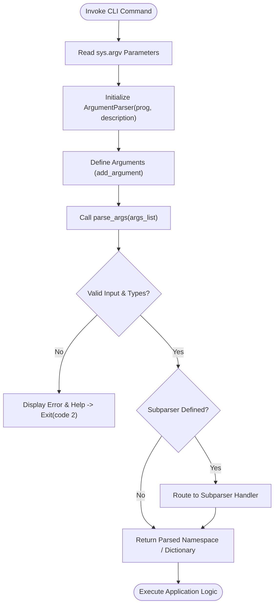

# 🛠️ Comprehensive Python Command-Line Argument Parsing (`argparse`) Master Guide

Welcome to the definitive master guide on **Python Command-Line Argument Parsing (`argparse`)**. This guide provides a production-grade reference covering argument parser configuration (`ArgumentParser`), positional and optional arguments, subparsers for multi-command applications (like `git` or `docker`), choices validation, mutually exclusive argument groups, custom type validators, range sequence integration, memory benchmarks ($O(1)$ space complexity), runtime introspection via `dir(range)`, and version evolutions from Python 2.7 to Python 3.13.

---

## 📌 Table of Contents

1. [Overview & Argument Parsing Architecture](#1-overview--argument-parsing-architecture)
2. [Fundamental Argument Parsing](#2-fundamental-argument-parsing)
3. [Advanced Parsing Features & Subcommands](#3-advanced-parsing-features--subcommands)
4. [Range Sequence Iterators & Memory Benchmarks](#4-range-sequence-iterators--memory-benchmarks)
5. [Runtime Introspection & Reflection Matrix (`dir(range)`)](#5-runtime-introspection--reflection-matrix-dirrange)
6. [Cross-Version Evolution (Python 2.7 to Python 3.13)](#6-cross-version-evolution-python-27-to-python-313)
7. [Practical Code Examples](#7-practical-code-examples)
8. [Common Pitfalls & Best Practices](#8-common-pitfalls--best-practices)

---

## 1. Overview & Argument Parsing Architecture

The `argparse` module in Python provides a declarative interface for parsing command-line options and positional arguments from `sys.argv`. It automatically generates formatted help menus, handles input validation, converts data types, and issues clear error messages when invalid options are provided.

### Argument Parsing Execution Flow



---

## 2. Fundamental Argument Parsing

A basic `argparse` configuration specifies required positional arguments and optional flags with explicit types and defaults:

```python
# Standard library argument parser import
import argparse
from typing import List, Tuple

def parse_basic_cli(args_list: List[str]) -> Tuple[str, int, bool]:
    """
    Configures and executes a fundamental CLI argument parser.
    """
    parser = argparse.ArgumentParser(
        prog="file_processor",
        description="Processes input data files with custom repetition count and verbosity.",
        epilog="For support, visit https://github.com/DilshadPython/Python",
    )

    # Positional argument (required by default)
    parser.add_argument(
        "filename",
        type=str,
        help="Path to input data file (positional)",
    )

    # Optional argument with type conversion and default value
    parser.add_argument(
        "-c", "--count",
        type=int,
        default=1,
        help="Number of processing cycles (default: 1)",
    )

    # Boolean flag (--verbose)
    parser.add_argument(
        "-v", "--verbose",
        action="store_true",
        help="Enable verbose log reporting",
    )

    args = parser.parse_args(args_list)
    return args.filename, args.count, args.verbose
```

---

## 3. Advanced Parsing Features & Subcommands

For complex applications, `argparse` supports multi-level CLI architectures:

### 1. Subparsers (Subcommands)
Enables command structures similar to `git commit` or `docker run`:

```python
import argparse

parser = argparse.ArgumentParser(prog="app_cli")
subparsers = parser.add_subparsers(dest="subcommand", required=True)

# 'create' subcommand
create_parser = subparsers.add_parser("create", help="Create new item")
create_parser.add_argument("item_name", type=str)

# 'delete' subcommand
delete_parser = subparsers.add_parser("delete", help="Delete existing item")
delete_parser.add_argument("item_id", type=int)
```

### 2. Mutually Exclusive Groups
Ensures only one argument in a conflicting group is specified:

```python
group = parser.add_mutually_exclusive_group()
group.add_argument("--json", action="store_true", help="Format as JSON")
group.add_argument("--xml", action="store_true", help="Format as XML")
```

### 3. Custom Actions (`append`, `count`)
- `action="append"`: Collects multiple instances into a list (`--tag alpha --tag beta` $\rightarrow$ `['alpha', 'beta']`).
- `action="count"`: Counts flag occurrences (`-v` $\rightarrow$ `1`, `-vvv` $\rightarrow$ `3`).

---

## 4. Range Sequence Iterators & Memory Benchmarks

CLI parameters frequently configure numerical sequences using `range()`. `range` objects consume $O(1)$ memory (~48 bytes) regardless of sequence bound size:

```python
import sys
import argparse

parser = argparse.ArgumentParser()
parser.add_argument("--limit", type=int, default=1_000_000)
args = parser.parse_args(["--limit", "1000000"])

# O(1) Memory Footprint:
r_obj = range(args.limit)
print(f"range object memory: {sys.getsizeof(r_obj)} bytes")  # ~48 bytes (O(1))

# O(N) Memory Footprint:
m_list = list(r_obj)
print(f"Materialized list memory: {sys.getsizeof(m_list)} bytes")  # ~8 MB (O(N))
```

---

## 5. Runtime Introspection & Reflection Matrix (`dir(range)`)

Inspecting `dir(range)` reveals sequence properties and methods accessible when processing range CLI arguments:

```python
r = range(10, 100, 5)

print("Start Index:", r.start)  # 10
print("Stop Index :", r.stop)   # 100
print("Step Value :", r.step)   # 5

# Member methods
print("Index of 25:", r.index(25))  # 3
print("Count of 25:", r.count(25))  # 1

# Reflection matrix via dir(range):
public_members = [m for m in dir(r) if not m.startswith("__")]
print("Public Range Members:", public_members)
# Output: ['count', 'index', 'start', 'step', 'stop']
```

---

## 6. Cross-Version Evolution (Python 2.7 to Python 3.13)

### Version Evolution Matrix

| Python Version | CLI Parsing & Range Evolution | Key Technical Changes |
| :--- | :--- | :--- |
| **Python 2.7** | `optparse` (Standard CLI), `xrange()` | `optparse` required manual type conversion; `range()` eagerly built lists in RAM; `xrange()` was used for lazy sequence generation. |
| **Python 3.0–3.2** | `argparse` introduced (PEP 389) | `optparse` deprecated; `argparse` added to standard library; `xrange()` removed and `range()` made $O(1)$ sequence generator. |
| **Python 3.7** | Intermixed Arguments (`parse_intermixed_args`) | Supported mixing positional and optional arguments anywhere on command line. |
| **Python 3.9** | `BooleanOptionalAction` & `exit_on_error` | Added native `--flag / --no-flag` toggle options; `exit_on_error=False` allows custom exception catching instead of forced `sys.exit`. |
| **Python 3.10** | Improved Error Hints & Formatting | Enhanced error reporting for invalid subcommands and misspelled option flags. |
| **Python 3.11** | `ExceptionGroup` Integration | Streamlined tracebacks and error messages for invalid argument parameters. |
| **Python 3.12–3.13**| `suggest_on_error` & GIL-free CPython (PEP 703) | Automatic spelling suggestions for misspelled flags; thread-safe multi-core execution without GIL locks. |

---

## 7. Practical Code Examples

### Example 1: Full Subparser CLI Runner
```python
import argparse

def main():
    parser = argparse.ArgumentParser(prog="deploy_tool")
    subparsers = parser.add_subparsers(dest="subcommand", required=True)

    # 'deploy' subcommand
    deploy_parser = subparsers.add_parser("deploy")
    deploy_parser.add_argument("--env", choices=["dev", "prod"], default="dev")
    deploy_parser.add_argument("--version", required=True)

    args = parser.parse_args(["deploy", "--env", "prod", "--version", "v2.1.0"])
    print(f"Deploying version {args.version} to {args.env} environment.")

if __name__ == "__main__":
    main()
```

### Example 2: Range Generator CLI
```python
import argparse

def run_range_cli():
    parser = argparse.ArgumentParser()
    parser.add_argument("--start", type=int, default=0)
    parser.add_argument("--stop", type=int, required=True)
    parser.add_argument("--step", type=int, default=1)

    args = parser.parse_args(["--stop", "50", "--step", "10"])
    r = range(args.start, args.stop, args.step)
    print(f"Generated Range: {list(r)}")

if __name__ == "__main__":
    run_range_cli()
```

---

## 8. Common Pitfalls & Best Practices

1. **Not defining `type` in `add_argument`**:
   - *Pitfall*: By default, `argparse` treats all values as strings. Passing `--count 5` results in `"5"` (str) instead of `5` (int).
   - *Fix*: Explicitly specify `type=int`, `type=float`, or custom type validator functions.

2. **Forgetting `dest` or `required=True` on Subparsers**:
   - *Pitfall*: In Python versions prior to 3.7, subparsers were optional by default, leading to `AttributeError` when accessing missing subcommand attributes.
   - *Fix*: Set `subparsers.required = True` or `dest="command"`.

3. **Conflicting Mutually Exclusive Options**:
   - *Pitfall*: Allowing `--verbose` and `--quiet` flags simultaneously produces confusing application output.
   - *Fix*: Wrap conflicting flags inside `parser.add_mutually_exclusive_group()`.
