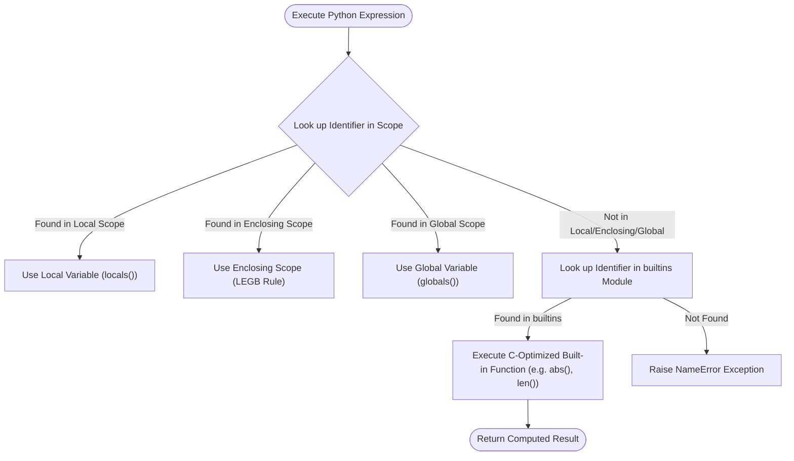

# 🧰 Comprehensive Python Built-in Functions & Reflection (`built_ins`) Master Guide

Welcome to the definitive master guide on **Python Built-in Functions & Reflection (`built_ins`)**. This guide provides a production-grade reference covering core built-in functions (`abs()`, `len()`, `sum()`, `min()`, `max()`, `all()`, `any()`), dynamic type reflection using `dir()`, `getattr()`, `hasattr()`, namespace introspection via `globals()` and `locals()`, Newton's Square Root method using `abs()` convergence loops, range sequence iteration, memory benchmarks ($O(1)$ space complexity), runtime introspection via `dir(range)`, and version evolutions from Python 2.7 to Python 3.13.

---

## 📌 Table of Contents

1. [Overview & Built-in Functions Architecture](#1-overview--built-in-functions-architecture)
2. [Fundamental Built-in Functions](#2-fundamental-built-in-functions)
3. [Advanced Reflection & Namespace Management](#3-advanced-reflection--namespace-management)
4. [Range Sequence Iteration & Memory Benchmarks](#4-range-sequence-iteration--memory-benchmarks)
5. [Runtime Introspection & Reflection Matrix (`dir(range)`)](#5-runtime-introspection--reflection-matrix-dirrange)
6. [Cross-Version Evolution (Python 2.7 to Python 3.13)](#6-cross-version-evolution-python-27-to-python-313)
7. [Practical Code Examples](#7-practical-code-examples)
8. [Common Pitfalls & Best Practices](#8-common-pitfalls--best-practices)

---

## 1. Overview & Built-in Functions Architecture

Python loads its standard set of built-in functions and exception types automatically into the global scope via the standard library `builtins` module. These built-in utilities are implemented directly in C for CPython, providing zero-overhead, highly optimized operations across all data types.

### Built-in Execution & Namespace Resolution Architecture



---

## 2. Fundamental Built-in Functions

Standard built-in functions perform mathematical calculations, collection summaries, and boolean truthiness evaluations:

```python
import builtins
from typing import List, Union

def calculate_absolute_values(values: List[Union[int, float, complex]]) -> List[float]:
    """Computes absolute magnitude values using built-in abs()."""
    return [round(abs(val), 4) for val in values]

def summarize_numeric_collection(numbers: List[float]) -> dict:
    """Summarizes numbers using built-in len(), sum(), min(), max()."""
    return {
        "count": len(numbers),
        "total": sum(numbers),
        "min": min(numbers),
        "max": max(numbers),
        "avg": sum(numbers) / len(numbers) if numbers else 0.0
    }
```

---

## 3. Advanced Reflection & Namespace Management

Dynamic reflection allows programs to inspect type attributes (`dir()`), dynamically access properties (`getattr()`), check attribute availability (`hasattr()`), and inspect namespaces (`globals()`, `locals()`):

```python
def inspect_public_methods(target_type: type) -> List[str]:
    """Returns public non-dunder attributes and methods of a type."""
    return [attr for attr in dir(target_type) if not attr.startswith("__")]

def newton_sqrt(n: float, tol: float = 1e-7) -> float:
    """Computes square root using Newton's iterative method with abs() check."""
    if n < 0:
        raise ValueError("Negative numbers have no real square root.")
    guess = n / 2.0
    while abs(guess * guess - n) >= tol:
        guess = (guess + n / guess) / 2.0
    return guess
```

---

## 4. Range Sequence Iteration & Memory Benchmarks

Built-in sequence creation via `range()` provides $O(1)$ memory consumption (~48 bytes) regardless of element count:

```python
import sys

def get_builtin_range(total_elements: int) -> range:
    """Generates O(1) memory sequence for stepping range iterations."""
    return range(0, total_elements, 1)

# Memory Benchmark:
r_seq = get_builtin_range(100_000)
print(f"range sequence memory: {sys.getsizeof(r_seq)} bytes")  # ~48 bytes (O(1))

m_list = list(r_seq)
print(f"Materialized list memory: {sys.getsizeof(m_list)} bytes")  # ~800 KB (O(N))
```

---

## 5. Runtime Introspection & Reflection Matrix (`dir(range)`)

Inspecting `dir(range)` highlights sequence attributes and methods available when working with built-in range objects:

```python
r = range(0, 1000, 25)

print("Start Index:", r.start)  # 0
print("Stop Limit :", r.stop)   # 1000
print("Step Size  :", r.step)   # 25

# Methods
print("Index of 50:", r.index(50))  # 2
print("Count of 50:", r.count(50))  # 1

# Reflection matrix via dir(range):
public_members = [m for m in dir(r) if not m.startswith("__")]
print("Public Members:", public_members)
# Output: ['count', 'index', 'start', 'step', 'stop']
```

---

## 6. Cross-Version Evolution (Python 2.7 to Python 3.13)

### Version Evolution Matrix

| Python Version | Built-in Function & Range Features | Key Technical Changes |
| :--- | :--- | :--- |
| **Python 2.7** | `xrange()`, `raw_input()`, `execfile()` | `range()` eagerly built lists in RAM; `xrange()` was required for lazy sequence iteration; `print` was a statement keyword. |
| **Python 3.0–3.3** | `print()` function & `range()` generator | `xrange()` removed; `range()` became an immutable $O(1)$ memory sequence generator; `zip()`, `map()`, and `filter()` returned iterators. |
| **Python 3.8** | Positional-only parameters (`/`) | Added `/` in built-in function signatures (PEP 570); `math.prod()` added for product calculations. |
| **Python 3.10** | `zip(strict=True)` & Match/Case | `zip()` added `strict=True` argument to raise ValueError on mismatched iterable lengths (PEP 618). |
| **Python 3.11** | Specialized Adaptive CPython Bytecode | Fast inline execution for common built-ins (`abs`, `len`, `min`, `max`) giving 10–60% execution speedup. |
| **Python 3.12–3.13**| GIL-Free CPython (PEP 703) | Free-threaded execution permits concurrent multi-threaded execution of built-in function calls across CPU cores. |

---

## 7. Practical Code Examples

### Example 1: Dynamic Introspection & Property Retrieval
```python
from advanced_reflection_and_namespaces import DynamicAttributeContainer

def run_reflection_demo():
    obj = DynamicAttributeContainer(language="Python", version=3.13)
    print(f"Language: {obj.safe_get('language')}")
    print(f"Version : {obj.safe_get('version')}")

if __name__ == "__main__":
    run_reflection_demo()
```

### Example 2: Built-in Collection Summaries
```python
from builtin_functions_basics import compute_collection_summary

def run_summary_demo():
    stats = compute_collection_summary([15.5, 22.0, 38.5, 42.0])
    print(f"Summary: Total={stats['total']}, Avg={stats['average']}")

if __name__ == "__main__":
    run_summary_demo()
```

---

## 8. Common Pitfalls & Best Practices

1. **Shadowing built-in function names**:
   - *Pitfall*: Naming variables or parameters `list`, `str`, `dict`, `min`, or `max` overrides built-in function references in local scope.
   - *Fix*: Use descriptive variable names (e.g. `items_list`, `name_str`, `min_val`).

2. **Materializing built-in range sequences**:
   - *Pitfall*: Converting `list(range(0, 10_000_000))` allocates unnecessary memory in RAM.
   - *Fix*: Iterate directly over the `range` generator.

3. **Using `eval()` instead of `getattr()` for dynamic attribute access**:
   - *Pitfall*: Passing untrusted string inputs into `eval()` creates security vulnerabilities.
   - *Fix*: Use `getattr(object, attribute_name)` for safe dynamic property resolution.
