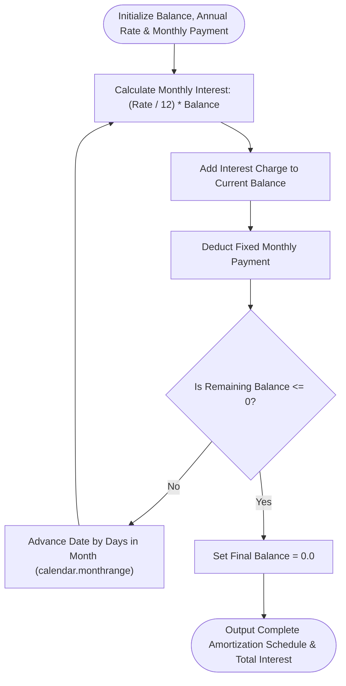

# 🧮 Comprehensive Mathematical & Financial Calculators (`calculate`) Master Guide

Welcome to the definitive master guide on **Python Mathematical & Financial Calculators (`calculate`)**. This guide provides a production-grade reference covering fundamental geometry math (Pythagorean hypotenuse calculation, difference of squares, Euclidean distance), advanced financial repayment models (`CreditCardRepaymentCalculator`), milestone goal trackers (`WeightLossGoalTracker`, `GoalGrowthTracker`), range sequence schedule iteration, memory benchmarks ($O(1)$ space complexity), runtime introspection via `dir(range)`, and version evolutions from Python 2.7 to Python 3.13.

---

## 📌 Table of Contents

1. [Overview & Calculation Pipeline Architecture](#1-overview--calculation-pipeline-architecture)
2. [Fundamental Mathematical Calculations](#2-fundamental-mathematical-calculations)
3. [Advanced Financial Repayment & Goal Trackers](#3-advanced-financial-repayment--goal-trackers)
4. [Range Sequence Iteration & Memory Benchmarks](#4-range-sequence-iteration--memory-benchmarks)
5. [Runtime Introspection & Reflection Matrix (`dir(range)`)](#5-runtime-introspection--reflection-matrix-dirrange)
6. [Cross-Version Evolution (Python 2.7 to Python 3.13)](#6-cross-version-evolution-python-27-to-python-313)
7. [Practical Code Examples](#7-practical-code-examples)
8. [Common Pitfalls & Best Practices](#8-common-pitfalls--best-practices)

---

## 1. Overview & Calculation Pipeline Architecture

Financial modeling and mathematical calculations require precise numerical formulas, date arithmetic via Python's `datetime` module, and monthly compounding schedules. The `calculate` pipeline models credit card amortization schedules, goal trajectories, and geometric distances.

### Credit Card Amortization & Calculation Dataflow



---

## 2. Fundamental Mathematical Calculations

Fundamental geometry and algebra utility functions:

```python
import math
from typing import Tuple

def compute_hypotenuse(a: float, b: float) -> float:
    """Computes hypotenuse c = sqrt(a^2 + b^2)."""
    return round(math.sqrt(math.pow(a, 2) + math.pow(b, 2)), 4)

def compute_difference_of_squares(a: float, b: float) -> float:
    """Computes (a^2 - b^2)."""
    return round(math.pow(a, 2) - math.pow(b, 2), 4)

def compute_euclidean_distance(p1: Tuple[float, float], p2: Tuple[float, float]) -> float:
    """Computes 2D Euclidean distance between two points."""
    return round(math.sqrt((p2[0] - p1[0])**2 + (p2[1] - p1[1])**2), 4)
```

---

## 3. Advanced Financial Repayment & Goal Trackers

Object-oriented financial payment schedules and milestone trackers:

```python
import calendar
import datetime

class CreditCardRepaymentCalculator:
    def __init__(self, balance: float, rate: float, payment: float):
        self.balance = balance
        self.rate = rate
        self.payment = payment

    def calculate_schedule(self, start_date: datetime.date):
        curr_bal = self.balance
        curr_dt = start_date
        total_interest = 0.0
        schedule = []

        while curr_bal > 0:
            interest = round(curr_bal * (self.rate / 12.0), 2)
            total_interest += interest
            curr_bal += interest
            pay = min(curr_bal, self.payment)
            curr_bal = round(curr_bal - pay, 2)

            days = calendar.monthrange(curr_dt.year, curr_dt.month)[1]
            curr_dt += datetime.timedelta(days=days)
            schedule.append({"date": curr_dt, "balance": curr_bal})

        return schedule, total_interest
```

---

## 4. Range Sequence Iteration & Memory Benchmarks

Iteration over calculation step schedules using `range(1, total_months + 1)` maintains $O(1)$ memory (~48 bytes):

```python
import sys

def get_schedule_range(total_months: int) -> range:
    """Generates O(1) memory sequence for schedule iteration."""
    return range(1, total_months + 1)

# Memory Benchmark:
r_seq = get_schedule_range(100_000)
print(f"range sequence memory: {sys.getsizeof(r_seq)} bytes")  # ~48 bytes (O(1))

m_list = list(r_seq)
print(f"Materialized list memory: {sys.getsizeof(m_list)} bytes")  # ~800 KB (O(N))
```

---

## 5. Runtime Introspection & Reflection Matrix (`dir(range)`)

Inspecting `dir(range)` highlights sequence attributes and methods available when working with calculation range objects:

```python
r = range(1, 61, 1)

print("Start Month:", r.start)  # 1
print("Stop Limit :", r.stop)   # 61
print("Step Size  :", r.step)   # 1

# Methods
print("Index of Month 12:", r.index(12))  # 11
print("Count of Month 12:", r.count(12))  # 1

# Reflection matrix via dir(range):
public_members = [m for m in dir(r) if not m.startswith("__")]
print("Public Members:", public_members)
# Output: ['count', 'index', 'start', 'step', 'stop']
```

---

## 6. Cross-Version Evolution (Python 2.7 to Python 3.13)

### Version Evolution Matrix

| Python Version | Numeric Calculation & Range Features | Key Technical Changes |
| :--- | :--- | :--- |
| **Python 2.7** | Integer division `/` & `xrange()` | `5 / 2` evaluated to `2` (integer floor); `range()` eagerly built lists in RAM; `xrange()` was required for lazy sequences. |
| **Python 3.0–3.3** | True division `/` & `//` operator | `5 / 2` evaluates to `2.5`; `//` introduced for explicit integer division; `range()` became an immutable $O(1)$ sequence generator. |
| **Python 3.5** | `math.isclose()` & Matrix `@` operator| Added `math.isclose()` for floating point comparisons; `@` operator added for matrix dot products. |
| **Python 3.8** | `math.prod()` function | Introduced `math.prod()` to calculate products of numeric iterables. |
| **Python 3.11** | Specialized Adaptive Bytecode | Fast inline execution for numeric operations yielding 10–60% execution speedup. |
| **Python 3.12–3.13**| GIL-Free CPython (PEP 703) | Free-threaded execution permits multi-core parallel processing of CPU-bound mathematical calculations. |

---

## 7. Practical Code Examples

### Example 1: Amortization Schedule Calculation
```python
import datetime
from financial_and_goal_trackers import CreditCardRepaymentCalculator

def run_repayment():
    calc = CreditCardRepaymentCalculator(5000.0, 0.26, 204.0)
    sched, interest = calc.calculate_repayment_schedule(datetime.date(2026, 1, 1))
    print(f"Total Repayment Months: {len(sched)}")
    print(f"Total Interest Paid   : £{interest}")

if __name__ == "__main__":
    run_repayment()
```

### Example 2: Weight Loss Milestone Timeline
```python
import datetime
from financial_and_goal_trackers import WeightLossGoalTracker

def run_weight_loss():
    tracker = WeightLossGoalTracker(current_weight=100.0, target_weight=75.0, avg_loss_per_week=0.8)
    target_dt, weeks = tracker.estimate_completion_date(datetime.date.today())
    print(f"Estimated Completion Date: {target_dt} ({weeks} weeks)")

if __name__ == "__main__":
    run_weight_loss()
```

---

## 8. Common Pitfalls & Best Practices

1. **Relying on legacy Python 2 integer division**:
   - *Pitfall*: Expecting `5 / 2` to evaluate to `2` in Python 3 causes subtle floating point logic bugs.
   - *Fix*: Use `5 // 2` explicitly when integer truncation is required.

2. **Floating-point inequality checks (`==`)**:
   - *Pitfall*: Comparing floats with `==` (e.g. `0.1 + 0.2 == 0.3`) fails due to IEEE 754 precision representation limits.
   - *Fix*: Use `math.isclose(a, b, rel_tol=1e-9)` or `round(val, 2)`.

3. **Infinite interest charge loops**:
   - *Pitfall*: Setting monthly credit card payments lower than monthly interest charges results in non-terminating loops.
   - *Fix*: Validate that monthly payment strictly exceeds monthly interest (`monthly_payment > balance * monthly_rate`).
