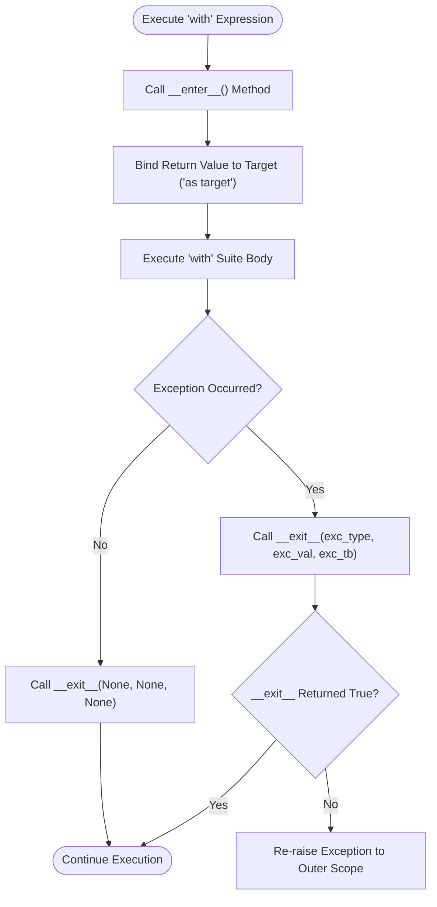

# 🔒 Comprehensive Python Context Managers & Resource Management Master Guide

Welcome to the definitive master guide on **Python Context Managers & Resource Management**. This guide provides a production-grade reference covering resource setup and teardown protocols (`__enter__` and `__exit__`), generator-based context managers (`@contextmanager`), standard library `contextlib` utilities (`chdir`, `ExitStack`, `suppress`, `nullcontext`), asynchronous context managers (`async with`), bytecode instruction optimization, `dir(range)` reflection matrix, and cross-version evolutions from Python 2.7 to Python 3.13.

---

## 📌 Table of Contents

1. [Overview & Context Manager Architecture](#1-overview--context-manager-architecture)
2. [Class-Based Context Managers (`__enter__` & `__exit__`)](#2-class-based-context-managers-__enter__--__exit__)
3. [Generator-Based Context Managers (`@contextmanager`)](#3-generator-based-context-managers-contextmanager)
4. [Standard Library Utilities (`contextlib`: `chdir`, `ExitStack`, `suppress`, `nullcontext`)](#4-standard-library-utilities-contextlib-chdir-exitstack-suppress-nullcontext)
5. [Asynchronous Context Managers (`async with`, `__aenter__`, `__aexit__`)](#5-asynchronous-context-managers-async-with-__aenter__-__aexit__)
6. [Range Sequence Iterators & Memory Benchmarks](#6-range-sequence-iterators--memory-benchmarks)
7. [Runtime Introspection & Reflection Matrix (`dir(range)`)](#7-runtime-introspection--reflection-matrix-dirrange)
8. [Cross-Version Evolution (Python 2.7 to Python 3.13)](#8-cross-version-evolution-python-27-to-python-313)
9. [Practical Code Examples](#9-practical-code-examples)
10. [Common Pitfalls & Best Practices](#10-common-pitfalls--best-practices)

---

## 1. Overview & Context Manager Architecture

The `with` statement in Python simplifies resource management by ensuring that setup and cleanup operations are executed automatically around a code suite, even if runtime exceptions or unexpected returns occur.

### Context Manager Execution Flow



---

## 2. Class-Based Context Managers (`__enter__` & `__exit__`)

Custom context manager classes implement two dunder lifecycle protocols:
- **`__enter__(self)`**: Initializes and allocates the underlying resource. The return value is bound to the optional `as target` identifier.
- **`__exit__(self, exc_type, exc_val, exc_tb)`**: Guarantees teardown execution. If an exception occurs inside the suite, its class type, value, and traceback are passed into `__exit__`. Returning `True` suppresses the exception; returning `False` or `None` allows it to propagate.

```python
from typing import Any, Optional, Type

class DirectoryChangeManager:
    """
    Class-based context manager that temporarily switches the active working directory.
    """
    def __init__(self, target_directory: str) -> None:
        import os
        from pathlib import Path
        self.target_dir = Path(target_directory)
        self.original_dir = os.getcwd()

    def __enter__(self) -> 'DirectoryChangeManager':
        import os
        self.target_dir.mkdir(parents=True, exist_ok=True)
        os.chdir(self.target_dir)
        return self

    def __exit__(
        self,
        exc_type: Optional[Type[BaseException]],
        exc_val: Optional[BaseException],
        exc_tb: Optional[Any]
    ) -> bool:
        import os
        os.chdir(self.original_dir)
        if exc_type is FileNotFoundError:
            print("Suppressed FileNotFoundError within directory context.")
            return True
        return False
```

---

## 3. Generator-Based Context Managers (`@contextmanager`)

The `@contextmanager` decorator from `contextlib` converts a generator function into a context manager:
- Code **prior** to `yield` runs during `__enter__()`.
- The value **yielded** is bound to the target variable.
- Code **following** `yield` inside a `finally:` block executes during `__exit__()`.

```python
from contextlib import contextmanager
from pathlib import Path
from typing import Generator, TextIO

@contextmanager
def managed_text_writer(filepath: str, mode: str = "w") -> Generator[TextIO, None, None]:
    """Generator-based context manager guaranteeing file handle closure."""
    path = Path(filepath)
    stream = open(path, mode, encoding="utf-8")
    try:
        yield stream
    finally:
        stream.close()

# Usage:
with managed_text_writer("output.txt") as stream:
    stream.write("Writing data safely via generator context manager\n")
```

---

## 4. Standard Library Utilities (`contextlib`: `chdir`, `ExitStack`, `suppress`, `nullcontext`)

### 1. `contextlib.chdir` (Python 3.11+)
Built-in context manager for changing the current working directory safely:

```python
import os
from contextlib import chdir

with chdir("/tmp"):
    print("Working directory inside context:", os.getcwd())
# Automatically returns to original working directory upon exit
```

### 2. `contextlib.ExitStack`
Dynamically manages an arbitrary list of context managers:

```python
from contextlib import ExitStack

file_list = ["a.txt", "b.txt", "c.txt"]
with ExitStack() as stack:
    handles = [stack.enter_context(open(fname, "w", encoding="utf-8")) for fname in file_list]
    for h in handles:
        h.write("Batch data entry\n")
# All handles automatically closed on exit
```

### 3. `contextlib.suppress`
Ignores specified exception types cleanly:

```python
import os
from contextlib import suppress

with suppress(FileNotFoundError):
    os.remove("non_existent_file.txt")
```

### 4. `contextlib.nullcontext` (Python 3.7+)
Acts as a no-op fallback context manager when conditional contexts are needed:

```python
from contextlib import nullcontext

def process_data(file_handle=None):
    # Use existing file handle if provided; otherwise open a new context
    cm = nullcontext(file_handle) if file_handle else open("data.txt", "r", encoding="utf-8")
    with cm as stream:
        return stream.read()
```

---

## 5. Asynchronous Context Managers (`async with`, `__aenter__`, `__aexit__`)

Python 3.5+ supports asynchronous context managers for coroutine-based resource management (PEP 492):

```python
import asyncio
from typing import Optional, Type, Any

class AsyncDatabaseConnection:
    """Asynchronous context manager for non-blocking I/O connections."""
    def __init__(self, db_url: str) -> None:
        self.db_url = db_url

    async def __aenter__(self) -> 'AsyncDatabaseConnection':
        await asyncio.sleep(0.01)  # Simulate non-blocking async network call
        print(f"Connected to async DB: {self.db_url}")
        return self

    async def __aexit__(
        self,
        exc_type: Optional[Type[BaseException]],
        exc_val: Optional[BaseException],
        exc_tb: Optional[Any]
    ) -> None:
        await asyncio.sleep(0.01)  # Simulate async disconnect
        print(f"Disconnected from async DB: {self.db_url}")

# Usage inside an async coroutine:
async def main():
    async with AsyncDatabaseConnection("postgres://localhost:5432/mydb") as db:
        print("Executing async query within active context")

# asyncio.run(main())
```

---

## 6. Range Sequence Iterators & Memory Benchmarks

Range objects instantiate sequence iterators with $O(1)$ space complexity (~48 bytes):

```python
import sys

# O(1) Memory Footprint:
r_iter = iter(range(1_000_000))
print(f"range_iterator memory: {sys.getsizeof(r_iter)} bytes")  # ~48 bytes (O(1))

# O(N) Memory Footprint:
m_list = list(range(1_000_000))
print(f"Materialized list memory: {sys.getsizeof(m_list)} bytes")  # ~8 MB (O(N))
```

---

## 7. Runtime Introspection & Reflection Matrix (`dir(range)`)

Inspecting `dir(range)` demonstrates sequence attributes and methods:

```python
r = range(10, 100, 5)

print("Start:", r.start)  # 10
print("Stop :", r.stop)   # 100
print("Step :", r.step)   # 5

# Methods
print("Index of 25:", r.index(25))  # 3
print("Count of 25:", r.count(25))  # 1

# Non-dunder attributes/methods via dir(range):
public_members = [m for m in dir(r) if not m.startswith("__")]
print("Public Members:", public_members)
# Output: ['count', 'index', 'start', 'step', 'stop']
```

---

## 8. Cross-Version Evolution (Python 2.7 to Python 3.13)

### Version Evolution Matrix

| Python Release | Context Manager & Syntax Feature | Architectural / Protocol Evolution |
| :--- | :--- | :--- |
| **Python 2.7** | `from __future__ import with_statement` (Py 2.5/2.6), manual `try...finally` | Required manual `try...finally` for resource cleanup in legacy releases; `range()` eagerly built lists. |
| **Python 3.3** | `contextlib.ExitStack` introduced | Standardized dynamic multi-context management. |
| **Python 3.4** | `contextlib.suppress`, `redirect_stdout`, `redirect_stderr` | Added utility context managers for stream redirection and error suppression. |
| **Python 3.5** | Async Context Managers (`async with`, `__aenter__`, `__aexit__`) | Added native asynchronous context management protocol (PEP 492). |
| **Python 3.7** | `contextlib.nullcontext` | Added no-op context manager for conditional context parameters. |
| **Python 3.10**| Parenthesized Context Managers | Enabled clean formatted multi-context statements: `with (A() as a, B() as b):`. |
| **Python 3.11**| `contextlib.chdir` & `ExceptionGroup` Integration | Built-in directory switching context manager; handling multi-exception stacks in context teardown. |
| **Python 3.12–3.13**| Free-Threaded CPython without GIL (PEP 703), Zero-Cost Exception Tables | Thread-safe execution of context managers across CPU cores without GIL locks; specialized bytecode (`BEFORE_WITH`, `WITH_EXCEPT_START`). |

---

## 9. Practical Code Examples

### Example 1: Custom Class Context Manager
```python
class SimpleResource:
    def __enter__(self):
        print("Acquiring resource")
        return self
    def __exit__(self, exc_type, exc_val, exc_tb):
        print("Releasing resource")

with SimpleResource():
    print("Inside context block")
```

### Example 2: Generator Context Manager with Error Cleanup
```python
from contextlib import contextmanager

@contextmanager
def safe_file_access(filepath: str):
    f = open(filepath, "w", encoding="utf-8")
    try:
        yield f
    finally:
        f.close()

with safe_file_access("demo.txt") as f:
    f.write("Hello context manager!\n")
```

### Example 3: Multi-Resource Parenthesized Context Manager (Python 3.10+)
```python
with (
    open("input.txt", "r", encoding="utf-8") as source,
    open("output.txt", "w", encoding="utf-8") as target
):
    target.write(source.read())
```

---

## 10. Common Pitfalls & Best Practices

1. **Omitting `try...finally` in `@contextmanager` generator functions**:
   - *Pitfall*: If an exception occurs inside the `with` block, post-yield cleanup code will be bypassed.
   - *Fix*: Wrap post-yield teardown logic inside a `finally:` block.

2. **Forgetting `return True` when suppressing exceptions in `__exit__`**:
   - *Pitfall*: Returning `None` or `False` causes caught exceptions to propagate outside the `with` block.
   - *Fix*: Explicitly `return True` from `__exit__` when exception suppression is intended.

3. **Not using `ExitStack` for dynamic resources**:
   - *Pitfall*: Opening resources in a loop without context managers risks descriptor leaks.
   - *Fix*: Wrap dynamic lists of resources using `contextlib.ExitStack`.
