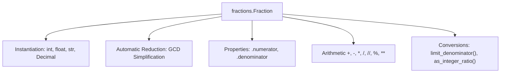

# 🔢 Comprehensive Python Fraction Master Guide

Welcome to the definitive pedagogical master guide on **Python Fractions (`fractions.Fraction`)**. This guide provides a production-grade reference covering rational arithmetic, floating-point inaccuracy elimination, string parsing, Decimal interop, standard library `math` integration, `limit_denominator()` approximations, range sequence performance, `dir(range)` reflection matrix, and cross-version evolutions from Python 2.7 to Python 3.13.

---

## 📌 Table of Contents

1. [Overview & Rational Architecture](#1-overview--rational-architecture)
2. [Instantiation Protocols (Integers, Strings, Floats, Decimals)](#2-instantiation-protocols-integers-strings-floats-decimals)
3. [Exact Arithmetic vs Floating-Point Inaccuracies](#3-exact-arithmetic-vs-floating-point-inaccuracies)
4. [Ratio Extraction (`as_integer_ratio()`) & Limit Approximations (`limit_denominator()`)](#4-ratio-extraction-as_integer_ratio--limit-approximations-limit_denominator)
5. [Standard Library `math` Integration & Rounding](#5-standard-library-math-integration--rounding)
6. [Range Sequence Generation & Memory Benchmarks](#6-range-sequence-generation--memory-benchmarks)
7. [Runtime Introspection & Reflection Matrix (`dir(range)`)](#7-runtime-introspection--reflection-matrix-dirrange)
8. [Cross-Version Behavioral Breakdown (Python 2.7 to Python 3.13)](#8-cross-version-behavioral-breakdown-python-27-to-python-313)
9. [10 Practical Implementation Examples](#9-10-practical-implementation-examples)
10. [Common Pitfalls & Best Practices](#10-common-pitfalls--best-practices)

---

## 1. Overview & Rational Architecture

The `fractions` module provides support for rational number arithmetic. A `Fraction` instance represents a number as a pair of integers: a **numerator** and a **denominator**.



Key features of `fractions.Fraction`:
- Automatically simplifies fractions to lowest terms upon creation using greatest common divisor reduction (`math.gcd`).
- Ensures the denominator is strictly positive ($\ge 1$). If denominator is negative, the negative sign is shifted to the numerator.
- Implements `numbers.Rational` from the abstract numeric hierarchy (`numbers` module).

---

## 2. Instantiation Protocols (Integers, Strings, Floats, Decimals)

`Fraction` objects can be constructed from various data types:

```python
from fractions import Fraction
from decimal import Decimal

# 1. From two integers (numerator, denominator)
f1 = Fraction(4, 14)          # Automatically reduced to 2/7

# 2. From a string representation
f2 = Fraction("3/8")           # 3/8
f3 = Fraction(" 1.25 ")        # 5/4 (Python 3.9+ allows whitespace around slash)

# 3. From a floating-point number
f4 = Fraction(0.25)           # 1/4

# 4. From a Decimal instance
f5 = Fraction(Decimal("0.75")) # 3/4
```

---

## 3. Exact Arithmetic vs Floating-Point Inaccuracies

Binary floating-point numbers (`float`) suffer from exact representation limits (e.g. `0.1` cannot be represented exactly in binary base-2). `Fraction` eliminates representation errors:

```python
# IEEE-754 Float Addition Inaccuracy:
print(0.1 + 0.2)  # Output: 0.30000000000000004

# Fraction Exact Rational Addition:
f1 = Fraction(1, 10)
f2 = Fraction(2, 10)
print(f1 + f2)    # Output: 3/10 (Exact!)
```

---

## 4. Ratio Extraction (`as_integer_ratio()`) & Limit Approximations (`limit_denominator()`)

### Extracting Integer Ratio
`Fraction.as_integer_ratio()` returns a 2-tuple `(numerator, denominator)` matching the interface of `float.as_integer_ratio()` and `int.as_integer_ratio()` (standardized in Python 3.8+):

```python
f = Fraction(5, 8)
num, den = f.as_integer_ratio()  # (5, 8)
```

### Bounded Approximations (`limit_denominator`)
When creating a `Fraction` from an inexact float (like $\pi \approx 3.1415926535$), direct conversion yields a huge denominator. `limit_denominator(max_denominator)` finds the closest rational approximation with a denominator $\le$ `max_denominator`:

```python
import math

exact_pi = Fraction(math.pi)
print(exact_pi)  # 884279719003555/281474976710656 (Huge!)

approx_pi = exact_pi.limit_denominator(10)
print(approx_pi) # 22/7 (Simple rational approximation!)
```

---

## 5. Standard Library `math` Integration & Rounding

`Fraction` seamlessly integrates with CPython's `math` module:

```python
import math
from fractions import Fraction

f = Fraction(7, 3)  # 2.333...

print(math.floor(f))  # 2
print(math.ceil(f))   # 3
print(math.trunc(f))  # 2
print(round(f))       # 2

# Summing lists of fractions without precision loss:
fractions = [Fraction(1, 2), Fraction(1, 3), Fraction(1, 6)]
total = sum(fractions, Fraction(0, 1))  # 1/1
```

---

## 6. Range Sequence Generation & Memory Benchmarks

Standard `range()` only accepts integers. However, fractional step sequences can be generated using list comprehensions or generators:

```python
from fractions import Fraction
import sys

# Generate fractional steps from 0 to 1 with step 1/4
fraction_steps = [Fraction(i, 4) for i in range(5)]
# Output: [Fraction(0, 1), Fraction(1, 4), Fraction(1, 2), Fraction(3, 4), Fraction(1, 1)]

# Range Memory Benchmark (Documentation & Performance Note):
r = range(1_000_000)
print(f"range(1,000,000) RAM footprint: {sys.getsizeof(r)} bytes")  # ~48 bytes (O(1))
print(f"List of 1,000 Fractions RAM:   {sys.getsizeof(fraction_steps)} bytes")  # O(N)
```

---

## 7. Runtime Introspection & Reflection Matrix (`dir(range)`)

Inspecting `dir(range)` reveals sequence methods and properties available when operating on range bounds:

```python
r = range(10, 100, 5)

print("Start:", r.start) # 10
print("Stop:",  r.stop)  # 100
print("Step:",  r.step)  # 5
print("Attributes:", [a for a in dir(r) if not a.startswith("__")])
# Output: ['count', 'index', 'start', 'step', 'stop']
```

---

## 8. Cross-Version Behavioral Breakdown (Python 2.7 to Python 3.13)

### Version Evolution Matrix

| Python Version | Core Fraction & Range Enhancements | Architectural & Performance Impact |
| :--- | :--- | :--- |
| **Python 2.7 (Legacy)** | `fractions.gcd()` lived in `fractions` module; `xrange()` was used for lazy ranges; `Fraction` string parsing was strict. | Legacy rational implementation; separate `long` type denominators. |
| **Python 3.0–3.4** | `range()` replaced `xrange()` as an $O(1)$ memory sequence type; unified `int` type; `Fraction` implemented `numbers.Rational`. | Prevented integer overflow distinction; established standard abstract numeric hierarchy. |
| **Python 3.5–3.8** | `fractions.gcd()` moved to `math.gcd()` (3.5); `Fraction.as_integer_ratio()` added in 3.8 (PEP 567). | Standardized GCD across integers and fractions; unified integer ratio API. |
| **Python 3.9–3.11** | `fractions.gcd()` removed in 3.9; `Fraction` string parser handles leading/trailing whitespace around slashes (3.9); CPython 3.11 Specializing Adaptive Interpreter accelerates binary arithmetic. | Cleaned up deprecated GCD imports; improved string parsing robustness and 10-25% runtime speedup. |
| **Python 3.12–3.13** | `Fraction` string constructor supports exponential strings (e.g. `Fraction("1e-2")`); CPython 3.13 free-threaded execution (PEP 703) enables parallel fraction operations. | Full numeric string support and multi-threaded parallel computation acceleration. |

---

## 9. 10 Practical Implementation Examples

### Example 1: Creating Fraction from Integers
```python
f = Fraction(6, 8)
print(f.numerator, f.denominator)  # 3 4
```

### Example 2: Parsing String Fraction
```python
f = Fraction(" 5 / 20 ")
print(f)  # 1/4
```

### Example 3: Exact Money Accumulation
```python
prices = [Fraction("19.99"), Fraction("5.50"), Fraction("0.10")]
total = sum(prices)
print(total, float(total))  # 1279/50 25.59
```

### Example 4: Limit Denominator for Approximating Floats
```python
val = 0.142857142857
print(Fraction(val).limit_denominator(10))  # 1/7
```

### Example 5: Extracting Integer Ratio
```python
f = Fraction(3, 8)
num, den = f.as_integer_ratio()  # 3, 8
```

### Example 6: Fraction Divmod
```python
f1 = Fraction(7, 2)
f2 = Fraction(4, 3)
q, r = divmod(f1, f2)
print(q, r)  # 2 5/6
```

### Example 7: Integer Floor and Ceiling
```python
import math
f = Fraction(11, 4)  # 2.75
print(math.floor(f), math.ceil(f))  # 2 3
```

### Example 8: Comparing Fraction vs Float
```python
f = Fraction(1, 2)
print(f == 0.5)  # True
```

### Example 9: Fractional Range Sequence Iteration
```python
steps = [Fraction(i, 3) for i in range(4)]
print(steps)  # [0, 1/3, 2/3, 1/1]
```

### Example 10: Range Attribute Introspection
```python
r = range(0, 10, 2)
print(r.start, r.stop, r.step, r.index(4))  # 0 10 2 2
```

---

## 10. Common Pitfalls & Best Practices

1. **Mixing Float and Fraction in High-Precision Loops**:
   - *Pitfall*: `Fraction(0.1)` directly converts the inexact float representation into a large fraction `3602879701896397/36028797018963968`.
   - *Fix*: Instantiate from strings `Fraction('0.1')` or use `limit_denominator()`.

2. **Using Deprecated `fractions.gcd`**:
   - *Pitfall*: `fractions.gcd()` was removed in Python 3.9 and raises `AttributeError`.
   - *Fix*: Use `math.gcd()`.

3. **Mixing Decimal and Fraction Directly**:
   - *Pitfall*: `Fraction(1, 2) + Decimal('0.5')` raises `TypeError`.
   - *Fix*: Explicitly convert `Decimal` to `Fraction` using `Fraction(decimal_val)`.
