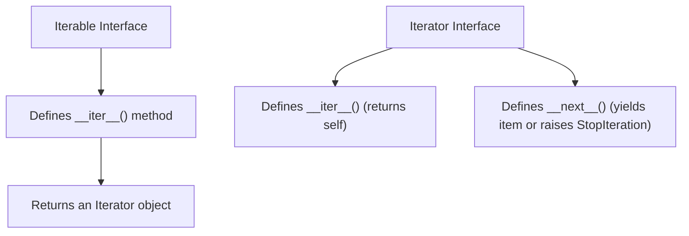

# 🔄 Comprehensive Python Iterators & Iterable Protocol Master Guide

Welcome to the definitive master guide on **Python Iterators & Iterable Protocols**. This guide provides a production-grade reference covering `iter()` and `next()` built-in functions, `StopIteration` exception handling, container iterators, custom class iterator protocols (`__iter__` / `__next__`), two-argument sentinel iterators, range iterator performance benchmarks, `dir(range)` reflection matrix, and cross-version evolutions from Python 2.7 to Python 3.13.

---

## 📌 Table of Contents

1. [Overview & Iterator Protocol Architecture](#1-overview--iterator-protocol-architecture)
2. [Built-In `iter()` and `next()` Mechanics](#2-built-in-iter-and-next-mechanics)
3. [Container Iterators (`list`, `dict`, `str`, `tuple`, File Streams)](#3-container-iterators-list-dict-str-tuple-file-streams)
4. [Custom Class Iterators (`__iter__` & `__next__` Protocols)](#4-custom-class-iterators-__iter__--__next__-protocols)
5. [Two-Argument Sentinel Iterators (`iter(callable, sentinel)`)](#5-two-argument-sentinel-iterators-itercallable-sentinel)
6. [Range Sequence Iterators & Memory Benchmarks](#6-range-sequence-iterators--memory-benchmarks)
7. [Runtime Introspection & Reflection Matrix (`dir(range)`)](#7-runtime-introspection--reflection-matrix-dirrange)
8. [Cross-Version Evolution (Python 2.7 to Python 3.13)](#8-cross-version-evolution-python-27-to-python-313)
9. [Practical Code Examples](#9-practical-code-examples)
10. [Common Pitfalls & Best Practices](#10-common-pitfalls--best-practices)

---

## 1. Overview & Iterator Protocol Architecture

In Python, iteration is governed by two core abstract interfaces from `collections.abc`:



- **Iterable**: An object capable of returning its members one at a time (e.g. `list`, `tuple`, `dict`, `str`, `set`, `range`). Defines `__iter__()`.
- **Iterator**: A stateful stream object representing a position in a sequence. Defines `__iter__()` (returning `self`) and `__next__()` (fetching the next element or raising `StopIteration`).

---

## 2. Built-In `iter()` and `next()` Mechanics

The built-in function `iter(obj)` calls `obj.__iter__()`, returning an iterator. The built-in function `next(iterator)` calls `iterator.__next__()`.

```python
numbers = [10, 20, 30]

# 1. Create an iterator from an iterable using iter()
num_iter = iter(numbers)  # <list_iterator object>

# 2. Fetch elements using next()
print(next(num_iter))  # 10
print(next(num_iter))  # 20
print(next(num_iter))  # 30

# 3. Safe Exhaustion & Default Handling
print(next(num_iter, "EXHAUSTED"))  # "EXHAUSTED" (No StopIteration raised!)
```

### Underlying `for` Loop Mechanism

```python
# What you write:
for item in container:
    process(item)

# Equivalent Python mechanics:
_iterator = iter(container)
while True:
    try:
        item = next(_iterator)
    except StopIteration:
        break
    process(item)
```

---

## 3. Container Iterators (`list`, `dict`, `str`, `tuple`, File Streams)

Different container types produce specialized iterator objects optimized for their internal data structures:

| Container Type | Built-In Iterator Class | Iteration Order / Behavior |
| :--- | :--- | :--- |
| **List (`list`)** | `list_iterator` | Sequential zero-based indexing |
| **Tuple (`tuple`)** | `tuple_iterator` | Sequential immutable sequence traversal |
| **Dictionary Keys (`dict.keys()`)** | `dict_keyiterator` | Insertion-order key stream |
| **Dictionary Values (`dict.values()`)** | `dict_valueiterator` | Insertion-order value stream |
| **Dictionary Items (`dict.items()`)** | `dict_itemiterator` | Insertion-order `(key, value)` tuple stream |
| **String (`str`)** | `str_iterator` | Unicode character-by-character stream |
| **File (`TextIOWrapper`)** | `TextIOWrapper` (Self) | Memory-efficient lazy line-by-line stream |

```python
# File line iteration (memory-efficient streaming)
with open("data.txt", "r", encoding="utf-8") as f:
    # 'f' is its own iterator; lines are read lazily from disk without loading full file into RAM
    for line in f:
        print(line.rstrip())
```

---

## 4. Custom Class Iterators (`__iter__` & `__next__` Protocols)

To make a custom class an iterator, implement both `__iter__()` returning `self` and `__next__()` returning elements or raising `StopIteration`:

```python
from typing import Iterator

class AlphabetIterator:
    """
    Stateful custom iterator yielding uppercase alphabet characters.
    """
    def __init__(self, limit: int = 5) -> None:
        self.chars = [chr(i) for i in range(ord('A'), ord('Z') + 1)]
        self.limit = min(limit, len(self.chars))
        self.index = 0

    def __iter__(self) -> Iterator[str]:
        return self

    def __next__(self) -> str:
        if self.index >= self.limit:
            raise StopIteration("End of character sequence reached.")
        char = self.chars[self.index]
        self.index += 1
        return char

# Usage:
for letter in AlphabetIterator(3):
    print(letter)  # Outputs: A, B, C
```

---

## 5. Two-Argument Sentinel Iterators (`iter(callable, sentinel)`)

The built-in `iter()` function supports a two-argument signature: `iter(callable, sentinel)`. It calls `callable()` with zero arguments on each `next()` invocation until the returned value equals `sentinel`, whereupon `StopIteration` is raised automatically.

```python
import random

def roll_die() -> int:
    return random.randint(1, 6)

# Continuously roll die until a 6 (sentinel) is rolled:
roll_stream = iter(roll_die, 6)
for roll in roll_stream:
    print(f"Rolled: {roll}")  # Loops until 6 is encountered
```

---

## 6. Range Sequence Iterators & Memory Benchmarks

### Lazy Sequence Evaluation

`range(start, stop, step)` objects do not store integers in RAM. Instead, calling `iter(range(n))` creates a C-level `range_iterator` containing only 3 integer parameters (`start`, `stop`, `step`).

### Memory & Performance Benchmarks

```python
import sys

# O(1) Memory Footprint of range_iterator:
r_iter = iter(range(1_000_000))
print(f"range_iterator size : {sys.getsizeof(r_iter)} bytes")  # ~48 bytes (O(1))

# O(N) Memory Footprint of materialized list iterator:
m_list = list(range(1_000_000))
l_iter = iter(m_list)
print(f"materialized list size: {sys.getsizeof(m_list)} bytes")  # ~8 MB (O(N))
```

> [!NOTE]
> `iter(range(1_000_000))` consumes the exact same memory (~48 bytes) as `iter(range(10))`.

---

## 7. Runtime Introspection & Reflection Matrix (`dir(range)`)

Inspecting `dir(range)` reveals available attributes and methods on Python `range` objects:

```python
r = range(10, 100, 5)

# Attributes
print("Start :", r.start)  # 10
print("Stop  :", r.stop)   # 100
print("Step  :", r.step)   # 5

# Methods
print("Index of 25:", r.index(25))  # 3
print("Count of 25:", r.count(25))  # 1

# Non-dunder attributes/methods via dir(range):
public_members = [m for m in dir(r) if not m.startswith("__")]
print("Public Members:", public_members)
# Output: ['count', 'index', 'start', 'step', 'stop']
```

---

## 8. Cross-Version Evolution (Python 2.7 to Python 3.13)

### Version Evolution Matrix

| Python Release | Core Iterator & Range Features | Syntax / Protocol / Architectural Changes |
| :--- | :--- | :--- |
| **Python 2.7** | `xrange()`, `iterator.next()`, `d.iterkeys()`, `d.itervalues()`, `d.iteritems()` | Iterators used `.next()` method instead of `__next__()`. `range()` eagerly built lists in RAM; `xrange()` was lazy. |
| **Python 3.3** | Delegating Generators (`yield from`, PEP 380) | `yield from` allows an iterator or generator to delegate part of its operations to another iterator cleanly. |
| **Python 3.4** | `pathlib` standard library & PEP 3114 standardization | Standardized `__next__()` method across standard library. `range()` replaced legacy `xrange()`. |
| **Python 3.5–3.8** | Async Iterators (`__aiter__`, `__anext__`), Dict Insertion Order (3.7), `reversed(dict.keys())` (3.8) | Added native `async for` support; guaranteed dictionary insertion order; positional-only parameter support (`/`). |
| **Python 3.9–3.11**| Generic Type Hinting (3.9), Adaptive Bytecode Interpreter (3.11) | Standard collections support `list[int]` type hints; CPython 3.11 Specializing Adaptive Interpreter sped up for-loops and iterators by 10–25%. |
| **Python 3.12–3.13**| PEP 695 `type` syntax (3.12), Free-Threaded CPython without GIL (3.13, PEP 703), Tier 2 JIT | Free-threaded execution allows multithreaded iterators to run across multiple CPU cores without GIL lock contention; Tier 2 JIT optimizes range execution. |

### Python 2.7 vs Python 3 Code Comparison

#### Python 2.7 (Legacy):
```python
# Python 2.7 syntax
r = xrange(1, 5)
itr = r.__iter__()
print itr.next()  # Using .next() method

d = {"a": 1, "b": 2}
for k in d.iterkeys():  # Legacy iterkeys()
    print k
```

#### Python 3.3 - 3.13 (Modern):
```python
# Modern Python syntax
r = range(1, 5)
itr = iter(r)
print(next(itr))  # Built-in next() calling __next__()

d = {"a": 1, "b": 2}
for k in d.keys():  # Dynamic view iterator
    print(k)
```

---

## 9. Practical Code Examples

### Example 1: Basic `iter()` and `next()`
```python
itr = iter(["Apple", "Banana", "Cherry"])
print(next(itr))  # "Apple"
print(next(itr))  # "Banana"
```

### Example 2: Safe `next()` with Default
```python
itr = iter([42])
print(next(itr, None))  # 42
print(next(itr, None))  # None (Safe, no StopIteration exception!)
```

### Example 3: Dictionary View Iterators
```python
grades = {"Alan": 95, "Sara": 98}
for student, score in grades.items():
    print(f"{student}: {score}")
```

### Example 4: Sentinel Function Reader
```python
def get_user_input():
    return input("Command > ")

# Keep requesting input until user enters 'quit'
# for cmd in iter(get_user_input, "quit"):
#     process_command(cmd)
```

### Example 5: Range Indexing and Introspection
```python
r = range(5, 50, 5)
print(f"Start: {r.start}, Stop: {r.stop}, Step: {r.step}")
print(f"20 is at index: {r.index(20)}")
```

---

## 10. Common Pitfalls & Best Practices

1. **Re-using Exhausted Iterators**:
   - *Pitfall*: Iterators are stateful single-pass streams. Traversing an exhausted iterator yields no items.
   - *Fix*: Create a new iterator via `iter(container)` or re-instantiate custom iterator classes.

2. **Calling `iterator.next()` instead of `next(iterator)`**:
   - *Pitfall*: `iterator.next()` was removed in Python 3.0 and raises `AttributeError`.
   - *Fix*: Always use the built-in function `next(iterator)`.

3. **Materializing Large Ranges into Lists**:
   - *Pitfall*: Writing `list(range(100_000_000))` consumes gigabytes of RAM.
   - *Fix*: Iterate directly over `range(100_000_000)` or `iter(range(100_000_000))` for $O(1)$ memory usage.
