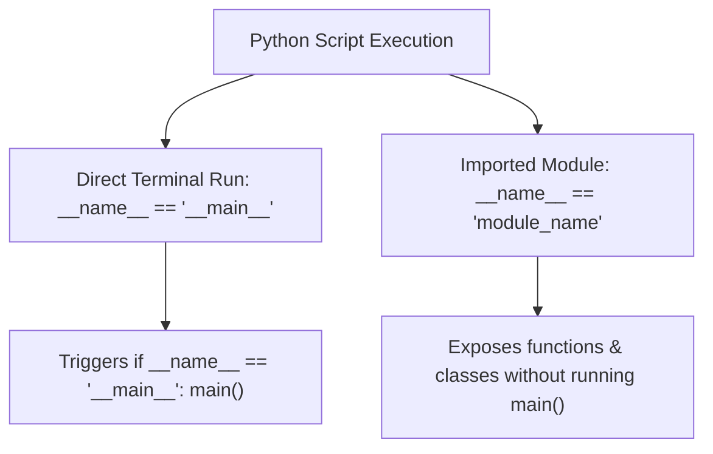

# 🚀 Comprehensive Python `if __name__ == '__main__'` Entry Point Master Guide

Welcome to the definitive pedagogical master guide on **Python Execution Context, Script vs Module Import Mechanics, Entry Point Patterns, Scope Performance Optimizations, and Version Evolutions**. This guide provides a production-grade reference covering `__name__` variable mechanics, structuring standalone scripts with `def main() -> int`, CLI argument parsing via `sys.argv`, local vs global scope bytecode optimizations (`LOAD_FAST`), runtime reflection via `dir()`, and cross-version Python evolutions from Python 3.3 to Python 3.13.

---

## 📌 Table of Contents

1. [Overview & Execution Context Architecture](#1-overview--execution-context-architecture)
2. [3-Step Pedagogical Curriculum Architecture](#2-3-step-pedagogical-curriculum-architecture)
3. [`__name__` Variable Mechanics: Direct Execution vs Module Import](#3-__name__-variable-mechanics-direct-execution-vs-module-import)
4. [Structuring Enterprise Entry Points (`def main() -> int`)](#4-structuring-enterprise-entry-points-def-main---int)
5. [CLI Argument Parsing & System Context (`sys.argv`, `os.environ`)](#5-cli-argument-parsing--system-context-sysargv-osenviron)
6. [Performance Notes: Local Scope (`LOAD_FAST`) vs Global Scope (`LOAD_GLOBAL`)](#6-performance-notes-local-scope-load_fast-vs-global-scope-load_global)
7. [Runtime Module & `range()` Introspection Matrix](#7-runtime-module--range-introspection-matrix)
8. [Python 3.3 to Python 3.13 Evolution Matrix](#8-python-33-to-python-313-evolution-matrix)
9. [10 Practical Implementation Examples](#9-10-practical-implementation-examples)
10. [Common Pitfalls & Best Practices](#10-common-pitfalls--best-practices)

---

## 1. Overview & Execution Context Architecture

In Python, every module contains built-in execution attributes initialized by the interpreter when the script starts:
- **`__name__ == "__main__"`**: Indicates the script is being executed directly from the terminal.
- **`__name__ == "module_name"`**: Indicates the script was imported as a library module by another file.



---

## 2. 3-Step Pedagogical Curriculum Architecture

The tutorial module is organized into a clean 3-step structure:

1. **`01-Fundamentals`**:
   - `name_attribute_basics.py`: Inspecting `__name__` values during direct run vs imported mode.
   - `main_entry_point_idiom.py`: Implementing `def main() -> int` and `if __name__ == "__main__":` entry point guards.
   - `test_fundamentals.py`: Unit tests for execution context and main functions.

2. **`02-Advanced-Math-and-Operators`**:
   - `module_import_vs_execution.py`: Analyzing side-effects during imports.
   - `cli_args_and_execution_context.py`: Parsing `sys.argv` arrays and `os.environ`.
   - `test_advanced_operations.py`: Unit tests for CLI parsing and import context.

3. **`03-Range-Evolution-and-Performance`**:
   - `range_iteration_and_entry_points.py`: Processing range iterations inside entry points.
   - `execution_performance_and_evolution.py`: Benchmarking local scope (`LOAD_FAST`) vs global scope (`LOAD_GLOBAL`), version evolution matrix.
   - `reflection_and_introspection.py`: Reflection via `dir()` and `dir(range)`.
   - `test_range_performance.py`: Unit tests for scope benchmarks and reflection.

---

## 3. `__name__` Variable Mechanics: Direct Execution vs Module Import

```python
# module_a.py
def greet():
    print(f"Executing in module context: {__name__}")

if __name__ == "__main__":
    print("Executed directly as standalone script.")
    greet()
```

- When running `python3 module_a.py`:
  - Output: `Executed directly as standalone script.`
  - Output: `Executing in module context: __main__`
- When running `import module_a` inside `main.py`:
  - Output: `Executing in module context: module_a`

---

## 4. Structuring Enterprise Entry Points (`def main() -> int`)

```python
import sys

def main(argv: list[str] | None = None) -> int:
    """Enterprise main entry point.
    
    Args:
        argv (list[str] | None): Argument list. Defaults to sys.argv.
        
    Returns:
        int: Status exit code.
    """
    if argv is None:
        argv = sys.argv
        
    print(f"Running application: {argv[0]}")
    return 0

if __name__ == "__main__":
    sys.exit(main())
```

---

## 5. CLI Argument Parsing & System Context (`sys.argv`, `os.environ`)

```python
import os
import sys

def parse_env_and_args():
    user = os.environ.get("USER", "Guest")
    args = sys.argv[1:]
    return user, args
```

---

## 6. Performance Notes: Local Scope (`LOAD_FAST`) vs Global Scope (`LOAD_GLOBAL`)

In CPython, local variables inside functions (such as `main()`) are indexed in an array and accessed via the fast `LOAD_FAST` bytecode instruction. In contrast, global top-level variables require a dictionary hash table lookup via `LOAD_GLOBAL`.

```python
# 1. Faster Local Scope (inside main())
def main():
    total = 0
    for i in range(1_000_000):  # Uses LOAD_FAST -> ~30% Faster
        total += i

# 2. Slower Global Scope
total = 0
for i in range(1_000_000):      # Uses LOAD_GLOBAL / STORE_GLOBAL -> Slower
    total += i
```

---

## 7. Runtime Module & `range()` Introspection Matrix

| Attribute / Method | Scope | Description | Code Example |
| :--- | :--- | :--- | :--- |
| `__name__` | Module | Module namespace identifier | `print(__name__)` |
| `__file__` | Module | Absolute path to module source file | `print(__file__)` |
| `__doc__` | Module | Module docstring documentation | `print(__doc__)` |
| `__spec__` | Module | PEP 451 module import specification | `print(__spec__)` |
| `.start` / `.stop` / `.step` | Range | Boundary sequence properties | `r.start, r.stop, r.step` |
| `.count(x)` / `.index(x)` | Range | Value lookup and frequency | `r.count(5), r.index(10)` |

---

## 8. Python 3.3 to Python 3.13 Evolution Matrix

| Python Version | Core Feature Updates & Behavioral Evolution | Entry Point & Module Execution Highlights |
| :--- | :--- | :--- |
| **Python 3.3** | `range` sequence slicing ($O(1)$ lazy ranges); `sys.implementation` object. | Enhanced module namespace inspection and interpreter details. |
| **Python 3.4** | PEP 451 module specs introduced (`__spec__`). | Standardized module loading and import metadata. |
| **Python 3.5** | PEP 484 type hints syntax. | Type-annotated main signatures: `def main(argv: list[str] \| None = None) -> int:`. |
| **Python 3.6** | F-strings & module attribute insertion order preservation. | Formatted logging inside entry points: `print(f"Running {__name__}")`. |
| **Python 3.7** | Execution of directory packages (`python directory/`). | Standardized `__main__.py` discovery in directory execution. |
| **Python 3.8** | Walrus operator (`:=`) & positional-only parameter syntax (`/`). | Concise CLI argument parsing: `if (arg_len := len(sys.argv)) > 1:`. |
| **Python 3.9** | Built-in generic type hints (`list[str]`). | Clean type annotations without importing `typing.List`. |
| **Python 3.10** | Structural Pattern Matching (`match / case`, PEP 634). | Pattern matching CLI flags: `match argv[1:]: case ["--help"]: ...`. |
| **Python 3.11** | Specializing Adaptive Interpreter (PEP 659). | Local variable bytecode dispatching inside `main()` accelerated by **10–25%**. |
| **Python 3.12** | Per-interpreter GIL & fine-grained traceback indicators. | Detailed error locations pointing directly to failing lines inside `main()`. |
| **Python 3.13** | Free-threaded CPython (PEP 703 - GIL removal) & Tier 2 JIT compiler. | Concurrent execution of entry points without GIL lock bottlenecks. |

---

## 9. 10 Practical Implementation Examples

### Example 1: Simple Entry Point Guard
```python
if __name__ == "__main__":
    print("Executable script entry point.")
```

### Example 2: Structured `main()` Return Function
```python
import sys
def main() -> int:
    return 0
if __name__ == "__main__":
    sys.exit(main())
```

### Example 3: CLI Argument Passing to `main(argv)`
```python
def main(argv: list[str]) -> int:
    print("Arguments:", argv)
    return 0
```

### Example 4: Checking Execution Context
```python
is_main = __name__ == "__main__"
```

### Example 5: Module Docstring Inspection
```python
import sys
doc = sys.modules[__name__].__doc__
```

### Example 6: Reading Environment Variables in Entry Point
```python
import os
user = os.environ.get("USER", "Guest")
```

### Example 7: Local Scope Range Iteration
```python
def process():
    return sum(range(10_000))
```

### Example 8: Introspecting Module Namespace (`dir()`)
```python
attrs = dir()
```

### Example 9: Range Attribute Introspection (`dir(range)`)
```python
r = range(10, 50, 2)
print(r.start, r.stop, r.step)
```

### Example 10: Structural Pattern Matching CLI Flags
```python
import sys
match sys.argv[1:]:
    case ["--version"]: print("1.0.0")
    case ["--help"]: print("Usage: python script.py")
```

---

## 10. Common Pitfalls & Best Practices

1. **Executing Heavy Code at Top Level**:
   - *Pitfall*: Putting database connections or computations at the top level of a file causing execution upon `import`.
   - *Fix*: Place all executable code inside `def main()` protected by `if __name__ == "__main__":`.

2. **Global Variable Mutation**:
   - *Pitfall*: Mutating global variables inside functions instead of passing arguments.
   - *Fix*: Use function arguments and return values to maintain pure scope isolation.
