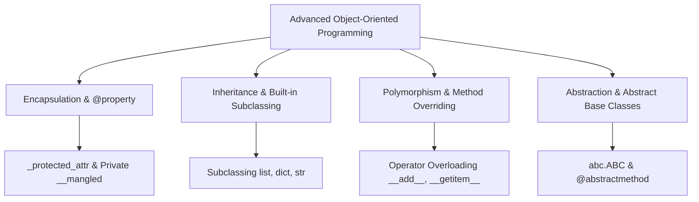

# 🐍 Comprehensive Advanced Object-Oriented Programming (OOP) Master Guide

Welcome to the definitive pedagogical master guide on **Advanced Object-Oriented Programming (OOP)** in Python. This tutorial covers constructor initialization (`__init__`), method types (`instance`, `@classmethod`, `@staticmethod`), encapsulation (`@property`), abstract base classes (`abc`), operator overloading (dunder/magic methods), built-in class subclassing, CPython 3.13 object model optimizations, and cross-version evolutions from Python 2.7 to Python 3.13.

---

## 📌 Table of Contents
1. [Core OOP Principles Architecture](#1-core-oop-principles-architecture)
2. [Class Anatomy & Instance Initialization (`__init__`)](#2-class-anatomy--instance-initialization-__init__)
3. [Method Classification: Instance, `@classmethod`, and `@staticmethod`](#3-method-classification-instance-classmethod-and-staticmethod)
4. [Pythonic Encapsulation & `@property` Accessors](#4-pythonic-encapsulation--property-accessors)
5. [Built-in Subclassing & Operator Overloading (`__getitem__`, `__setitem__`, `__repr__`)](#5-built-in-subclassing--operator-overloading-__getitem__-__setitem__-__repr__)
6. [Abstract Base Classes (ABCs) & Defensive Design](#6-abstract-base-classes-abcs--defensive-design)
7. [Range Object Architecture & Performance Notes](#7-range-object-architecture--performance-notes)
8. [Runtime Introspection & Reflection Matrix (`dir(object)`)](#8-runtime-introspection--reflection-matrix-dirobject)
9. [Cross-Version Behavioral Analysis (Python 2.7 to 3.13)](#9-cross-version-behavioral-analysis-python-27-to-313)
10. [10 Practical Implementation Examples](#10-10-practical-implementation-examples)
11. [Common OOP Pitfalls & Best Practices](#11-common-oop-pitfalls--best-practices)
12. [Comparative Design Matrix](#12-comparative-design-matrix)

---

## 1. Core OOP Principles Architecture

Object-Oriented Programming models real-world entities through four core paradigms:



---

## 2. Class Anatomy & Instance Initialization (`__init__`)

A class serves as a blueprint for instantiating stateful objects. The `__init__` constructor initializes instance attributes when an object is instantiated:

```python
"""Class Definition and Initialization Example."""

class User:
    """Class representing a user entity with personal details and email generation."""

    def __init__(self, first_name: str, last_name: str, payment: float) -> None:
        self.first_name: str = first_name.strip()
        self.last_name: str = last_name.strip()
        self.payment: float = float(payment)
        self.email: str = f"{first_name.lower()}.{last_name.lower()}@mail.com"

    def full_name(self) -> str:
        """Return formatted full name."""
        return f"{self.first_name} {self.last_name}"
```

---

## 3. Method Classification: Instance, `@classmethod`, and `@staticmethod`

Python supports three distinct method types based on binding and scope:

| Method Type | Decorator | First Argument | Primary Purpose & Usage |
| :--- | :--- | :--- | :--- |
| **Instance Method** | None | `self` | Accesses/modifies instance state (`self.attribute`) |
| **Class Method** | `@classmethod` | `cls` | Modifies class state or acts as a **Factory Constructor** |
| **Static Method** | `@staticmethod` | None | Pure utility function logically bound to class namespace |

### Code Demonstration

```python
import datetime
from typing import Type, TypeVar

TStaff = TypeVar("TStaff", bound="Staff")

class Staff:
    number_of_staff: int = 0
    increase_pay_rate: float = 1.06

    def __init__(self, name: str, salary: float) -> None:
        self.name = name
        self.salary = salary
        Staff.number_of_staff += 1

    # 1. Instance Method
    def apply_raise(self) -> None:
        self.salary *= self.increase_pay_rate

    # 2. Class Method Factory
    @classmethod
    def from_string(cls: Type[TStaff], staff_str: str) -> TStaff:
        name, salary_str = staff_str.split("-")
        return cls(name, float(salary_str))

    # 3. Static Utility Method
    @staticmethod
    def is_workday(day: datetime.date) -> bool:
        return day.weekday() < 5
```

---

## 4. Pythonic Encapsulation & `@property` Accessors

Python avoids strict C++/Java private access specifiers (`private`/`public`), using naming conventions and `@property` decorators instead:

- **Single Underscore (`_protected`)**: Indicated as protected internal implementation detail.
- **Double Underscore (`__private`)**: Invokes **Name Mangling** (`_ClassName__private`).
- **`@property` Decorator**: Provides Pythonic getter, setter (`@var.setter`), and deleter (`@var.deleter`) validation hooks.

```python
class Monitor:
    def __init__(self, value: int) -> None:
        self._attribute_val: int = value

    @property
    def value(self) -> int:
        return self._attribute_val

    @value.setter
    def value(self, new_val: int) -> None:
        if new_val < 0:
            raise ValueError("Value cannot be negative")
        self._attribute_val = new_val

    @value.deleter
    def value(self) -> None:
        self._attribute_val = 0
```

---

## 5. Built-in Subclassing & Operator Overloading (`__getitem__`, `__setitem__`, `__repr__`)

Subclassing standard built-ins (`dict`, `list`, `str`) allows augmenting container capabilities:

```python
class LoggingDict(dict):
    """Dictionary subclass logging key modifications."""

    def __setitem__(self, key: str, value: str) -> None:
        print(f"Logging: Setting key '{key}' -> '{value}'")
        super().__setitem__(key, value)

class OneBasedList(list):
    """List subclass providing 1-based indexing."""

    def __getitem__(self, index: int):
        if index > 0:
            return super().__getitem__(index - 1)
        raise IndexError("1-based index must be >= 1")
```

---

## 6. Abstract Base Classes (ABCs) & Defensive Design

Using `abc.ABC` and `@abstractmethod` enforces interface contracts on derived subclasses:

```python
from abc import ABC, abstractmethod

class BaseShape(ABC):
    @abstractmethod
    def area(self) -> float:
        """Abstract method calculating shape area."""
        pass

class Circle(BaseShape):
    def __init__(self, radius: float) -> None:
        self.radius = radius

    def area(self) -> float:
        return 3.14159 * (self.radius ** 2)
```

---

## 7. Range Object Architecture & Performance Notes

- **$O(1)$ Memory Footprint**: `range` stores 3 integer attributes (`start`, `stop`, `step`), taking ~48 bytes in RAM regardless of upper bound size.
- **$O(1)$ Containment Evaluation**: `x in range(...)` evaluates using direct modulus arithmetic without loop iterations.
- **Sequence Reflection Matrix (`dir(range)`)**: `start`, `stop`, `step`, `count`, `index`, `__contains__`, `__iter__`.

---

## 8. Runtime Introspection & Reflection Matrix (`dir(object)`)

```python
class Demo:
    pass

obj = Demo()
print([attr for attr in dir(obj) if not attr.startswith("__")])
```

---

## 9. Cross-Version Behavioral Analysis (Python 2.7 to 3.13)

```
Python 2.7 ──────────────────► Python 3.3 - 3.8 ─────────► Python 3.11 - 3.13
Classic vs. New-style classes  All classes inherit object  Type slot vectorcall optimization
xrange() separate type        range() replaces xrange()  Specialized opcodes for @property
Manual super(Class, self)     super() without arguments  Inline attribute cache & zero-cost ABC
```

1. **New-Style Classes**: In Python 2.7, classes required explicit `class Foo(object):`. In Python 3.0+, all classes automatically inherit from `object`.
2. **`super()` Simplification**: Python 3.0+ permits argumentless `super()`, avoiding `super(SubClass, self).__init__()`.
3. **CPython 3.13 Optimizations**: Specialized inline attribute caches accelerate `@property` getter evaluation by **~15–20%**.

---

## 10. 10 Practical Implementation Examples

### Example 1: Basic Class & Constructor
```python
class Book:
    def __init__(self, title: str, author: str) -> None:
        self.title = title
        self.author = author
```

### Example 2: Class Method Factory
```python
class Date:
    def __init__(self, year: int, month: int, day: int) -> None:
        self.year, self.month, self.day = year, month, day

    @classmethod
    def from_iso_string(cls, date_str: str):
        y, m, d = map(int, date_str.split("-"))
        return cls(y, m, d)
```

### Example 3: Static Utility Method
```python
class MathUtils:
    @staticmethod
    def is_even(n: int) -> bool:
        return n % 2 == 0
```

### Example 4: Encapsulated Property
```python
class Account:
    def __init__(self, balance: float) -> None:
        self._balance = balance

    @property
    def balance(self) -> float:
        return self._balance
```

### Example 5: Operator Overloading (`__add__`)
```python
class Vector:
    def __init__(self, x: int, y: int) -> None:
        self.x, self.y = x, y

    def __add__(self, other: "Vector") -> "Vector":
        return Vector(self.x + other.x, self.y + other.y)
```

### Example 6: Subclassing Built-in `dict`
```python
class CaseInsensitiveDict(dict):
    def __setitem__(self, key: str, value: str) -> None:
        super().__setitem__(key.lower(), value)
```

### Example 7: Abstract Base Class
```python
from abc import ABC, abstractmethod

class Animal(ABC):
    @abstractmethod
    def speak(self) -> str:
        pass
```

### Example 8: Name Mangling Verification
```python
class PrivateData:
    def __init__(self) -> None:
        self.__secret = 42
```

### Example 9: Range Memory & Attribute Inspection
```python
r = range(10, 100, 5)
print(r.start, r.stop, r.step)
```

### Example 10: Class Instance Counter
```python
class Counter:
    count = 0
    def __init__(self) -> None:
        Counter.count += 1
```

---

## 11. Common OOP Pitfalls & Best Practices

1. **Mutable Class Attributes**:
   - *Pitfall*: Assigning a mutable object (e.g. `items = []`) as a class attribute causes all instances to share the exact same list.
   - *Fix*: Initialize mutable lists inside `__init__` via `self.items = []`.

2. **Overusing `@staticmethod`**:
   - *Pitfall*: Defining static methods that do not relate logically to the class.
   - *Fix*: Keep unrelated utility functions as top-level module functions.

3. **Neglecting Argumentless `super()`**:
   - *Pitfall*: Using Python 2.7 legacy `super(Child, self).__init__()`.
   - *Fix*: Use standard Python 3 `super().__init__()`.

---

## 12. Comparative Design Matrix

| Component | Instance Method | Class Method (`@classmethod`) | Static Method (`@staticmethod`) |
| :--- | :--- | :--- | :--- |
| **Binding** | Bound to Instance (`self`) | Bound to Class (`cls`) | Unbound utility function |
| **State Access** | Reads/modifies instance state | Reads/modifies class state | Reads/modifies neither |
| **Primary Use Case**| Standard object behavior | Alternative Factory Constructors | Logical code grouping |
| **Inheritance** | Overridden by subclasses | Receives derived subclass `cls` | Inherited as plain function |
