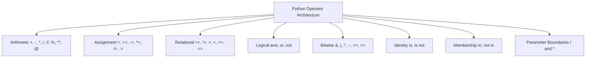

# 🧮 Comprehensive Python Operators Master Guide

Welcome to the definitive pedagogical master guide on **Python Operators**. This guide provides a production-grade reference covering all categories of Python operators, arithmetic division behaviors, bitwise manipulations, matrix multiplication (`@`), Walrus operator expressions (`:=`), parameter boundary operators (`/` and `*`), CPython internal operator overloading, range sequence performance, and cross-version evolutions from Python 2.7 to Python 3.13.

---

## 📌 Table of Contents

1. [Overview & Operator Classifications](#1-overview--operator-classifications)
2. [Arithmetic Operators & Division Evolution](#2-arithmetic-operators--division-evolution)
3. [Assignment & Augmented Assignment Operators](#3-assignment--augmented-assignment-operators)
4. [Relational, Identity, & Membership Operators](#4-relational-identity--membership-operators)
5. [Logical & Bitwise Operators](#5-logical--bitwise-operators)
6. [Walrus Operator (`:=`) & Parameter Boundary Syntax (`/` and `*`)](#6-walrus-operator---parameter-boundary-syntax--and-)
7. [Operator Overloading Protocol Hooks](#7-operator-overloading-protocol-hooks)
8. [Range Sequence Operators & Performance Notes](#8-range-sequence-operators--performance-notes)
9. [Runtime Introspection & Reflection Matrix (`dir(range)`)](#9-runtime-introspection--reflection-matrix-dirrange)
10. [Cross-Version Behavioral Breakdown (Python 2.7 to Python 3.13)](#10-cross-version-behavioral-breakdown-python-27-to-python-313)
11. [10 Practical Implementation Examples](#11-10-practical-implementation-examples)
12. [Common Pitfalls & Best Practices](#12-common-pitfalls--best-practices)

---

## 1. Overview & Operator Classifications

Operators are special symbols and keywords that perform operations on values and variables (operands). Python categorizes operators into 8 distinct families:



---

## 2. Arithmetic Operators & Division Evolution

Arithmetic operators compute mathematical operations between numeric operands:

| Operator | Name | Syntax | Python 2.7 vs. Python 3+ Behavior |
| :--- | :--- | :--- | :--- |
| `+` | Addition | `a + b` | Adds two operands. |
| `-` | Subtraction | `a - b` | Subtracts right operand from left. |
| `*` | Multiplication | `a * b` | Multiplies two operands. |
| `/` | True Division | `a / b` | **Py2.7**: Truncated integer division if both int (`5/2 == 2`). **Py3+**: Always returns `float` (`5/2 == 2.5`). |
| `//` | Floor Division | `a // b` | Rounds division result down to nearest integer (`5//2 == 2`). |
| `%` | Modulo | `a % b` | Returns division remainder (`5 % 2 == 1`). |
| `**` | Exponentiation | `a ** b` | Raises left operand to power of right (`2 ** 3 == 8`). |
| `@` | Matrix Multiply | `A @ B` | Introduced in **Python 3.5 (PEP 465)** for linear algebra matrix multiplication. |

```python
# True Division vs Floor Division in Python 3+
print(5 / 2)   # 2.5 (float)
print(5 // 2)  # 2 (int)
print(5.0 // 2) # 2.0 (float)
```

---

## 3. Assignment & Augmented Assignment Operators

Assignment operators bind values to variables or mutate existing values in place:

```python
# Basic Assignment
x = 10

# Augmented Arithmetic Assignments
x += 5   # Equivalent to x = x + 5  (15)
x -= 3   # Equivalent to x = x - 3  (12)
x *= 2   # Equivalent to x = x * 2  (24)
x /= 4   # Equivalent to x = x / 4  (6.0)
x //= 2  # Equivalent to x = x // 2 (3.0)
x **= 3  # Equivalent to x = x ** 3 (27.0)

# Bitwise Augmented Assignments
b = 16
b &= 4   # b = b & 4
b |= 2   # b = b | 2
b ^= 1   # b = b ^ 1
b <<= 2  # b = b << 2
b >>= 1  # b = b >> 1
```

---

## 4. Relational, Identity, & Membership Operators

### Relational / Comparison Operators
- `==` (Equal to), `!=` (Not equal to), `>` (Greater than), `<` (Less than), `>=` (Greater or equal), `<=` (Less or equal).
- *Note*: Python 2.7 allowed `<>` as an alternative for `!=`. In Python 3+, `<>` raises `SyntaxError`.

### Identity Operators (`is`, `is not`)
Evaluates whether two variables point to the **same object in memory** (`id(a) == id(b)`):

```python
list1 = [1, 2, 3]
list2 = list1        # Alias: Same memory reference
list3 = [1, 2, 3]    # Distinct object with identical values

print(list1 == list3)  # True (Values match)
print(list1 is list3)   # False (Different memory addresses)
print(list1 is list2)   # True (Same memory address)
```

### Membership Operators (`in`, `not in`)
Evaluates sequence containment in lists, tuples, sets, strings, or dictionary keys:

```python
fruits = ["apple", "banana", "cherry"]
print("banana" in fruits)      # True
print("durian" not in fruits)  # True
```

---

## 5. Logical & Bitwise Operators

### Logical Operators (`and`, `or`, `not`)
Python evaluates logical operators using **short-circuit evaluation**:
- `a and b`: Evaluates `b` only if `a` is truthy.
- `a or b`: Evaluates `b` only if `a` is falsy.

### Bitwise Operators (`&`, `|`, `^`, `~`, `<<`, `>>`)
Operate on individual binary bits of integers:

| Bitwise Symbol | Name | Description | Example (`x=12 (1100)`, `y=10 (1010)`) |
| :--- | :--- | :--- | :--- |
| `&` | Bitwise AND | Sets bit to 1 if both bits are 1 | `12 & 10 -> 8 (1000)` |
| `\|` | Bitwise OR | Sets bit to 1 if either bit is 1 | `12 \| 10 -> 14 (1110)` |
| `^` | Bitwise XOR | Sets bit to 1 if exactly one bit is 1 | `12 ^ 10 -> 6 (0110)` |
| `~` | Bitwise NOT | Inverts all bits (Two's complement `~x = -x-1`) | `~12 -> -13` |
| `<<` | Left Shift | Shifts bits left, filling with zeros (`x * 2^n`) | `12 << 2 -> 48` |
| `>>` | Right Shift | Shifts bits right (`x // 2^n`) | `12 >> 1 -> 6` |

---

## 6. Walrus Operator (`:=`) & Parameter Boundary Syntax (`/` and `*`)

### Walrus Operator (`:=` PEP 572 - Python 3.8+)
Assigns values to variables as part of an expression:

```python
# Filtering and transforming inline using Walrus Operator
data = ["apple", "hi", "elephant", "cat", "banana"]
long_words = [upper for word in data if (n := len(word)) > 4 for upper in [word.upper()]]
print(long_words)  # ['APPLE', 'ELEPHANT', 'BANANA']
```

### Parameter Boundary Operators (`/` and `*` PEP 570 - Python 3.8+)
- `/` indicates that preceding parameters are **Positional-Only**.
- `*` indicates that following parameters are **Keyword-Only**.

```python
def process_data(pos_only_val, /, standard_val, *, key_only_val=10):
    return pos_only_val + standard_val + key_only_val

# Correct Usage:
print(process_data(5, 15, key_only_val=20))  # 40

# Error Cases:
# process_data(pos_only_val=5, 15)  -> TypeError: positional-only argument passed as keyword
# process_data(5, 15, 20)           -> TypeError: takes 2 positional arguments but 3 were given
```

---

## 7. Operator Overloading Protocol Hooks

Custom Python classes can overload built-in operators by implementing double-underscore (dunder) methods:

```python
class Vector2D:
    def __init__(self, x: float, y: float) -> None:
        self.x = float(x)
        self.y = float(y)

    # Overload '+' operator
    def __add__(self, other: "Vector2D") -> "Vector2D":
        if not isinstance(other, Vector2D):
            return NotImplemented
        return Vector2D(self.x + other.x, self.y + other.y)

    # Overload '==' operator
    def __eq__(self, other: object) -> bool:
        if not isinstance(other, Vector2D):
            return False
        return self.x == other.x and self.y == other.y

v1 = Vector2D(3, 4)
v2 = Vector2D(1, 2)
print(v1 + v2)  # Calls __add__ -> Vector2D(4.0, 6.0)
```

---

## 8. Range Sequence Operators & Performance Notes

### Range Evolution Across Python Versions
- **Python 2.7**: `range()` generated a full materialized `list` in memory. `xrange()` was a custom generator type for memory-friendly sequence iteration.
- **Python 3.0+**: `range()` replaced `xrange()` entirely, becoming an immutable sequence object that computes elements lazily in $O(1)$ memory.

### Range Memory & Performance Benchmark
```python
import sys

r = range(1_000_000)
lst = list(r[:1000])

print(f"range(1_000_000) RAM footprint: {sys.getsizeof(r)} bytes")  # ~48 bytes (O(1))
print(f"list(1_000) RAM footprint:       {sys.getsizeof(lst)} bytes") # ~8000+ bytes (O(N))
```

---

## 9. Runtime Introspection & Reflection Matrix (`dir(range)`)

Calling `dir(range)` exposes sequence methods and attribute accessors:

```python
r = range(10, 100, 5)

print("Start:", r.start) # 10
print("Stop:",  r.stop)  # 100
print("Step:",  r.step)  # 5
print("Attributes:", [a for a in dir(r) if not a.startswith("__")])
# Output: ['count', 'index', 'start', 'step', 'stop']
```

---

## 10. Cross-Version Behavioral Breakdown (Python 2.7 to Python 3.13)

### Version Evolution Matrix

| Python Version | Core Operator Enhancements & Behavioral Changes | Architectural & Performance Impact |
| :--- | :--- | :--- |
| **Python 2.7 (Legacy)** | `5 / 2` performed integer division (`2`); `<>` syntax for inequality; `cmp(a, b)` function; `xrange()` for lazy ranges. | Legacy operator model; integer division bugs in arithmetic algorithms. |
| **Python 3.0+** | `/` performs float true division; `//` for floor division; `<>` removed; `range()` replaced `xrange()` with $O(1)$ lazy evaluation. | Prevents silent division truncation bugs; unified range sequence type. |
| **Python 3.5** | Matrix multiplication operator `@` introduced (PEP 465) mapped to `__matmul__` and `__rmatmul__`. | Native syntax support for NumPy and matrix linear algebra libraries. |
| **Python 3.8** | Walrus Operator `:=` (PEP 572) for inline assignment expressions; Positional-only parameter syntax `/` (PEP 570). | Enables compact list comprehension conditions; strict API parameter boundaries. |
| **Python 3.10** | Structural Pattern Matching (`match / case` PEP 634) over operator expressions and sequence patterns. | Replaced complex `if/elif/else` operator trees with declarative matching. |
| **Python 3.11** | Specializing Adaptive Interpreter (CPython PEP 659) accelerates binary operator dispatching by **10–25%**. | Major runtime speedup for numeric operator loops. |
| **Python 3.12–3.13** | Tier 2 JIT compiler, free-threaded CPython (PEP 703) accelerating parallel multi-threaded operator operations without GIL. | Parallel operator evaluation across multiple threads. |

---

## 11. 10 Practical Implementation Examples

### Example 1: Basic Arithmetic & Floor Division
```python
def calculate_fuel(distance: float, efficiency: float) -> tuple:
    total_liters = distance / efficiency
    full_tanks = int(distance // (efficiency * 50))
    return total_liters, full_tanks
```

### Example 2: Walrus Operator in While Loop
```python
# Read lines dynamically until empty string
lines = []
# while (line := input("> ")) != "":
#     lines.append(line)
```

### Example 3: Bitwise Flag Masking
```python
READ_PERMISSION = 0b100
WRITE_PERMISSION = 0b010
EXEC_PERMISSION = 0b001

user_permissions = READ_PERMISSION | WRITE_PERMISSION
has_write = bool(user_permissions & WRITE_PERMISSION)  # True
```

### Example 4: Positional-Only Parameter Boundary
```python
def divide_values(numerator, denominator, /):
    return numerator / denominator
```

### Example 5: Custom Matrix `@` Overloading
```python
class Matrix:
    def __init__(self, val): self.val = val
    def __matmul__(self, other): return Matrix(self.val * other.val)
```

### Example 6: Short-Circuit Guard Clause
```python
user = None
is_admin = user is not None and user.is_admin  # Safe from AttributeError
```

### Example 7: `operator.itemgetter` Sorting
```python
import operator
items = [{"name": "A", "price": 30}, {"name": "B", "price": 10}]
items.sort(key=operator.itemgetter("price"))
```

### Example 8: Identity vs Equality Check
```python
a = [10, 20]
b = [10, 20]
print(a == b)  # True
print(a is b)  # False
```

### Example 9: Range Slicing & Indexing
```python
r = range(100, 200, 10)
print(r[2])      # 120
print(r[:3])     # range(100, 130, 10)
```

### Example 10: Range Attribute Reflection
```python
r = range(0, 50, 5)
print(r.start, r.stop, r.step, r.index(25))  # 0 50 5 5
```

---

## 12. Common Pitfalls & Best Practices

1. **Confusing `==` with `is`**:
   - *Pitfall*: Using `a is b` to compare values (strings or integers). CPython caches small integers (-5 to 256) and short strings, making `is` appear to work for values, but it fails on larger objects.
   - *Fix*: Use `==` for value comparison; use `is` only for identity checks (`obj is None`).

2. **Chained Assignment Mutations**:
   - *Pitfall*: `a = b = []` binds both `a` and `b` to the exact same list instance in memory.
   - *Fix*: Use separate assignments `a = []; b = []`.

3. **Mixing Modulo `%` with Negative Numbers**:
   - *Pitfall*: Python modulo `%` returns results matching the sign of the divisor, unlike C/C++ or Java.
   - *Fix*: Be mindful when translating mathematical modulo algorithms across languages.
