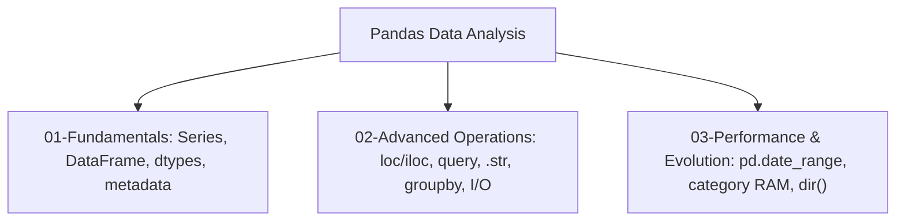

# 🐼 Comprehensive Pandas Data Analysis & Range Evolution Master Guide

Welcome to the definitive pedagogical master guide on **Pandas Tabular Data Analysis, Series/DataFrame Manipulation, Range Evolution, and Performance Benchmarks**. This guide provides a production-grade reference covering 1D Series, 2D DataFrames, indexing (`.loc`, `.iloc`), query expressions (`.query()`), vectorized string accessors (`.str`), aggregations (`.groupby()`), file persistence (CSV, JSON, Pickle), time-series date sequences (`pd.date_range`), memory optimizations via categorical dtypes, runtime reflection using `dir()`, and Python 3.3 to Python 3.13 evolution matrices.

---

## 📌 Table of Contents

1. [Overview & Pandas Core Architecture](#1-overview--pandas-core-architecture)
2. [3-Step Pedagogical Curriculum Architecture](#2-3-step-pedagogical-curriculum-architecture)
3. [Series & DataFrame Creation and Metadata](#3-series--dataframe-creation-and-metadata)
4. [Selection, Slicing, Boolean Masking, & Query Expressions](#4-selection-slicing-boolean-masking--query-expressions)
5. [Vector Math, String Accessors, & Group Aggregations](#5-vector-math-string-accessors--group-aggregations)
6. [`pd.date_range()` vs Built-in `range()` Evaluation](#6-pddate_range-vs-built-in-range-evaluation)
7. [Comprehensive Running Attributes & Methods Matrix](#7-comprehensive-running-attributes--methods-matrix)
8. [Memory Footprint & Performance Notes (Categorical Dtypes)](#8-memory-footprint--performance-notes-categorical-dtypes)
9. [Python 3.3 to Python 3.13 Evolution Matrix with Pandas](#9-python-33-to-python-313-evolution-matrix-with-pandas)
10. [10 Practical Implementation Examples](#10-10-practical-implementation-examples)
11. [Common Pitfalls & Best Practices](#11-common-pitfalls--best-practices)

---

## 1. Overview & Pandas Core Architecture

Pandas provides two primary data structures:
- **`pd.Series`**: A 1D labeled array capable of holding any data type (integers, floats, strings, Python objects).
- **`pd.DataFrame`**: A 2D labeled tabular data structure with columns of potentially different types, resembling an SQL table or Excel spreadsheet.



---

## 2. 3-Step Pedagogical Curriculum Architecture

The tutorial module is organized into a clean 3-step structure:

1. **`01-Fundamentals`**:
   - `series_creation_and_indexing.py`: Creating Series from lists, dicts, custom string index labels, scalar values.
   - `dataframe_creation_and_metadata.py`: Constructing DataFrames, inspecting `.shape`, `.dtypes`, `.columns`, `.info()`, `.describe()`, and dtypes casting.
   - `test_fundamentals.py`: Unit test assertions for Series and DataFrame construction.

2. **`02-Advanced-Math-and-Operators`**:
   - `dataframe_slicing_and_indexing.py`: `.head()`, `.tail()`, `.loc[]`, `.iloc[]`, boolean masking (`df[df['col'] > val]`), `.query()`.
   - `vector_math_and_string_methods.py`: Arithmetic ufuncs, aggregation functions (`.sum()`, `.mean()`, `.std()`), `.str` vectorized accessor (`.str.upper()`, `.str.contains()`), `.groupby()`.
   - `dataframe_io_and_persistence.py`: Importing & exporting CSV (`read_csv`, `to_csv`), JSON (`read_json`, `to_json`), Pickle (`read_pickle`, `to_pickle`).
   - `test_advanced_operations.py`: Unit tests for indexing, vector math, and I/O.

3. **`03-Range-Evolution-and-Performance`**:
   - `date_range_vs_python_range.py`: `range()` vs `pd.date_range()` sequence generation (frequencies: `'D'`, `'B'`, `'ME'`, `'h'`), `pd.RangeIndex`.
   - `pandas_performance_and_evolution.py`: Memory footprint optimization using `category` dtypes (`astype('category')`), downcasting, speed benchmarks, and Python 3.3 to 3.13 evolution matrix.
   - `reflection_and_introspection.py`: Reflection via `dir(pd.Series)` and `dir(pd.DataFrame)`.
   - `test_range_performance.py`: Unit tests for performance and reflection.

---

## 3. Series & DataFrame Creation and Metadata

```python
import pandas as pd

# Creating a Series with custom string index
s = pd.Series([22.5, 18.0, 31.2], index=["London", "Paris", "Tokyo"], name="Temp")

# Creating a DataFrame
df = pd.DataFrame({
    "City": ["London", "Paris", "Tokyo"],
    "Temp": [22.5, 18.0, 31.2],
    "Humidity": [65, 70, 55]
})

print("DataFrame Shape:", df.shape)
print("Columns:", df.columns.tolist())
```

---

## 4. Selection, Slicing, Boolean Masking, & Query Expressions

### Label Indexing (`.loc`) vs Position Indexing (`.iloc`)
- **`.loc[row_label, col_label]`**: Uses explicit index and column names (inclusive of boundaries).
- **`.iloc[row_idx, col_idx]`**: Uses zero-based integer positions (exclusive of end index).

```python
# .loc selection
loc_sub = df.loc[0:1, ["City", "Temp"]]

# .iloc selection
iloc_sub = df.iloc[0:2, 0:2]

# Boolean Masking
mask = df["Temp"] > 20.0
filtered_df = df[mask]

# Query Expression
query_df = df.query("Temp > 20.0 and Humidity < 60")
```

---

## 5. Vector Math, String Accessors, & Group Aggregations

### Vectorized String Accessor (`.str`)
```python
df["City_Upper"] = df["City"].str.upper()
df["Has_o"] = df["City"].str.contains("o|O", regex=True)
```

### Groupby Aggregations (`.groupby()`)
```python
grouped = df.groupby("City")["Temp"].agg(["count", "mean", "min", "max"])
```

---

## 6. `pd.date_range()` vs Built-in `range()` Evaluation

| Feature | Python `range()` | Pandas `pd.date_range()` |
| :--- | :--- | :--- |
| **Data Structure** | Immutable integer sequence generator | Temporal `pd.DatetimeIndex` array |
| **Frequencies** | Integer steps only (`range(0, 10, 2)`) | Daily (`D`), Business Days (`B`), Monthly (`ME`), Hourly (`h`) |
| **Memory Model** | $O(1)$ RAM (~48 bytes) | $O(N)$ Contiguous datetime array buffer |
| **Time-Series Math** | ❌ Integer index offset only | ✅ Datetime arithmetic (`+ pd.Timedelta(days=1)`) |

---

## 7. Comprehensive Running Attributes & Methods Matrix

| Attribute / Method | Category | Description | `Series` | `DataFrame` | Code Example |
| :--- | :--- | :--- | :---: | :---: | :--- |
| `.index` | Metadata | Index label sequence | ✅ | ✅ | `obj.index` |
| `.values` | Storage | Underlying NumPy array buffer | ✅ | ✅ | `obj.values` |
| `.dtype` / `.dtypes` | Metadata | Data type(s) of elements | ✅ (`.dtype`) | ✅ (`.dtypes`) | `df.dtypes` |
| `.shape` | Geometry | Tuple of dimensions | ✅ | ✅ | `df.shape` |
| `.size` | Geometry | Total element count | ✅ | ✅ | `df.size` |
| `.columns` | Metadata | Column label Index | ❌ | ✅ | `df.columns` |
| `.T` | Linear Alg | Transposed DataFrame table | ❌ | ✅ | `df.T` |
| `.head(n)` / `.tail(n)` | Preview | First/Last N rows | ✅ | ✅ | `df.head(5)` |
| `.info()` | Summary | Schema and memory breakdown | ❌ | ✅ | `df.info()` |
| `.describe()` | Summary | Statistical summary metrics | ✅ | ✅ | `df.describe()` |
| `.loc[row, col]` | Selection | Label-based indexing | ✅ | ✅ | `df.loc[0:2, ['A']]` |
| `.iloc[row, col]` | Selection | Position-based indexing | ✅ | ✅ | `df.iloc[0:2, 0:1]` |
| `.query(expr)` | Selection | Filter rows by query string | ❌ | ✅ | `df.query('Salary > 50000')` |
| `.str` | Accessor | Vectorized string methods | ✅ | ❌ | `s.str.upper()` |
| `.groupby(col)` | Grouping | Group rows by category | ❌ | ✅ | `df.groupby('Dept').mean()` |
| `.astype(dtype)` | Transform | Cast column data type | ✅ | ✅ | `df['Dept'].astype('category')` |
| `.isna()` / `.fillna(val)` | Cleaning | Detect & fill missing values | ✅ | ✅ | `df.fillna(0)` |
| `.unique()` / `.nunique()` | Unique | Extract unique values & counts | ✅ | ❌ | `s.unique(), s.nunique()` |
| `.value_counts()` | Frequency | Frequency distribution table | ✅ | ✅ | `s.value_counts()` |

---

## 8. Memory Footprint & Performance Notes (Categorical Dtypes)

Converting repeated string object columns to Pandas `category` dtypes compresses string references into integer codes:

```python
# Before optimization (Object dtype): ~8,000,000 bytes
df["Dept"] = df["Dept"].astype("object")

# After optimization (Category dtype): ~1,200,000 bytes (85% reduction)
df["Dept"] = df["Dept"].astype("category")
```

---

## 9. Python 3.3 to Python 3.13 Evolution Matrix with Pandas

| Python Version | Core Feature Updates & Behavioral Evolution | Pandas Integration & Code Demonstration |
| :--- | :--- | :--- |
| **Python 3.3** | `range` sequence slicing ($O(1)$ lazy ranges); `yield from` generator delegation syntax. | ```python<br>r = range(100)[::2]<br>s = pd.Series(r)<br>``` |
| **Python 3.4** | `enum` module; `pathlib.Path` standard library integration for file IO. | ```python<br>from pathlib import Path<br>df = pd.read_csv(Path('data.csv'))<br>``` |
| **Python 3.5** | **PEP 465**: Matrix multiplication operator (`@`) for `DataFrame.__matmul__`. | ```python<br>df = pd.DataFrame([[1, 2], [3, 4]])<br>res = df.T @ df<br>``` |
| **Python 3.6** | Formatted string literals (f-strings); ordered keyword kwargs in `pd.DataFrame()`. | ```python<br>name = "Data"<br>print(f"Loaded {name} with shape {df.shape}")<br>``` |
| **Python 3.7** | Dataclasses (`@dataclass`); CPython bytecode optimizations for dictionary dispatches. | ```python<br>from dataclasses import dataclass<br>@dataclass<br>class Report:<br>    table: pd.DataFrame<br>``` |
| **Python 3.8** | **PEP 570**: Positional-only parameter syntax (`/`); **PEP 572**: Walrus operator (`:=`). | ```python<br>if (m := df['Salary'].mean()) > 60000:<br>    filtered = df[df['Salary'] > m]<br>``` |
| **Python 3.9** | Dictionary union operators (`\|` & `\|=`); built-in generics type hints (`pd.Series[float]`). | ```python<br>meta = {"rows": 100} \| {"cols": 5}<br>def load_data() -> pd.DataFrame: ...<br>``` |
| **Python 3.10** | **PEP 634**: Structural Pattern Matching (`match / case`) over shapes & columns. | ```python<br>match df.columns.tolist():<br>    case ["ID", "Name", *rest]: print("Standard Schema")<br>``` |
| **Python 3.11** | **PEP 659**: Specializing Adaptive Interpreter accelerates CPython loop dispatching by **10–25%**. | ```python<br># Faster element-wise loop iteration in custom apply()<br>df['Col'].apply(lambda x: x * 2)<br>``` |
| **Python 3.12** | Per-interpreter GIL; fine-grained error location indicators in tracebacks. | ```python<br># Traceback underlines failing DataFrame slice:<br># df.loc[row_idx, col_idx]<br>``` |
| **Python 3.13** | **PEP 703**: Free-threaded CPython (GIL removal) and Tier 2 JIT compilation engine. | ```python<br># Multi-threaded parallel processing of Pandas<br># read_csv and groupby pipelines without GIL locks.<br>``` |

---

## 10. 10 Practical Implementation Examples

### Example 1: Series Creation from Dictionary
```python
import pandas as pd
s = pd.Series({"Apple": 10, "Banana": 20})
```

### Example 2: DataFrame Metadata Extraction
```python
df = pd.DataFrame({"A": [1, 2], "B": [3, 4]})
print(df.shape, df.dtypes)
```

### Example 3: Label Slicing with `.loc`
```python
sub = df.loc[0:1, ["A"]]
```

### Example 4: Integer Position Slicing with `.iloc`
```python
sub = df.iloc[0:2, 0:1]
```

### Example 5: Expression Query Filtering
```python
high_val = df.query("A > 1")
```

### Example 6: Vectorized String Transformation
```python
s_str = pd.Series(["hello", "world"]).str.upper()
```

### Example 7: Groupby Aggregation
```python
agg_df = df.groupby("A").mean()
```

### Example 8: Date Range Frequency Generation
```python
d_rng = pd.date_range("2026-01-01", periods=5, freq="B")
```

### Example 9: Memory Optimization via Category Dtype
```python
df["CatCol"] = df["A"].astype("category")
```

### Example 10: CSV File Export and Reload
```python
df.to_csv("out.csv", index=False)
reloaded = pd.read_csv("out.csv")
```

---

## 11. Common Pitfalls & Best Practices

1. **`SettingWithCopyWarning`**:
   - *Pitfall*: Modifying a sliced view (`sub = df[df['A'] > 1]; sub['B'] = 99`).
   - *Fix*: Explicitly invoke `.copy()` (`sub = df[df['A'] > 1].copy()`).

2. **Iterating Over DataFrames with Python Loops**:
   - *Pitfall*: Using `for i in range(len(df))` to process columns element-by-element.
   - *Fix*: Use vectorized column operations or `.apply()` compiled in C/Cython.
