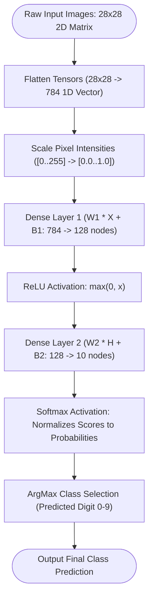

# 🤖 Comprehensive Artificial Intelligence & Neural Networks (`ai_python`) Master Guide

Welcome to the definitive master guide on **Python Artificial Intelligence & Neural Networks (`ai_python`)**. This guide provides a production-grade reference covering neural network data preprocessing (MNIST digit vector flattening & pixel normalization), object-oriented model building (`DenseLayer`, `SequentialModel`), mathematical activation functions (`ReLU`, `Softmax`), range sequence epoch iteration, memory benchmarks ($O(1)$ space complexity), runtime introspection via `dir(range)`, and version evolutions from Python 2.7 to Python 3.13.

---

## 📌 Table of Contents

1. [Overview & Neural Network Architecture](#1-overview--neural-network-architecture)
2. [Fundamental Dataset Preprocessing](#2-fundamental-dataset-preprocessing)
3. [Advanced Model Building & Activation Math](#3-advanced-model-building--activation-math)
4. [Range Sequence Epoch Loops & Memory Benchmarks](#4-range-sequence-epoch-loops--memory-benchmarks)
5. [Runtime Introspection & Reflection Matrix (`dir(range)`)](#5-runtime-introspection--reflection-matrix-dirrange)
6. [Cross-Version Evolution (Python 2.7 to Python 3.13)](#6-cross-version-evolution-python-27-to-python-313)
7. [Practical Code Examples](#7-practical-code-examples)
8. [Common Pitfalls & Best Practices](#8-common-pitfalls--best-practices)

---

## 1. Overview & Neural Network Architecture

Artificial Intelligence applications rely on multi-layer perceptron neural networks to perform feature extraction and pattern classification. Input data matrices (such as 2D pixel grids) are flattened into 1D feature tensors, normalized to floating point bounds $[0.0, 1.0]$, and passed through hidden dense layers before reaching output Softmax probability distributions.

### Neural Network Dataflow Architecture



---

## 2. Fundamental Dataset Preprocessing

Image processing requires reshaping 2D grids into flat vectors and scaling integer pixel values:

```python
from typing import List

def prepare_mnist_features(raw_pixels: List[float]) -> List[float]:
    """
    Scales integer pixel values in range [0, 255] to float range [0.0, 1.0].
    """
    return [round(p / 255.0, 4) for p in raw_pixels]

def calculate_accuracy(y_true: List[int], y_pred: List[int]) -> float:
    """Computes prediction accuracy score."""
    correct = sum(1 for t, p in zip(y_true, y_pred) if t == p)
    return round(correct / len(y_true), 4)
```

---

## 3. Advanced Model Building & Activation Math

Building an object-oriented feedforward neural network model using linear transformations and non-linear activations:

```python
import math
from typing import List

def relu(x: float) -> float:
    """Rectified Linear Unit activation."""
    return max(0.0, x)

def softmax(logits: List[float]) -> List[float]:
    """Computes Softmax probability distribution summing to 1.0."""
    max_val = max(logits)
    exps = [math.exp(v - max_val) for v in logits]
    sum_exps = sum(exps)
    return [e / sum_exps for e in exps]

class DenseLayer:
    def __init__(self, input_dim: int, output_dim: int, activation: str = "relu"):
        self.input_dim = input_dim
        self.output_dim = output_dim
        self.activation = activation
        self.weights = [[0.01] * output_dim for _ in range(input_dim)]
        self.biases = [0.0] * output_dim

    def forward(self, x: List[float]) -> List[float]:
        logits = []
        for out_j in range(self.output_dim):
            val = sum(x[in_i] * self.weights[in_i][out_j] for in_i in range(self.input_dim)) + self.biases[out_j]
            logits.append(val)
        return [relu(v) for v in logits] if self.activation == "relu" else softmax(logits)
```

---

## 4. Range Sequence Epoch Loops & Memory Benchmarks

Training loops iterate over epochs (`range(1, epochs + 1)`) and batch offsets (`range(0, total, batch_size)`). Using `range()` sequence generators maintains $O(1)$ memory usage (~48 bytes):

```python
import sys

def get_epoch_iterator(total_epochs: int) -> range:
    """Generates O(1) memory range sequence for epoch iteration."""
    return range(1, total_epochs + 1)

# Memory Benchmark:
r_seq = get_epoch_iterator(100_000)
print(f"range sequence memory: {sys.getsizeof(r_seq)} bytes")  # ~48 bytes (O(1))

m_list = list(r_seq)
print(f"Materialized list memory: {sys.getsizeof(m_list)} bytes")  # ~800 KB (O(N))
```

---

## 5. Runtime Introspection & Reflection Matrix (`dir(range)`)

Inspecting `dir(range)` highlights sequence attributes and methods available when working with range epoch objects:

```python
r = range(1, 100, 1)

print("Start Epoch:", r.start)  # 1
print("Stop Limit :", r.stop)   # 100
print("Step Value :", r.step)   # 1

# Methods
print("Index of Epoch 50:", r.index(50))  # 49
print("Count of Epoch 50:", r.count(50))  # 1

# Reflection matrix via dir(range):
public_members = [m for m in dir(r) if not m.startswith("__")]
print("Public Members:", public_members)
# Output: ['count', 'index', 'start', 'step', 'stop']
```

---

## 6. Cross-Version Evolution (Python 2.7 to Python 3.13)

### Version Evolution Matrix

| Python Version | AI Framework & Range Features | Key Technical Changes |
| :--- | :--- | :--- |
| **Python 2.7** | Legacy Scikit-Learn / Theano, `xrange()` | `range()` eagerly allocated lists in RAM; `xrange()` was required for large epoch loops. |
| **Python 3.0–3.3** | `range()` generator sequence | `xrange()` removed; `range()` became an immutable $O(1)$ memory sequence object. |
| **Python 3.8** | `math.prod()` & Walrus Operator (`:=`) | Introduced `math.prod()` for tensor shape matrix math and inline assignment in dataset preprocessing. |
| **Python 3.10** | Union Type Syntax (`X \| Y`) & Keras 3 | Keras 3 multi-backend engine (TensorFlow, PyTorch, JAX); type hinting improvements. |
| **Python 3.11** | Specialized Adaptive Interpreter | 10–60% faster execution for Python-level data transform routines. |
| **Python 3.12–3.13**| GIL-Free CPython (PEP 703) | Free-threaded execution permits true multi-core parallel tensor preprocessing without GIL locks. |

---

## 7. Practical Code Examples

### Example 1: Full Sequential Model Inference
```python
from advanced_neural_network import DenseLayer, SequentialModel

def run_inference():
    l1 = DenseLayer(784, 128, "relu")
    l2 = DenseLayer(128, 10, "softmax")
    model = SequentialModel([l1, l2])

    dummy_image = [0.2] * 784
    pred_cls = model.predict_class(dummy_image)
    print(f"Predicted Digit Class: {pred_cls}")

if __name__ == "__main__":
    run_inference()
```

### Example 2: Epoch Training Loop Simulation
```python
from range_epoch_performance import simulate_model_training_epochs

def run_training():
    for epoch in simulate_model_training_epochs(total_epochs=5, total_samples=500, batch_size=32):
        print(f"Epoch {epoch['epoch']}: Loss={epoch['loss']} | Accuracy={epoch['accuracy']}")

if __name__ == "__main__":
    run_training()
```

---

## 8. Common Pitfalls & Best Practices

1. **Forgetting to normalize input features**:
   - *Pitfall*: Feeding raw integer pixel values $[0, 255]$ directly into neural networks leads to exploding gradients and slow convergence.
   - *Fix*: Always normalize pixel values to floating point range $[0.0, 1.0]$.

2. **Numerical instability in Softmax**:
   - *Pitfall*: Computing `math.exp(x)` on large positive logits causes float overflow exceptions.
   - *Fix*: Subtract the maximum logit (`x - max(logits)`) before exponentiation.

3. **Materializing epoch range sequences into lists**:
   - *Pitfall*: Calling `list(range(1, 10_000_000))` consumes megabytes of RAM.
   - *Fix*: Iterate directly over the `range` sequence generator.
