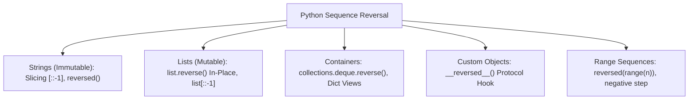

# 🔄 Comprehensive Python Sequence & Range Reversal Master Guide

Welcome to the definitive pedagogical master guide on **Python Sequence & Range Reversal**. This guide provides a production-grade reference covering string reversal mechanics, word-order reversal, in-place list mutation vs. out-of-place lazy iterators, custom `__reversed__()` dunder protocols, dictionary view reversal, range sequence performance, `dir(range)` reflection matrix, and cross-version evolutions from Python 2.7 to Python 3.13.

---

## 📌 Table of Contents

1. [Overview & Reversal Architecture](#1-overview--reversal-architecture)
2. [String Reversal Mechanics (Immutability, Slicing & Iterators)](#2-string-reversal-mechanics-immutability-slicing--iterators)
3. [List & Container In-Place vs. Out-of-Place Reversal](#3-list--container-in-place-vs-out-of-place-reversal)
4. [Custom `__reversed__()` Dunder Protocol & Fallback Protocol](#4-custom-__reversed__-dunder-protocol--fallback-protocol)
5. [Dictionary View Reversal (`dict.keys()`, `dict.values()`, `dict.items()`)](#5-dictionary-view-reversal-dictkeys-dictvalues-dictitems)
6. [Range Sequence Reversal & Memory Benchmarks](#6-range-sequence-reversal--memory-benchmarks)
7. [Runtime Introspection & Reflection Matrix (`dir(range)`)](#7-runtime-introspection--reflection-matrix-dirrange)
8. [Cross-Version Behavioral Breakdown (Python 2.7 to Python 3.13)](#8-cross-version-behavioral-breakdown-python-27-to-python-313)
9. [10 Practical Implementation Examples](#9-10-practical-implementation-examples)
10. [Common Pitfalls & Best Practices](#10-common-pitfalls--best-practices)

---

## 1. Overview & Reversal Architecture

Python provides multiple mechanisms for sequence reversal, depending on mutability, memory constraints, and data structure type:



---

## 2. String Reversal Mechanics (Immutability, Slicing & Iterators)

Because Python strings (`str`) are **immutable**, they cannot be reversed in-place. A new string object must be created:

```python
# 1. Extended Slice Syntax [::-1] (Fastest in CPython)
text = "Python"
rev_slice = text[::-1]  # "nohtyP"

# 2. Built-in reversed() + str.join()
rev_iter = "".join(reversed(text))  # "nohtyP"

# 3. Word Order Reversal in Sentences
sentence = "On a Mac keyboard"
words = sentence.split()
words.reverse()
rev_sentence = " ".join(words)  # "keyboard Mac a On"
```

---

## 3. List & Container In-Place vs. Out-of-Place Reversal

### In-Place Reversal (`list.reverse()`)
Modifies the underlying array in $O(N)$ time and $O(1)$ auxiliary RAM. Returns `None` following Command-Query Separation:

```python
numbers = [1, 2, 3, 4, 5]
numbers.reverse()  # Mutates numbers to [5, 4, 3, 2, 1], returns None
```

### Out-of-Place Reversal (`list[::-1]` and `reversed(list)`)
- `list[::-1]` creates a new list copy ($O(N)$ memory).
- `reversed(list)` returns a lazy `reverse_iterator` without copying items ($O(1)$ memory).

```python
lst = [10, 20, 30]

# New list copy
lst_copy = lst[::-1]  # [30, 20, 10]

# Lazy reverse iterator
rev_iter = reversed(lst)  # <list_reverseiterator object>
```

---

## 4. Custom `__reversed__()` Dunder Protocol & Fallback Protocol

Custom classes can define explicit reverse iteration behavior by implementing the `__reversed__()` hook (PEP 322):

```python
class CustomDeck:
    def __init__(self, cards):
        self.cards = cards

    def __reversed__(self):
        # Yield cards in reverse order
        for card in reversed(self.cards):
            yield card

# Invocation:
deck = CustomDeck(["Heart", "Diamond", "Spade"])
print(list(reversed(deck)))  # ['Spade', 'Diamond', 'Heart']
```

### Sequence Fallback Protocol
If a class does NOT implement `__reversed__()`, Python automatically falls back to calling `__len__()` and `__getitem__()` using descending indices (`obj[len-1]`, `obj[len-2]`, ..., `obj[0]`).

---

## 5. Dictionary View Reversal (`dict.keys()`, `dict.values()`, `dict.items()`)

In Python 3.7+, standard dictionaries preserve insertion order. Python 3.8 (PEP 584) added `__reversed__()` support for dictionary views:

```python
d = {"a": 1, "b": 2, "c": 3}

print(list(reversed(d.keys())))    # ['c', 'b', 'a']
print(list(reversed(d.values())))  # [3, 2, 1]
print(list(reversed(d.items())))   # [('c', 3), ('b', 2), ('a', 1)]
```

---

## 6. Range Sequence Reversal & Memory Benchmarks

Reversing range sequences can be accomplished via `reversed(range(...))` or negative step ranges `range(stop-1, start-1, -step)`:

```python
import sys

# 1. Built-in reversed(range(n))
rev_r = reversed(range(10))  # 9, 8, 7, ..., 0

# 2. Negative step range()
neg_r = range(9, -1, -1)     # 9, 8, 7, ..., 0

# Memory Benchmark (Documentation & Performance Note):
r_iter = reversed(range(1_000_000))
print(f"reversed(range(1M)) RAM footprint: {sys.getsizeof(r_iter)} bytes")  # ~48 bytes (O(1))
```

---

## 7. Runtime Introspection & Reflection Matrix (`dir(range)`)

Calling `dir(range)` exposes sequence methods and attribute accessors available when reversing range bounds:

```python
r = range(10, 100, 5)

print("Start:", r.start) # 10
print("Stop:",  r.stop)  # 100
print("Step:",  r.step)  # 5
print("Attributes:", [a for a in dir(r) if not a.startswith("__")])
# Output: ['count', 'index', 'start', 'step', 'stop']
```

---

## 8. Cross-Version Behavioral Breakdown (Python 2.7 to Python 3.13)

### Version Evolution Matrix

| Python Version | Core Sequence Reversal Enhancements | Architectural & Performance Impact |
| :--- | :--- | :--- |
| **Python 2.7 (Legacy)** | `reversed()` available for sequences implementing `__reversed__()` or `__len__()`/`__getitem__()`; `xrange()` supported lazy reversal. | Legacy sequence reversal model. |
| **Python 3.0–3.4** | `range()` replaced `xrange()` as an $O(1)$ lazy sequence; `reversed(range(n))` returns a `range_iterator`. | Memory-friendly range reversal. |
| **Python 3.5–3.8** | Dicts maintained insertion order (3.7); Python 3.8 (PEP 584) added `__reversed__()` support to `dict_keys`, `dict_values`, and `dict_items`. | Native reverse traversal over dictionary keys and key-value items. |
| **Python 3.9–3.11** | CPython 3.11 Specializing Adaptive Interpreter accelerated sequence slicing `text[::-1]` and range iterator loops by **10–25%**. | Substantial runtime speedup for string and sequence reversal operations. |
| **Python 3.12–3.13** | CPython 3.13 free-threaded execution (PEP 703) enables parallel multi-threaded sequence reversal operations without GIL locks. | Multi-threaded parallel processing acceleration for large sequence reversals. |

---

## 9. 10 Practical Implementation Examples

### Example 1: Reversing String Characters
```python
s = "Hello"
print(s[::-1])  # "olleH"
```

### Example 2: Reversing Words in a Sentence
```python
sentence = "Python is great"
print(" ".join(sentence.split()[::-1]))  # "great is Python"
```

### Example 3: In-Place List Reversal
```python
nums = [1, 2, 3]
nums.reverse()
print(nums)  # [3, 2, 1]
```

### Example 4: Lazy Reverse Iteration
```python
colors = ["red", "green", "blue"]
for color in reversed(colors):
    print(color)
```

### Example 5: Reversing Tuple
```python
tpl = (10, 20, 30)
print(tpl[::-1])  # (30, 20, 10)
```

### Example 6: Reversing Dict Keys and Values
```python
d = {"a": 1, "b": 2}
print(list(reversed(d.keys())))  # ['b', 'a']
```

### Example 7: Deque In-Place Reversal
```python
from collections import deque
d = deque([1, 2, 3])
d.reverse()
print(d)  # deque([3, 2, 1])
```

### Example 8: Reversing Range with Negative Step
```python
print(list(range(5, 0, -1)))  # [5, 4, 3, 2, 1]
```

### Example 9: Custom Class `__reversed__()`
```python
class Stack:
    def __init__(self, items): self.items = items
    def __reversed__(self): return reversed(self.items)
```

### Example 10: Range Attribute Introspection
```python
r = range(0, 10, 2)
print(r.start, r.stop, r.step, list(reversed(r)))  # 0 10 2 [8, 6, 4, 2, 0]
```

---

## 10. Common Pitfalls & Best Practices

1. **Expecting `list.reverse()` to Return a New List**:
   - *Pitfall*: `new_list = old_list.reverse()` assigns `None` to `new_list`.
   - *Fix*: Use `old_list[::-1]` or `list(reversed(old_list))` for out-of-place reversal.

2. **Attempting to Reverse Sets or Un-ordered Iterators Directly**:
   - *Pitfall*: `reversed({1, 2, 3})` raises `TypeError: 'set' object is not reversible`.
   - *Fix*: Materialize set to a list or sorted list first `reversed(sorted(my_set))`.

3. **In-Place String Reversal Fallacy**:
   - *Pitfall*: Expecting `str` methods to modify string in-place.
   - *Fix*: Assign returned reversed string to a variable `s = s[::-1]`.
