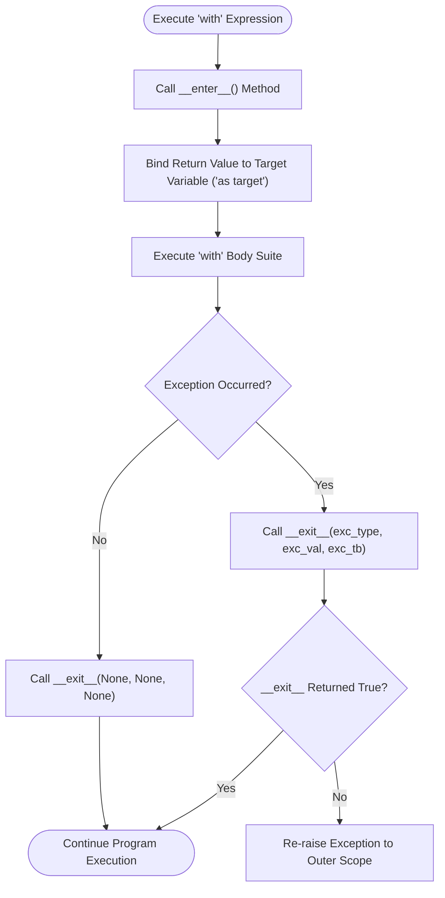

# 🔒 Comprehensive Python With Statement & Context Managers Master Guide

Welcome to the definitive master guide on **Python With Statements & Context Managers**. This guide provides a production-grade reference covering resource management, the context manager protocol (`__enter__` and `__exit__`), generator-based context managers (`@contextmanager`), `ExitStack`, `contextlib.suppress`, bytecode instruction optimization, `dir(range)` sequence reflection, and cross-version evolutions from Python 2.7 to Python 3.13.

---

## 📌 Table of Contents

1. [Overview & Context Manager Architecture](#1-overview--context-manager-architecture)
2. [Class-Based Context Managers (`__enter__` & `__exit__`)](#2-class-based-context-managers-__enter__--__exit__)
3. [Generator-Based Context Managers (`@contextmanager`)](#3-generator-based-context-managers-contextmanager)
4. [Multi-Resource Management (`ExitStack` & `contextlib.suppress`)](#4-multi-resource-management-exitstack--contextlibsuppress)
5. [File I/O: Modern `with open()` vs Legacy `try...finally`](#5-file-io-modern-with-open-vs-legacy-tryfinally)
6. [Range Sequence Iterators & Memory Benchmarks](#6-range-sequence-iterators--memory-benchmarks)
7. [Runtime Introspection & Reflection Matrix (`dir(range)`)](#7-runtime-introspection--reflection-matrix-dirrange)
8. [Cross-Version Evolution (Python 2.7 to Python 3.13)](#8-cross-version-evolution-python-27-to-python-313)
9. [Practical Code Examples](#9-practical-code-examples)
10. [Common Pitfalls & Best Practices](#10-common-pitfalls--best-practices)

---

## 1. Overview & Context Manager Architecture

The `with` statement simplifies resource management by ensuring setup (`__enter__`) and teardown (`__exit__`) routines automatically wrap code block execution, even if exceptions occur during runtime.

### Context Manager Control Flow



---

## 2. Class-Based Context Managers (`__enter__` & `__exit__`)

A custom context manager class implements two special dunder methods:
- **`__enter__(self)`**: Sets up the resource and returns the bound target object.
- **`__exit__(self, exc_type, exc_val, exc_tb)`**: Performs cleanup. Returning `True` suppresses exceptions; returning `False` or `None` lets exceptions propagate.

```python
from typing import Optional, Type, Any

class CustomResource:
    """Class-based context manager for explicit setup and teardown."""
    def __init__(self, resource_name: str) -> None:
        self.name = resource_name

    def __enter__(self) -> 'CustomResource':
        print(f"Allocating resource: {self.name}")
        return self

    def __exit__(
        self,
        exc_type: Optional[Type[BaseException]],
        exc_val: Optional[BaseException],
        exc_tb: Optional[Any]
    ) -> bool:
        print(f"Releasing resource: {self.name}")
        if exc_type is ValueError:
            print("Suppression: Suppressed ValueError exception inside __exit__")
            return True  # Suppress ValueError
        return False  # Do not suppress other exceptions

# Usage:
with CustomResource("DatabaseConnection") as resource:
    print(f"Using active resource: {resource.name}")
```

---

## 3. Generator-Based Context Managers (`@contextmanager`)

The `contextlib.contextmanager` decorator converts a generator function into a context manager:
- Code **before** `yield` acts as `__enter__()`.
- The value **yielded** is bound to the target variable (`as target`).
- Code **after** `yield` inside a `finally` block acts as `__exit__()`.

```python
from contextlib import contextmanager
from typing import Generator, TextIO

@contextmanager
def open_managed_file(filepath: str, mode: str = "r") -> Generator[TextIO, None, None]:
    """Generator-based context manager for managing text file resources."""
    stream = open(filepath, mode, encoding="utf-8")
    try:
        yield stream
    finally:
        stream.close()

# Usage:
with open_managed_file("sample.txt", "w") as f:
    f.write("Writing data via generator context manager\n")
```

---

## 4. Multi-Resource Management (`ExitStack` & `contextlib.suppress`)

### `contextlib.ExitStack`
`ExitStack` dynamically manages an arbitrary number of context managers or cleanup functions:

```python
from contextlib import ExitStack

file_paths = ["file1.txt", "file2.txt", "file3.txt"]
with ExitStack() as stack:
    handles = [stack.enter_context(open(fname, "w")) for fname in file_paths]
    for h in handles:
        h.write("Batch header line\n")
# All file handles automatically closed upon exiting ExitStack context
```

### `contextlib.suppress`
Ignores specified exception types cleanly without verbose `try...except` blocks:

```python
import os
from contextlib import suppress

# Safely delete file ignoring missing file errors
with suppress(FileNotFoundError):
    os.remove("non_existent_file.txt")
```

---

## 5. File I/O: Modern `with open()` vs Legacy `try...finally`

| Metric | Modern `with open()` | Legacy `try...finally: f.close()` |
| :--- | :--- | :--- |
| **Readability** | High, clean declarative structure | Verbose boilerplate code |
| **Exception Safety** | Guaranteed closure under all exit paths | Error-prone if `open()` fails or `close()` omitted |
| **Bytecode Opcode** | Optimized CPython `BEFORE_WITH` instructions | Standard call stack manipulation |

```python
# Modern Python 3 Context Manager Pattern:
with open("data.txt", "r", encoding="utf-8") as f:
    data = f.read()

# Legacy Python 2.7 try...finally Pattern:
f = open("data.txt", "r")
try:
    data = f.read()
finally:
    f.close()
```

---

## 6. Range Sequence Iterators & Memory Benchmarks

Range sequences calculate elements dynamically on demand without storing numbers in memory:

```python
import sys

# O(1) Memory Footprint of range_iterator:
r_iter = iter(range(1_000_000))
print(f"range_iterator RAM: {sys.getsizeof(r_iter)} bytes")  # ~48 bytes (O(1))

# O(N) Memory Footprint of materialized list:
m_list = list(range(1_000_000))
print(f"Materialized list RAM: {sys.getsizeof(m_list)} bytes")  # ~8 MB (O(N))
```

---

## 7. Runtime Introspection & Reflection Matrix (`dir(range)`)

Inspecting `dir(range)` demonstrates sequence attributes and methods:

```python
r = range(10, 100, 5)

print("Start:", r.start)  # 10
print("Stop :", r.stop)   # 100
print("Step :", r.step)   # 5

# Methods
print("Index of 25:", r.index(25))  # 3
print("Count of 25:", r.count(25))  # 1

# Non-dunder attributes/methods via dir(range):
public_members = [m for m in dir(r) if not m.startswith("__")]
print("Public Members:", public_members)
# Output: ['count', 'index', 'start', 'step', 'stop']
```

---

## 8. Cross-Version Evolution (Python 2.7 to Python 3.13)

### Version Evolution Matrix

| Python Release | Context Manager & Range Features | Architectural / Syntax Evolution |
| :--- | :--- | :--- |
| **Python 2.7** | `from __future__ import with_statement` (Py 2.5/2.6), manual `try...finally` | Context managers required explicit import in older 2.x versions; `range()` eagerly built lists. |
| **Python 3.3** | `contextlib.ExitStack` introduced | Dynamic multi-context management added to standard library. |
| **Python 3.4** | `contextlib.suppress`, `redirect_stdout`, `redirect_stderr` | Added utility context managers for error suppression and stream redirection. |
| **Python 3.5** | Async Context Managers (`async with`, `__aenter__`, `__aexit__`) | Added native asynchronous context management protocol (PEP 492). |
| **Python 3.7** | `contextlib.nullcontext` | Added no-op fallback context manager for optional context parameters. |
| **Python 3.10**| Parenthesized Context Managers | Enabled formatted multiline context managers: `with (A() as a, B() as b):`. |
| **Python 3.11**| `contextlib.chdir` & `ExceptionGroup` Integration | Built-in directory switching context manager; handling multi-exception stacks in context teardown. |
| **Python 3.12–3.13**| Free-Threaded CPython without GIL (PEP 703), Zero-Cost Exception Tables | Concurrent thread-safe execution of context managers across CPU cores without GIL locks. |

---

## 9. Practical Code Examples

### Example 1: Basic File Context Manager
```python
with open("sample.txt", "w", encoding="utf-8") as f:
    f.write("Hello World\n")
```

### Example 2: Custom Logging Context Manager
```python
class LogContext:
    def __enter__(self):
        print("[START] Entering operation block")
    def __exit__(self, exc_type, exc_val, exc_tb):
        print("[END] Exiting operation block")

with LogContext():
    print("Executing core operation...")
```

### Example 3: Parenthesized Multi-Context Manager (Python 3.10+)
```python
with (
    open("input.txt", "r", encoding="utf-8") as source,
    open("output.txt", "w", encoding="utf-8") as target
):
    target.write(source.read())
```

---

## 10. Common Pitfalls & Best Practices

1. **Forgetting `return True` when suppressing exceptions in `__exit__`**:
   - *Pitfall*: Returning `False` or `None` causes the exception to propagate out of the `with` block.
   - *Fix*: Explicitly `return True` from `__exit__` when exception suppression is intended.

2. **Forgetting `try...finally` inside `@contextmanager` generators**:
   - *Pitfall*: If an exception is raised inside the `with` block, post-yield cleanup code will be skipped unless wrapped in `try...finally`.
   - *Fix*: Always place post-yield cleanup code inside a `finally:` block in generator context managers.

3. **Not using `ExitStack` for dynamic lists of files**:
   - *Pitfall*: Opening files in a loop without context managers causes file descriptor leaks.
   - *Fix*: Use `contextlib.ExitStack` to manage dynamic lists of context managers.
