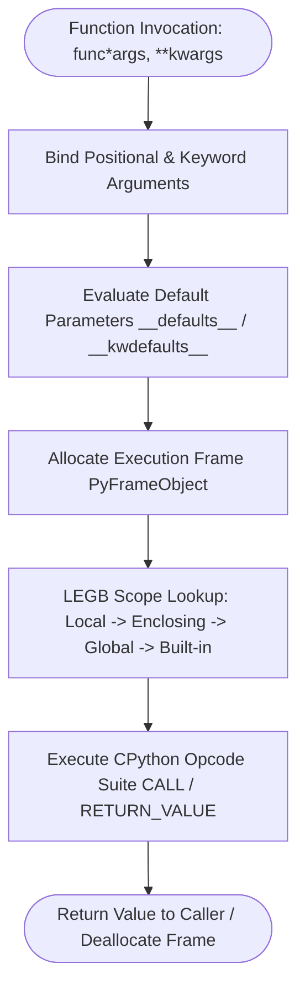

# Technical Documentation: Python Function Mechanics & Cross-Version Architecture

## 1. Executive Summary
This technical documentation provides an in-depth analysis of function definitions in Python, parameter parsing algorithms, scope resolution (LEGB rule), function object memory attributes via `dir()`, and cross-version architectural evolutions from Python 2.7 to Python 3.13.

---

## 2. Function Object Lifecycle & Parameter Resolution

---

## 3. Function Attributes & Reflection Matrix (`dir()`)

Every Python function is an instance of `types.FunctionType`. Inspected via `dir(func)`:

| Dunder Attribute | Data Type | Functional Description |
| :--- | :--- | :--- |
| `__name__` | `str` | The name of the function as declared in source code. |
| `__qualname__` | `str` | Fully qualified dotted name path showing class/enclosing scope context. |
| `__doc__` | `Optional[str]` | Function docstring or `None` if omitted. |
| `__annotations__` | `Dict[str, Any]` | Dictionary mapping parameter/return names to type hint annotations. |
| `__defaults__` | `Optional[Tuple]` | Tuple of default values for positional parameters. |
| `__kwdefaults__` | `Optional[Dict]` | Dictionary of default values for keyword-only parameters. |
| `__code__` | `code` | Compiled bytecode object containing `co_code`, `co_varnames`, `co_argcount`. |
| `__closure__` | `Optional[Tuple]` | Tuple of cell objects binding enclosed non-local variables for closures. |
| `__globals__` | `Dict[str, Any]` | Reference to module global dictionary where function was defined. |
| `__module__` | `str` | Module name string where function was defined. |
| `__call__` | `method` | Dunder call method allowing function object invocation (`func(*args)`). |

---

## 4. `import` vs `from ... import ...` Namespace Mechanics

Understanding how imports load symbols into Python's namespace dictionary is vital for modular program architecture:

### 1. `import module_name`
- **Behavior**: Loads the entire module into Python's `sys.modules` cache and binds the module object to `module_name` in the calling scope.
- **Example**: `import calendar`
- **Access Pattern**: Requires explicit attribute access (`calendar.month(2026, 8)`).
- **Advantage**: Prevents variable shadowing and namespace collision.

### 2. `from module_name import attribute_name`
- **Behavior**: Loads the module into `sys.modules` and binds specific symbol(s) directly into the calling scope's symbol table.
- **Example**: `from typing import Tuple, List, Dict`
- **Access Pattern**: Direct symbol usage (`Tuple[int, float]`).
- **Advantage**: Cleaner, concise code syntax when using specific domain utilities.

---

## 5. Comparative Summary: `Function` vs `Functions-Advanced`

| Architectural Dimension | Basic Function Module (`Function`) | Advanced Function Module (`Functions-Advanced`) |
| :--- | :--- | :--- |
| **Primary Scope** | Core `def` parameters, return values, basic recursion, simple LEGB | Decorators, wrapper functions, `@functools.wraps`, descriptors |
| **Closure Overhead** | Basic closure cell references (`__closure__`) | Multi-layered nested closures, dynamic wrapper interception |
| **Invocation Latency** | Direct opcode `CALL` execution | Stack frame wrapping latency + wrapper function execution |
| **Parameter Complexity** | Standard positional, `*args`, `**kwargs` | Positional-only (`/`), keyword-only (`*`), PEP 612 `ParamSpec` |
| **Dispatch Strategy** | Dictionary/If-Elif branch selection | Single/multi-dispatch (`functools.singledispatch`) |

---

## 6. If-Statement & Branching Evolutions inside Functions

Conditional evaluation inside functions has undergone significant CPython optimization:

1. **Python 2.7 ➔ 3.3**: Branching evaluated using `JUMP_IF_FALSE_OR_POP` opcodes.
2. **Python 3.10+ Pattern Matching**: Introduction of `match...case` structurally replacing nested `if/elif` chains inside dispatch functions (`dispatch_dict.py`, `dispatch_if.py`).
3. **Python 3.13 Branch Optimization**: Modern CPython replaces generic jump instructions with specialized `TO_BOOL` and `POP_JUMP_IF_FALSE` opcodes, eliminating intermediate boolean object allocation in conditional checks.

---

## 7. Refactored Module Index & Mapping Matrix

All Python files in `Function/` are PEP 8 compliant, fully typed, documented, and verified by `test_functions.py`. Standardized descriptive filenames accurately reflect module functionality while legacy alias wrappers maintain backwards compatibility:

| Primary Descriptive Module | Legacy / Alias File | Functional Responsibility |
| :--- | :--- | :--- |
| `number_square.py` | `example_1.py` | Simple number squaring computation |
| `vowel_counter.py` | `example_2.py` | Vowel counting in input text strings |
| `cave_navigation.py` | `func.py` | Graph-like cave node navigation data structure |
| `gender_translator.py` | `func_1.py` | Gender code translation (`m`/`f`) |
| `gender_mapping.py` | `func_2.py` | Standardized gender mapping with null checks |
| `profile_formatter.py` | `func_3.py` | User profile string formatting |
| `user_greeting.py` | `func_4.py` | User greeting function with default values |
| `calculator_dict.py` | `func_5.py` | Encapsulated arithmetic calculator returning dict |
| `tuple_arithmetic.py` | `func_6.py` | Sum and difference tuple returns |
| `absolute_values.py` | `func_abs.py` | Absolute values for int, float, and complex numbers |
| `nested_scope_shadowing.py` | `func_call_itself.py` | Nested function lexical scope shadowing |
| `formatted_greeting.py` | `func_format.py` | Dynamic string formatting and `*args`/`**kwargs` |
| `greeting_welcome.py` | `func_two_args.py` | Multi-argument greeting function |
| `email_welcome.py` | `func_with_argument.py` | Combining email verification and welcome messages |
| `default_parameters.py` | `info.py` | Required vs optional default parameter handling |
| `basic_calculator.py` | `def_cal.py` | Basic arithmetic calculator dictionary |
| `student_directory.py` | `dict_id.py` | Student ID dictionary lookup table |
| `metric_conversion.py` | `kwargs_func.py` | Inches and feet to centimeter conversions |
| `global_keyword.py` | `global.py` | Module-level global state modification via `global` |
| `global_scope_shadowing.py` | `global_1.py` | Outer scope shadowing without `nonlocal` |
| `global_scope_access.py` | `global_2.py` | Nested inner access to outer global scope |
| `global_inner_local.py` | `global_kw.py` | Inner function local scope variable declarations |
| `nested_function_scope.py` | `in_out_func.py` | Distinct inner vs outer local scope resolution |
| `nonlocal_scope_read.py` | `local_var.py` | Reading outer scope variables via `nonlocal` |
| `nonlocal_scope_modify.py` | `no_local.py` | Modifying outer scope variables via `nonlocal` |
| `script_main_entry.py` | `main.py` | Standard CPython `if __name__ == '__main__':` pattern |
| `greeting_handler.py` | `main_1.py` | Parameterized greeting handler function |
| `recursive_factorial.py` | `recursive_func.py` | Recursive factorial computation |
| `recursive_factorial_v1.py` | `recursive_func1.py` | Factorial base case implementation |
| `recursive_factorial_v2.py` | `recursive_func2.py` | Recursive factorial handling negative inputs |
| `recursive_factorial_v3.py` | `recursive_func3.py` | Recursive factorial with validation |
| `function_references.py` | `recursive_square.py` | Dynamic function object references and invocation |
| `boolean_func.py` | `boolian_func.py` | Boolean parity and positivity predicate functions |
| `calculate_func.py` | `calclute_dunc.py` | Tuple calculation results |
| `closure_function.py` | `clouser_function.py` | Multiplier closure state retention |
| `def_calendar.py` | `def_calander.py` | Standard library calendar output generator |
| `global_variable.py` | `global_varaible.py` | Module-level global counter state management |
| `recursive_duplicate.py` | `recursive_duplecate.py` | Recursive consecutive duplicate character removal |
| `recursive_explode.py` | `recursive_explod.py` | Recursive string spacing expansion |
