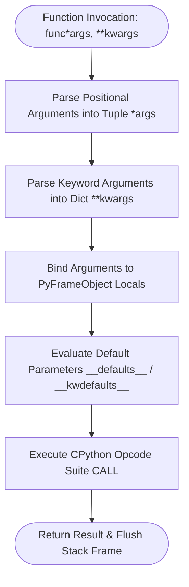

# Technical Documentation: Advanced Function Architecture & Cross-Version Evolutions

## 1. Executive Summary
This technical documentation details advanced function mechanics in CPython, focusing on variadic positional argument lists (`*args`), keyword argument dictionaries (`**kwargs`), positional-only (`/`) and keyword-only (`*`) parameters, function object attribute inspection via `dir()`, and architectural evolutions from Python 2.7 through Python 3.13.

---

## 2. Parameter Binding & Argument Unpacking Lifecycle



---

## 3. Advanced Function Attributes & Reflection Matrix (`dir()`)

Every function object in Python is an instance of `types.FunctionType`. Calling `dir(func)` exposes the following introspection dunder attributes:

| Attribute | Type | Description |
| :--- | :--- | :--- |
| `__name__` | `str` | Name of the function as defined in source code. |
| `__qualname__` | `str` | Qualified dotted name showing class or enclosing module path. |
| `__doc__` | `Optional[str]` | Docstring documentation attached to function body. |
| `__annotations__` | `Dict[str, Any]` | Type hint annotations dictionary (`{'return': ..., 'arg': ...}`). |
| `__defaults__` | `Optional[Tuple]` | Tuple of default values for positional parameters. |
| `__kwdefaults__` | `Optional[Dict]` | Dictionary of default values for keyword-only parameters. |
| `__code__` | `code` | Compiled CPython bytecode object (`co_varnames`, `co_argcount`, `co_flags`). |
| `__closure__` | `Optional[Tuple]` | Tuple of cell objects containing bound non-local variables for closures. |
| `__globals__` | `Dict[str, Any]` | Module-level global symbol table reference. |
| `__module__` | `str` | Module name string where the function was declared. |
| `__dict__` | `Dict[str, Any]` | Custom attribute namespace dictionary attached to function object. |
| `__call__` | `method` | Dunder invocation method enabling `func(*args, **kwargs)` calls. |

---

## 4. `import` vs `from ... import ...` Namespace Mechanics

### 1. `import module_name`
- **Behavior**: Imports the entire module into Python's internal `sys.modules` registry and binds the module object to `module_name` in the caller's namespace.
- **Example**: `import sys`, `import path`
- **Access Syntax**: Requires explicit attribute access (`sys.path.insert(...)`).
- **Benefit**: Prevents symbol collisions and maintains explicit namespace boundaries.

### 2. `from module_name import attribute_name`
- **Behavior**: Loads the module into `sys.modules` and binds specific exported attributes directly into local scope.
- **Example**: `from typing import Any, Dict, Tuple`
- **Access Syntax**: Direct variable access (`Tuple[int, float]`).
- **Benefit**: Concise, clean code syntax without repetitive module prefixes.

---

## 5. Cross-Version Architectural Evolutions (Python 2.7 ➔ Python 3.3 ➔ Python 3.13)

### Python 2.7 Legacy Mechanics
- **Syntax**: `print` was a statement (`print "Text"`, `print >>sys.stderr`).
- **Argument Unpacking**: Allowed tuple unpacking directly in function headers (`def func(a, (b, c)):`). Removed in Python 3.0 (PEP 3113).
- **Function Attributes**: Used `func_code`, `func_defaults`, `func_globals`, `func_doc` (deprecated in favor of `__code__`, `__defaults__`, `__globals__`, `__doc__`).

```python
# Sample Python 2.7 Syntax (Legacy)
def legacy_func(heading, *args):
    print "Start heading:", heading
    for arg in args:
        print "Arg:", arg
```

### Python 3.3 Enhancements
- **Keyword-Only Parameters (PEP 3102)**: Introduced `*` separator enforcing keyword-only arguments (`def func(a, *, key=None)`).
- **Function Annotations (PEP 3107)**: Formalized function type hints stored in `__annotations__`.
- **`yield from`**: Introduced delegating generators inside functions.

### Python 3.8 ➔ Python 3.13 Modern Features
- **Positional-Only Parameters (PEP 570 - Python 3.8)**: Syntax using `/` separator (`def func(pos_only, /, standard, *, kw_only):`).
- **Structural Pattern Matching (PEP 634 - Python 3.10)**: Introduced `match...case` construct for branch selection inside variadic functions.
- **CPython 3.13 Bytecode JUMP & Call Optimizations**: Modernized interpreter opcodes replacing generic jumps with specialized `TO_BOOL`, `POP_JUMP_IF_FALSE`, and zero-overhead inline call frames.

---

## 6. If-Statement & Branching Evolutions inside Advanced Functions

Inside variadic and dispatch functions, conditional branching has evolved significantly across CPython versions:

| CPython Version | Branching Bytecode / Optimization | Functional Impact |
| :--- | :--- | :--- |
| **Python 2.7 - 3.3** | `JUMP_IF_FALSE_OR_POP` / `JUMP_IF_TRUE_OR_POP` | Stack-based boolean evaluation with intermediate allocation. |
| **Python 3.10+** | Structural Pattern Matching (`match...case`) | Declarative branching over argument structures and type guards. |
| **Python 3.13** | `TO_BOOL`, `POP_JUMP_IF_FALSE`, JUMP specialization | Direct opcode-level evaluation without boolean object instantiation. |

---

## 7. Comparative Summary: `Function` vs `Functions-Advanced`

| Dimension | Basic Function Module (`Function`) | Advanced Function Module (`Functions-Advanced`) |
| :--- | :--- | :--- |
| **Primary Scope** | Basic `def`, fixed parameters, simple recursion, basic LEGB | Variadic `*args`, `**kwargs`, positional-only `/`, keyword-only `*` |
| **Argument Flexibility** | Fixed positional and keyword arguments | Unlimited variable-length positional and keyword parameter lists |
| **Data Structures** | Scalars, basic tuples, basic lists | Dynamic tuple unpacking (`*`) and dictionary unpacking (`**`) |
| **Introspection Level** | Standard `__name__` and `__doc__` | Full reflection (`__code__`, `__kwdefaults__`, `__dict__`, `dir()`) |
| **Use Cases** | Core domain logic & basic utilities | Dynamic dispatchers, wrapper decorators, flexible API interfaces |
