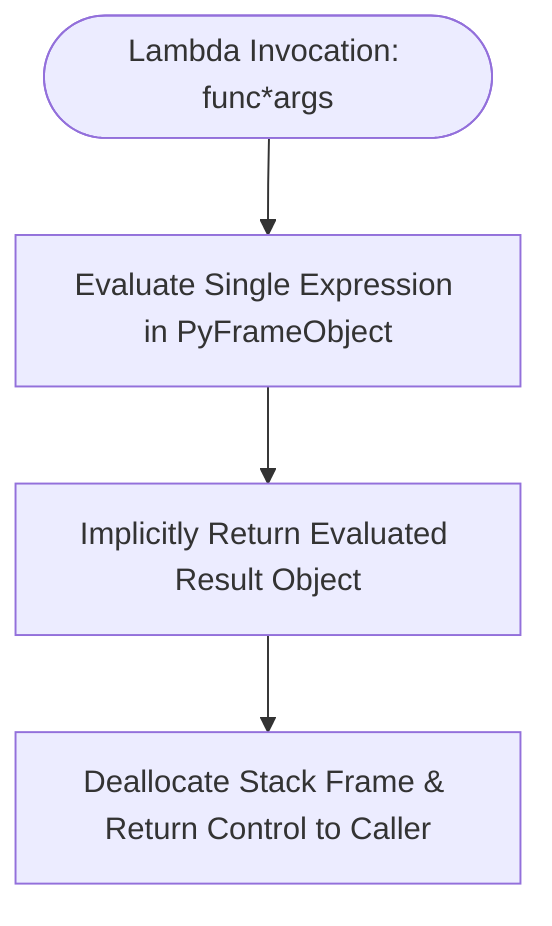

# Technical Documentation: Lambda Expressions & Cross-Version Architecture

## 1. Executive Summary
This technical documentation provides an in-depth analysis of Python `lambda` expressions (anonymous inline functions), parameter binding, conditional ternary branching within lambdas, dunder object attribute reflection via `dir()`, and architectural evolutions from Python 2.7 through Python 3.13.

---

## 2. Lambda Evaluation Lifecycle



---

## 3. Lambda Attribute & Reflection Matrix (`dir()`)

Every `lambda` expression compiles into a function object (`types.LambdaType` / `types.FunctionType`). Executing `dir(lambda x: x)` reveals the following attributes:

| Dunder Attribute | Data Type | Description & Behavior for Lambdas |
| :--- | :--- | :--- |
| `__name__` | `str` | Always set to string `'<lambda>'` for all anonymous lambda functions. |
| `__qualname__` | `str` | Qualified dotted name showing enclosing scope context (`'<lambda>'` or `'outer.<locals>.<lambda>'`). |
| `__doc__` | `NoneType` | Always `None` (lambdas cannot contain docstrings). |
| `__annotations__` | `Dict[str, Any]` | Dictionary of type annotations if explicitly assigned to lambda variable. |
| `__defaults__` | `Optional[Tuple]` | Tuple of default values if default arguments are specified (`lambda x=10: x`). |
| `__kwdefaults__` | `Optional[Dict]` | Dictionary of default values for keyword-only parameters. |
| `__code__` | `code` | Compiled CPython bytecode object (`co_code`, `co_varnames`, `co_argcount`). |
| `__closure__` | `Optional[Tuple]` | Tuple of cell objects binding enclosed non-local variables for closures. |
| `__globals__` | `Dict[str, Any]` | Reference to module global dictionary where lambda was declared. |
| `__module__` | `str` | Module name string where lambda was created. |
| `__call__` | `method` | Dunder invocation method enabling direct callable invocation (`(lambda x: x + 1)(5)`). |

---

## 4. `import` vs `from ... import ...` Namespace Mechanics

### 1. `import module_name`
- **Behavior**: Loads the entire module into Python's internal `sys.modules` cache and binds the module identifier in local scope.
- **Example**: `import sys`, `import math`
- **Access Pattern**: Requires prefixing (`sys.float_info.min`).
- **Advantage**: Prevents symbol collisions and maintains explicit namespace boundaries.

### 2. `from module_name import attribute_name`
- **Behavior**: Loads the module into `sys.modules` and binds specific imported symbols directly into local namespace.
- **Example**: `from typing import Callable, Dict, List, Union`
- **Access Pattern**: Direct identifier reference (`Callable[[int], int]`).
- **Advantage**: Concise and readable type annotations for functional signatures.

---

## 5. Cross-Version Architectural Evolutions (Python 2.7 ➔ Python 3.3 ➔ Python 3.13)

### Python 2.7 Legacy Mechanics
- **Tuple Parameter Unpacking**: Python 2.7 permitted unpacking tuple parameters directly in lambda signatures (`lambda (x, y): x + y`). Removed in Python 3.0 (PEP 3113).
- **Map & Filter Returns**: `map()` and `filter()` with lambdas returned full in-memory `list` instances in Python 2.7, causing high memory overhead for large datasets.

```python
# Sample Python 2.7 Syntax (Legacy - Deprecated in Py3)
pair_adder = lambda (x, y): x + y
print pair_adder((3, 4))  # Evaluates to 7
```

### Python 3.3 Enhancements
- **Qualified Names (`__qualname__`)**: Introduced `__qualname__` attribute enabling accurate reflection for nested lambdas inside classes and functions.
- **Lazy Iterators**: `map()` and `filter()` converted to return memory-efficient lazy iterators.

```python
# Python 3.3+ Modern Equivalent
pair_adder = lambda pair: pair[0] + pair[1]
print(pair_adder((3, 4)))  # Evaluates to 7
```

### Python 3.8 ➔ Python 3.13 Modern Features
- **Assignment Expressions (PEP 572 - Python 3.8)**: Walrus operator `:=` can be used inside expressions called by lambdas.
- **CPython 3.13 Bytecode JUMP & Call Specialization**: Modernized interpreter opcodes replace generic jumps with specialized `TO_BOOL`, `POP_JUMP_IF_FALSE`, and zero-overhead inline call frames for high-frequency lambda invocations.

---

## 6. If-Statement & Branching Evolutions inside Lambdas

While lambdas cannot contain imperative `if...elif...else` statements, they express conditional branching via **conditional ternary expressions**:

```python
# Conditional Ternary inside Lambda
divide_safe = lambda a, b: a / b if b != 0 else float('nan')
```

| CPython Version | Branching Bytecode / Optimization | Functional Impact |
| :--- | :--- | :--- |
| **Python 2.7 - 3.3** | `JUMP_IF_FALSE_OR_POP` | Evaluates condition on stack frame with intermediate boolean allocation. |
| **Python 3.10+** | Guard Integration with Pattern Matching | Permits inline expression evaluation within structural match guards. |
| **Python 3.13** | `TO_BOOL` + `POP_JUMP_IF_FALSE` Specialization | Eliminates intermediate boolean allocation during ternary evaluation inside lambdas. |

---

## 7. Comparative Summary: Standard `def` vs `lambda`

| Feature | Standard Function (`def`) | Anonymous Lambda (`lambda`) |
| :--- | :--- | :--- |
| **Name Identification (`__name__`)** | Named function string | Always `'<lambda>'` |
| **Statement Count** | Multiple statements and blocks allowed | Strictly single expression |
| **Docstrings (`__doc__`)** | Supported (`"""..."""`) | Unsupported (`None`) |
| **Return Mechanism** | Explicit `return` statement | Implicit expression return |
| **Type Annotations** | Native syntax (`def f(x: int) -> int:`) | Variable annotations (`f: Callable[[int], int] = lambda x: x`) |
| **Primary Use Cases** | Domain logic, complex algorithms, multi-line routines | Short callbacks, key functions (`sort(key=...)`), dispatch tables |
