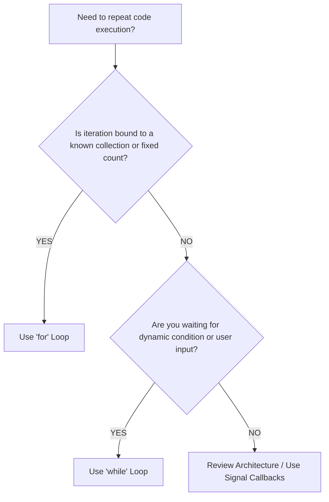

# Python Loops & Iteration Technical Reference (`Loops/docs.md`)

A comprehensive, production-grade technical reference for Python iteration constructs, comparing `for` and `while` loops, control flow keywords (`break`, `continue`, `pass`, `else`), iterator protocols, performance optimizations, and cross-version evolutions (**Python 2.7**, **Python 3.3** through **Python 3.13**).

---

## 🔁 `for` Loop vs. `while` Loop: Technical Reference & Usage Guide

In Python, loops are used to automate repetitive execution. Choosing between a `for` loop and a `while` loop depends on whether iteration is **bounded by a sequence** (Definite) or **controlled by a dynamic condition** (Indefinite).

### 1. Key Technical Differences

| Feature / Aspect | `for` Loop | `while` Loop |
| :--- | :--- | :--- |
| **Iteration Paradigm** | **Definite Iteration** (Bounded) | **Indefinite Iteration** (Unbounded) |
| **Execution Trigger** | Iterates over elements of an iterable object | Executes as long as a boolean expression evaluates to `True` |
| **Counter / State Control**| Automatically managed by Python's iterator protocol | Manually initialized, evaluated, and mutated by the programmer |
| **Termination Mechanism**| Terminates when `StopIteration` is raised internally | Terminates when condition becomes `False` or `break` is executed |
| **Infinite Loop Risk** | Low (only if iterating over infinite generator/stream) | High (if condition is never invalidated or counter fails to update) |
| **Memory Efficiency** | High with lazy iterators (`range`, generators) | High (evaluates condition per iteration step) |
| **Primary Use Cases** | Sequence traversal, collections, fixed ranges, slicing | Input validation, event listeners, server sockets, state engines |

---

### 2. When to Use a `for` Loop

Use a `for` loop when the number of iterations is **known in advance** or when traversing bounded sequences (`list`, `tuple`, `dict`, `set`, `str`, `bytes`, `range`, or files).

#### A. Iterating Over Sequences
```python
# Iterating directly over sequence elements
languages = ["Python", "Java", "C++", "JavaScript"]

for lang in languages:
    print(f"Language: {lang}")
```

#### B. Fixed Bounded Iteration with `range()`
```python
# Repeat action exactly N times (0 to N-1)
for i in range(5):
    print(f"Execution step: {i}")
```

#### C. Indexed Traversal with `enumerate()`
```python
# Accessing both 1-based index position and item value
libraries = ["pandas", "numpy", "scipy"]

for position, lib in enumerate(libraries, start=1):
    print(f"{position}. {lib}")
```

---

### 3. When to Use a `while` Loop

Use a `while` loop when the **number of iterations is unknown in advance** and depends on dynamic runtime evaluation (e.g. validating user inputs, polling network sockets, or waiting for state updates).

#### A. Interactive Input Validation (`while True` + `break`)
```python
while True:
    user_input = input("Please enter a positive number: ")
    if user_input.isdigit() and int(user_input) > 0:
        number = int(user_input)
        break  # Exit loop when valid input is supplied
    print("Invalid input! Please enter an integer greater than 0.")
```

#### B. Condition-Based State Evaluation
```python
balance = 100
transaction_fee = 15

# Loop runs until balance is insufficient
while balance >= transaction_fee:
    balance -= transaction_fee
    print(f"Fee paid. Remaining balance: ${balance}")
```

---

### 4. Loop Selection Decision Matrix



---

## 🛠️ Loop Control Keywords (`break`, `continue`, `pass`, `else`)

### 1. Action Matrix

| Keyword | Statement Description | Loop Behavior |
| :--- | :--- | :--- |
| `break` | Terminate loop immediately | Exits the innermost loop and skips optional `else` block |
| `continue` | Skip remaining iteration statements | Jumps directly to the next iteration evaluation |
| `pass` | Null operation placeholder | Does nothing; serves as syntactic placeholder |
| `else` | Optional completion block | Executes **ONLY** if loop finishes without hitting `break` |

### 2. The `for-else` and `while-else` Constructs

In Python, loops support an optional `else` block that executes when the loop completes all iterations normally.

```python
def search_item(items: list, target: str) -> bool:
    for item in items:
        if item == target:
            print(f"Found target: {target}")
            return True
    else:
        # Executed ONLY if loop completes without encountering 'break'
        print(f"Target '{target}' not found in sequence.")
        return False
```

---

## 📜 Import Statement Guidelines (`import` vs `from ... import ...`)

| Import Pattern | Syntax Example | Namespace Impact | Best Practice Scenario |
| :--- | :--- | :--- | :--- |
| `import module` | `import os` | Binds full module object; requires module prefix | Large modules, avoiding name collisions (`os.path.exists`) |
| `from module import symbol` | `from typing import List, Dict` | Imports specific symbol directly into local namespace | Type hints, specific utility functions (`List[int]`) |

### Module-Specific Import Role Breakdown

| Script Name | Import Statement(s) | Role & Explanation |
| :--- | :--- | :--- |
| `_notused.py` | `from typing import List` | Provides `List[str]` static type signature for throwaway variable loop output. |
| `add_nums.py` | `from typing import List, Set` | Provides type hints for generic numerical lists and set deduplication outputs. |
| `big_word.py` | `import os`<br>`from typing import Dict, Tuple, Optional` | `os.path.exists` checks file presence; `typing` symbols annotate dict word counters. |
| `def_for.py` | `from typing import List` | Annotates generated list sequences from range iteration. |
| `def_while_for.py` | `import sys`<br>`from typing import List` | `sys.stdin.isatty()` checks interactive terminal status to prevent non-interactive hangs. |
| `double_def_for.py` | `from typing import List` | Annotates nested function message delegation outputs. |
| `elevator.py` | `from typing import List, Tuple` | Annotates floor trajectory history lists and status result tuples. |
| `end_py.py` | `from typing import List` | Annotates horizontally formatted range sequences. |
| `exculator.py` | `from typing import List, Tuple`<br>`from elevator import navigate_elevator` | Re-exports annotations and delegates logic to elevator simulation module. |
| `for_bar.py` | `import os`<br>`from typing import List, Tuple` | `os.path.exists` checks `grade.txt`; `typing` symbols annotate line parsing. |
| `for_dic_key.py` | `from typing import Dict, List, Tuple, Any` | Annotates key, value, and key-value pair inspection structures. |
| `for_dict.py` | `from typing import Dict, List, Tuple, Any` | Annotates user record dictionaries, filtering lists, and ID search outputs. |
| `for_else.py` | `from typing import List, Tuple` | Annotates tech stack lists and `for-else` search status result tuples. |
| `for_enumerate_index.py` | `from typing import List, Tuple` | Annotates input arrays and `enumerate()` tuple index pairings. |
| `for_factorial.py` | Standard built-ins | Pure integer multiplication product accumulator. |
| `for_factrorial.py` | `from for_factorial import calculate_factorial` | Re-exports core calculation function for backward compatibility. |
| `for_index.py` | `from typing import List, Tuple` | Annotates car inventory list traversal and search boolean result tuples. |
| `for_len.py` | `from typing import List` | Annotates Python library string list. |
| `for_list.py` | `from typing import List, Any, Optional` | Annotates list slice boundaries (`Optional[int]`) and list iteration sequences. |
| `for_loop.py` | `from typing import List, Tuple` | Annotates loop control targets and cartesian product nested tuples. |
| `for_print.py` | `from typing import Tuple` | Annotates horizontal and vertical repeated string outputs. |
| `for_range.py` | `from typing import List, Tuple` | Annotates single, dual, and stepped range output lists. |
| `for_tuple.py` | `from typing import Tuple, List` | Annotates tuple sequence inputs, running totals, and longest string calculations. |
| `print_shape_forloop.py` | `from typing import List` | Annotates generated ASCII hash triangle row strings. |
| `shape_code.py` | `from typing import List` | Annotates multi-loop numeric pyramid pattern line strings. |
| `stop.py` | `from typing import List, Tuple` | Annotates token lists and keyword evaluation execution state tuples. |
| `while_for.py` | `import sys`<br>`from typing import List, Optional` | `sys.stdin.isatty()` checks interactive terminal status to prevent stdin hangs. |
| `test_loops.py` | `import os, sys, unittest`<br>`from unittest.mock import patch` | `os` resolves file paths; `sys` configures `sys.path`; `unittest` provides test framework; `patch` mocks `input`. |

---

## 🔄 Python Version Evolution: Python 2.7 vs Python 3.3 – 3.13

### 1. Python 2.7 Legacy Differences & Code Samples

1. **`xrange()` vs `range()`**: Python 2.7 `range()` created full in-memory lists, while `xrange()` was a lazy generator. Python 3 replaced `xrange()` and made `range()` lazy.
2. **`print` Statement**: Python 2.7 used statement syntax (`print "Text",`). Python 3 requires function syntax (`print("Text", end=" ")`).
3. **Dict Traversal**: Python 2.7 used `.iteritems()` for lazy iteration. Python 3 uses lightweight view objects (`.items()`).
4. **Variable Leaking**: Python 2.7 list comprehensions leaked loop variables into surrounding scope. Python 3 isolates comprehension scope.
5. **Comma Exception Handling**: Python 2.7 used `except Exception, e:` instead of `except Exception as e:`.

```python
# Python 2.7 Legacy Loop Example:
for i in xrange(1, 4):
    print "Item:", i,

print ""

user_dict = {"a": 1, "b": 2}
for k, v in user_dict.iteritems():
    print k, "->", v
```

### 2. Python 3 Version Feature Timeline

- **Python 3.3**: Memory-efficient lazy iterators (`range`, `zip`, `map`) & `yield from` sub-generator delegation.
- **Python 3.4**: `enum.Enum` iteration and `pathlib.Path.glob()` path traversal in loops.
- **Python 3.5**: Asynchronous loops (`async for` / `aiter`) via PEP 492 and extended iterable unpacking.
- **Python 3.6**: Guaranteed insertion-order dictionary iteration and async list comprehensions.
- **Python 3.7**: Dataclass iteration via `dataclasses.asdict()` and `astuple()`.
- **Python 3.8**: Assignment expressions (Walrus operator `:=`) inside `while` loop conditions.
- **Python 3.9**: Dictionary merge operator (`|=`) inside loop bodies.
- **Python 3.10**: Structural pattern matching (`match-case`) inside loops and `zip(strict=True)` length verification.
- **Python 3.11**: Faster CPython specialized bytecode opcodes (`FOR_ITER_LIST`, `FOR_ITER_RANGE`), yielding 25-60% loop speedups.
- **Python 3.12**: PEP 709 comprehension scope inlining (up to 2x faster list/dict comprehensions inside loops).
- **Python 3.13**: Free-threaded parallel loop execution (`--disable-gil`) and Tier-1 JIT compiler integration.

---

## ⚡ Performance Optimization Guidelines

1. **Favor Built-in Functions**: Replace explicit accumulator loops (`total += x`) with built-in functions like `sum()`, `min()`, `max()`.
2. **Avoid `range(len(seq))`**: Use direct sequence iteration (`for item in seq:`) or `enumerate(seq)` instead of explicit indexing.
3. **Use List Comprehensions**: `[x * 2 for x in data]` runs significantly faster than `append()` inside explicit `for` loops due to C-level optimizations.
