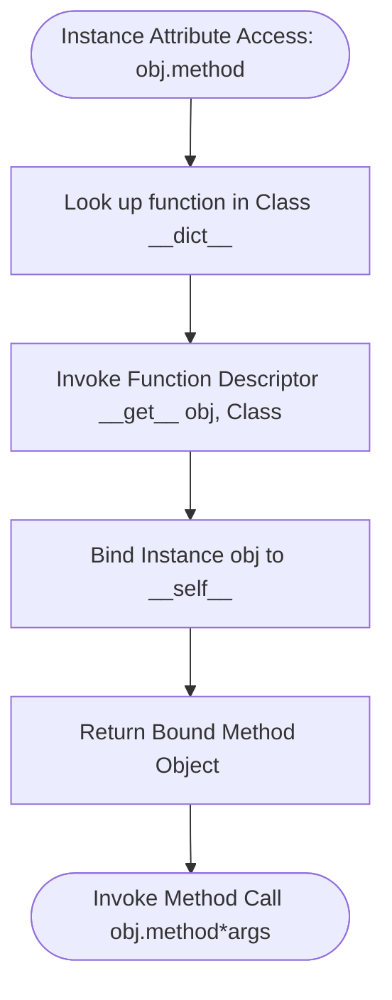

# Technical Documentation: Method Binding Architecture & Cross-Version Evolutions

## 1. Executive Summary
This technical documentation details Python method binding mechanics, the descriptor protocol (`__get__`), attribute reflection (`dir()`), higher-order functional transformers (`map()`, `filter()`, `reduce()`), and CPython internal optimizations from Python 2.7 through Python 3.13.

---

## 2. Method Binding & Descriptor Protocol Lifecycle



---

## 3. Method Object Attribute & Reflection Matrix (`dir()`)

When a function is accessed on an instance, CPython wraps it in a `types.MethodType` bound method object. Calling `dir(instance.method)` reveals the following attributes:

| Dunder Attribute | Data Type | Description |
| :--- | :--- | :--- |
| `__self__` | `object` | The underlying class instance object bound to `self`. |
| `__func__` | `function` | The underlying raw function object stored in class namespace. |
| `__name__` | `str` | Name string of the method as defined in source code. |
| `__qualname__` | `str` | Fully qualified dotted name (`'ClassName.method_name'`). |
| `__doc__` | `Optional[str]` | Docstring documentation attached to the underlying function. |
| `__module__` | `str` | Name of the module where the method's class is declared. |
| `__call__` | `method` | Dunder invocation entrypoint enabling `obj.method(*args)` execution. |

---

## 4. `import` vs `from ... import ...` Namespace Mechanics

### 1. `import module_name`
- **Behavior**: Imports the entire module into Python's internal `sys.modules` cache and binds the module object to `module_name` in local scope.
- **Example**: `import statistics`, `import math`, `import random`
- **Access Pattern**: Requires explicit attribute access (`statistics.mean()`).
- **Advantage**: Prevents symbol collisions and maintains explicit namespace boundaries.

### 2. `from module_name import attribute_name`
- **Behavior**: Loads the module into `sys.modules` and binds specific exported attributes directly into local scope.
- **Example**: `from functools import reduce`
- **Access Pattern**: Direct function access (`reduce(lambda x, y: x * y, data)`).
- **Advantage**: Eliminates repetitive module prefixes.

---

## 5. Cross-Version Architectural Evolutions (Python 2.7 ➔ Python 3.3 ➔ Python 3.13)

### Python 2.7 Legacy Mechanics
- **Unbound Methods**: Accessing a method on a class (`Class.method`) in Python 2.7 returned an `unbound method` object (`types.UnboundMethodType`), which enforced type checking on the first argument.
- **`reduce()` Built-in**: `reduce()` was a global built-in function in Python 2.7. In Python 3.0, it was moved to the `functools` module (`from functools import reduce`).

```python
# Sample Python 2.7 Unbound Method Syntax (Legacy)
class LegacyCar(object):
    def drive(self):
        print "Driving"

# Returns <unbound method LegacyCar.drive> in Py2.7
unbound = LegacyCar.drive
```

### Python 3.3 Enhancements
- **Removal of Unbound Methods**: In Python 3.0+, accessing `Class.method` returns a standard, plain `function` object without wrapper overhead.
- **Qualified Names (`__qualname__`)**: Standardized dotted qualified naming for bound and unbound methods.

```python
# Python 3.3+ Modern Behavior
# Class.drive returns <function LegacyCar.drive at 0x...>
print(type(LegacyCar.drive))  # <class 'function'>
```

### Python 3.8 ➔ Python 3.13 Modern Features
- **Vectorcall Protocol (PEP 590 - Python 3.8+)**: CPython introduced internal fast calling convention (`PyVectorcall_Call`) bypassing tuple/dict creation for method calls.
- **Specialized Opcodes (Python 3.13)**: CPython 3.13 replaces generic call opcodes with specialized `CALL_METHOD`, `LOAD_METHOD`, and zero-overhead inline call frames for bound instance methods.

---

## 6. If-Statement & Branching Evolutions inside Methods

Inside methods, conditional branching has evolved significantly across CPython versions:

| CPython Version | Branching Bytecode / Optimization | Functional Impact |
| :--- | :--- | :--- |
| **Python 2.7 - 3.3** | `JUMP_IF_FALSE_OR_POP` | Standard stack-based boolean evaluation with intermediate allocation. |
| **Python 3.10+** | Structural Pattern Matching (`match...case`) | Enables object attribute matching directly inside method bodies. |
| **Python 3.13** | Specialized `TO_BOOL`, `POP_JUMP_IF_FALSE` | Zero-overhead JUMP specialization removing intermediate boolean objects inside method branching. |

---

## 7. Comparative Analysis: Functions vs Methods (Where to Use Them)

| Feature / Dimension | Standalone Function (`def`) | Object Method (`def method(self)`) |
| :--- | :--- | :--- |
| **Definition Scope** | Module level or local nested scope | Inside class body definition |
| **State Dependency** | Stateless or depends only on passed arguments | Operates on object instance state (`self`) or class state (`cls`) |
| **Invocation Syntax** | `result = calculate_factorial(5)` | `result = car_obj.get_details()` |
| **Object Lifetime** | Persists for lifespan of module | Bound dynamically when accessed on object instance |
| **When to Use** | Pure mathematical calculations, utility transformers, standalone operations | Object-oriented state manipulation, encapsulated behaviors, class factories |
