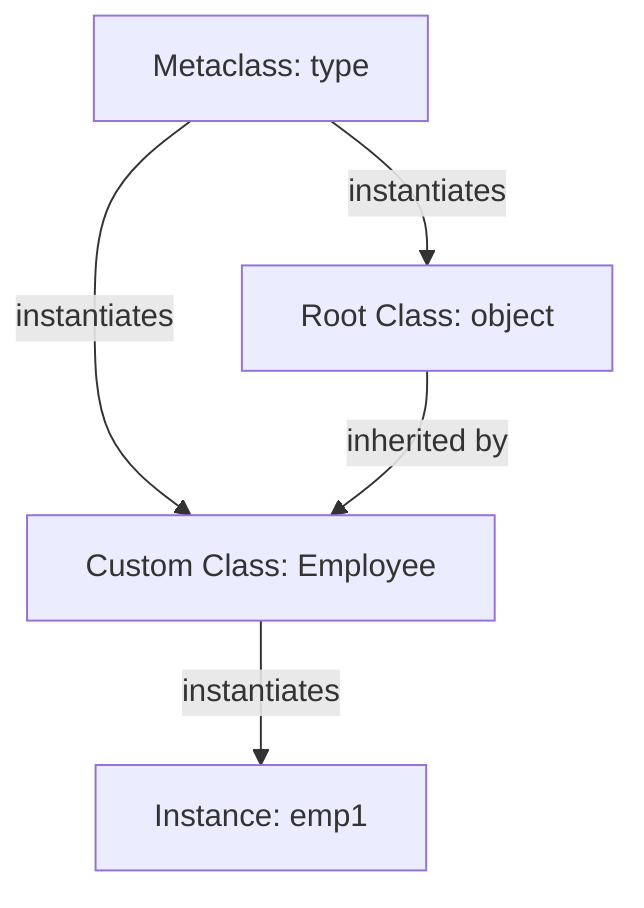

# Pedagogical Technical Reference: Python Object-Oriented Programming (OOP) Architecture & Version Evolution

This document provides an in-depth technical reference detailing CPython's type system (`type` and `object`), class inheritance mechanics, C3 linearization for Method Resolution Order (MRO), descriptor protocols, `__slots__` memory optimizations, dataclasses, reflection via `dir()`, and cross-version evolutions from Python 2.7 to Python 3.13.

---

## 1. CPython Object Model Architecture

In CPython, everything is an object. At the core of Python's object-oriented type system lies a fundamental dualism between **`type`** (the default metaclass) and **`object`** (the root of the class hierarchy).



- **`object`**: The ultimate base class for all built-in and user-defined classes. Every class in Python 3 implicitly inherits from `object`.
- **`type`**: The metaclass that instantiates class objects. `type` is itself a class that inherits from `object`, creating CPython's self-referential type system hierarchy.

---

## 2. Method Resolution Order (MRO) & C3 Linearization

Python uses the **C3 Linearization algorithm** to calculate a deterministic method resolution order for classes involved in single or multiple inheritance.

### C3 Linearization Rules

For a class $C$ with base classes $B_1, B_2, \dots, B_n$, the linearization $L(C)$ is defined as:

$$L(C) = C + \text{merge}(L(B_1), L(B_2), \dots, L(B_n), B_1 B_2 \dots B_n)$$

### Inspected via `__mro__`

```python
class A: pass
class B(A): pass
class C(A): pass
class D(B, C): pass

print(D.__mro__)
# (<class 'D'>, <class 'B'>, <class 'C'>, <class 'A'>, <class 'object'>)
```

The C3 algorithm guarantees:
1. **Monotonicity**: Child classes always appear before parent classes.
2. **Local Precedence Order**: The order of base classes specified in the class definition header is preserved.

---

## 3. Descriptors and Property Mechanics

Properties (`@property`), class methods (`@classmethod`), static methods (`@staticmethod`), and bound functions all rely on Python's **Descriptor Protocol**.

A descriptor is any object that defines at least one of the following dunder methods:
- `__get__(self, instance, owner=None)`
- `__set__(self, instance, value)`
- `__delete__(self, instance)`

```python
# How @property works under the hood
class ManagedAttribute:
    def __get__(self, instance, owner):
        if instance is None:
            return self
        return getattr(instance, "_value", None)

    def __set__(self, instance, value):
        instance._value = value
```

---

## 4. Comprehensive Version Evolution (Python 2.7 to Python 3.13)

### Python 2.7 vs Python 3.x Differences

1. **Old-Style vs New-Style Classes**:
   - **Python 2.7**: Classes defined without inheriting from `object` (`class Legacy:`) were "classic" / "old-style" classes that did not use C3 linearization and lacked descriptor support.
   - **Python 3.x**: Unified object model. All classes are new-style classes that automatically inherit from `object`.

2. **Zero-Argument `super()`**:
   - **Python 2.7**: Required explicit class name and `self` arguments: `super(ChildClass, self).__init__()`.
   - **Python 3.0+**: Introduced zero-argument `super()` using compiler implicit `__class__` cell closure: `super().__init__()`.

### Timeline of Key OOP Enhancements

- **Python 3.6 (`__init_subclass__` & PEP 487)**:
  Introduced `__init_subclass__(cls, **kwargs)` allowing base classes to customize child class creation without writing custom metaclasses.

- **Python 3.7 (PEP 557: Data Classes)**:
  Added the `@dataclass` decorator to `dataclasses` module, auto-generating `__init__`, `__repr__`, `__eq__`, and comparison dunders based on type annotations:
  ```python
  from dataclasses import dataclass

  @dataclass
  class Point:
      x: float
      y: float
  ```

- **Python 3.10 (`@dataclass(slots=True)`)**:
  Allowed `@dataclass` to automatically generate `__slots__`, reducing per-instance memory footprint.

- **Python 3.11 - 3.13 (Performance & CPython Vectorcall)**:
  - **PEP 590 Vectorcall**: Fast internal C-API calling protocol bypassing tuple allocation for instance method calls.
  - **Specialized Opcodes (Python 3.13)**: Inline attribute caching (`LOAD_ATTR_INSTANCE_VALUE`) and specialized `CALL_METHOD` opcodes for bound instance methods.

---

## 5. Performance & Memory Notes: `__slots__` vs `__dict__`

By default, Python instance attributes are stored in a dynamic dictionary (`__dict__`). While flexible, dictionary storage incurs memory overhead (typically ~100-300 bytes per instance).

### Memory Optimization with `__slots__`

Using `__slots__` instructs CPython to allocate a fixed-size array for instance attributes instead of a `__dict__`.

```python
class EfficientPoint:
    __slots__ = ("x", "y")

    def __init__(self, x: float, y: float):
        self.x = x
        self.y = y
```

### Benchmark & Tradeoffs

| Feature | Dynamic `__dict__` | Fixed `__slots__` |
| :--- | :--- | :--- |
| **Memory Footprint** | ~150-300 bytes per object | ~48 bytes per object (60-70% savings) |
| **Dynamic Attributes** | Allowed (`obj.new_attr = 5`) | Prevented (unless `'__dict__'` in slots) |
| **Access Speed** | Fast (dictionary lookup with cache) | Slightly Faster (direct array index access) |

---

## 6. Introspection Matrix (`dir()`, `__dict__`, `__mro__`)

| Reflection Feature | Target | Description |
| :--- | :--- | :--- |
| `dir(obj)` | Instance / Class | List of all attribute and method names available |
| `obj.__dict__` | Instance / Class | Dictionary storing object instance or class attributes |
| `Class.__mro__` | Class | Tuple of classes defining Method Resolution Order |
| `isinstance(obj, Class)` | Instance | Check if object is an instance of `Class` or subclass |
| `issubclass(Sub, Base)` | Class | Check if `Sub` inherits from `Base` |
