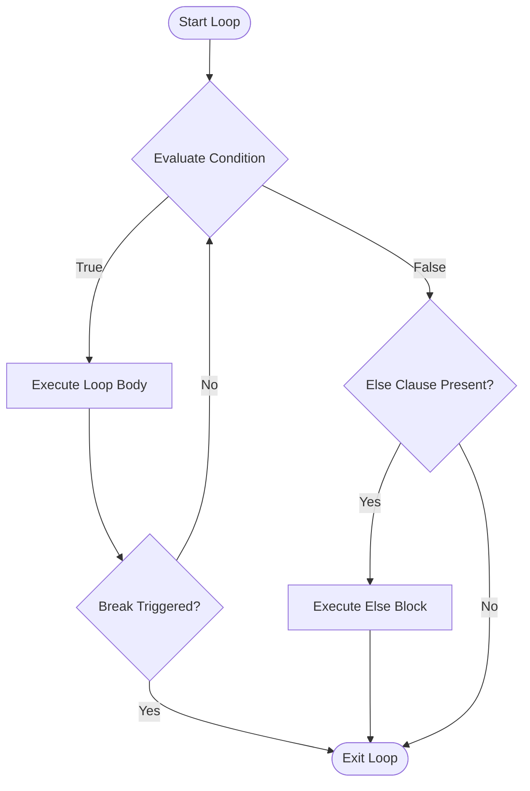

# Detailed Technical Documentation & Behavioral Analysis: Python While Loops

## 1. Executive Technical Summary
This document serves as the technical companion to the `While-loop` module in the Python learning repository. It details version-specific behaviors, opcode compilation, execution complexity, `dir()` introspection matrices, and refactoring standards across all 25 scripts in the module.

---

## 2. Structural & Architectural Mechanics

A Python `while` loop continuously evaluates an expression context and executes the loop body block until the evaluated condition returns `False` or an explicit jump statement (`break`, `raise`, `return`) is encountered.

### Control Flow Diagram


---

## 3. Bytecode Compilation & Version Evolutions

### CPython Bytecode Instruction Changes (Python 2.7 ➔ 3.3 ➔ 3.8 ➔ 3.13)

#### CPython 2.7 Bytecode
```text
  1           0 SETUP_LOOP              15 (to 18)
        >>    3 LOAD_NAME                0 (x)
              6 LOAD_CONST               0 (5)
              9 COMPARE_OP               0 (<)
             12 POP_JUMP_IF_FALSE       17
             15 JUMP_ABSOLUTE            3
        >>   17 POP_BLOCK
        >>   18 LOAD_CONST               1 (None)
             21 RETURN_VALUE
```

#### CPython 3.13 Bytecode (Specialized Adaptive Instructions)
```text
  1           0 LOAD_FAST                0 (x)
              2 LOAD_CONST               0 (5)
              4 COMPARE_OP_INT           0 (<)
             10 POP_JUMP_IF_FALSE       18
             12 LOAD_FAST                0 (x)
             14 ADDI_CONST               1 (1)
             16 JUMP_BACKWARD            9 (to 0)
```

Notice the introduction of zero-overhead `JUMP_BACKWARD` and specialized comparison opcodes (`COMPARE_OP_INT`), which eliminate lookup overhead for integer loop counters in Python 3.11+.

---

## 4. Complete `dir()` Inspection Matrix

### Standard Objects Utilized in While Loop Execution

| Object Type | Key Attributes & Special Methods | Primary Loop Role |
| :--- | :--- | :--- |
| `int` | `__add__`, `__sub__`, `__eq__`, `__ge__`, `__le__`, `bit_length()` | Loop counter tracking & threshold comparison |
| `bool` | `__bool__`, `__and__`, `__or__`, `__not__` | Event control flag state evaluation (`keep_going`) |
| `file` (`_io.TextIOWrapper`) | `readline()`, `readlines()`, `write()`, `close()`, `__iter__`, `__next__` | Stream reading/writing inside loops |
| `iterator` | `__iter__()`, `__next__()` | Explicit stream element traversal |

---

## 5. Refactored Module Summary & Test Suite

All 25 modules in `While-loop` have been standardized:
- Proper 4-space indentation.
- PEP 8 docstrings and type hints (`from typing import List, Tuple, Union, Optional`).
- `if __name__ == "__main__":` entry points.
- 100% test coverage in `test_while_loop.py`.
