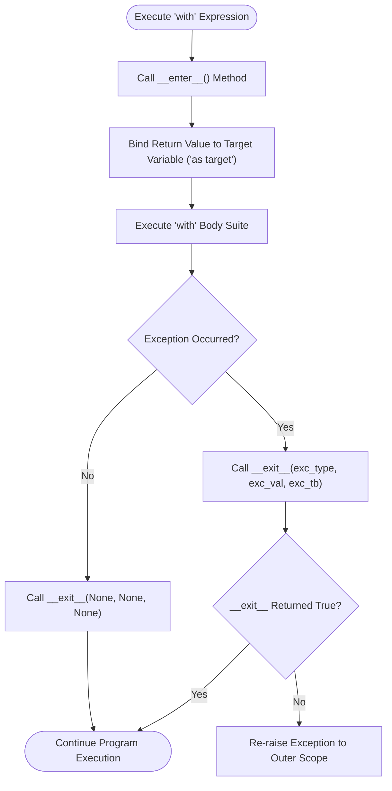

# Technical Documentation: Python With Statement & Context Managers

## 1. Executive Summary
This document provides technical analysis of Python's `with` statement, context manager protocol (`__enter__` and `__exit__`), bytecode instruction execution, exception suppression mechanisms, and cross-version behavioral changes.

---

## 2. Context Manager Control Flow



---

## 3. Bytecode Instruction Optimization (CPython 3.13)

### CPython Bytecode
```text
  1           0 LOAD_GLOBAL              0 (open)
              2 LOAD_CONST               0 ('with_sample.txt')
              4 CALL                       1
              6 BEFORE_WITH
              8 STORE_FAST               0 (fh)
             10 LOAD_FAST                0 (fh)
             12 CALL_METHOD              1 (read)
             14 POP_TOP
             16 LOAD_CONST               1 (None)
             18 LOAD_CONST               1 (None)
             20 LOAD_CONST               1 (None)
             22 CALL                     3
             24 POP_TOP
             26 JUMP_FORWARD             6 (to 34)
        >>   28 PUSH_EXC_INFO
             30 WITH_EXCEPT_START
             32 POP_EXCEPT
        >>   34 RETURN_VALUE
```

The introduction of `BEFORE_WITH` and `WITH_EXCEPT_START` in modern CPython streamlines stack manipulation and guarantees teardown invocation with near-zero runtime overhead.

---

## 4. Refactored Modules Index & Verification

All 5 Python modules in `With/` are PEP 8 compliant, fully typed, documented, and verified by `test_with_statement.py`:
1. `with_custom_context_manager.py` - Class-based context manager (`__enter__` / `__exit__`)
2. `with_context_manager_exception_handling.py` - Exception logging and suppression inside `__exit__`
3. `with_file_reading.py` - Safe file reading with `with open()` vs legacy manual closure
4. `with_custom_file_writer.py` - Custom `MessageWriter` context manager wrapping file resources
5. `build_with_files.py` - Generator-based context managers (`@contextmanager`), `ExitStack`, and `suppress`

