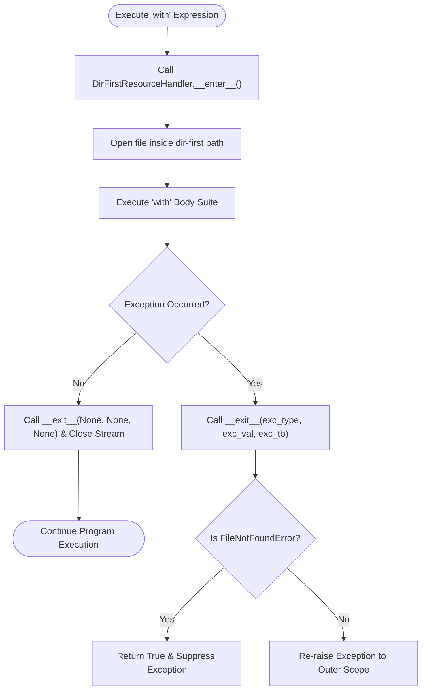

# Dir-First Subfolder Tutorial Module

Welcome to the **Dir-First Subfolder Tutorial Module** inside `context_managers/dir_first`. This directory provides an isolated, subfolder-specific demonstration of class-based context managers (`DirFirstResourceHandler`), generator-based context managers (`managed_dir_first_file`), range performance benchmarks, and automated unit testing.

---

## 📋 Table of Contents

1. [Overview & Functional Purpose](#1-overview--functional-purpose)
2. [Module Index](#2-module-index)
3. [`import` vs `from ... import ...` Namespace Mechanics](#3-import-vs-from--import--namespace-mechanics)
4. [Cross-Version Behavioral Evolution (Python 2.7 to Python 3.13)](#4-cross-version-behavioral-evolution-python-27-to-python-313)
5. [Range Sequence Iterators & Performance Notes](#5-range-sequence-iterators--performance-notes)
6. [`dir(range)` Reflection Matrix](#6-dirrange-reflection-matrix)
7. [Running the Unit Test Suite](#7-running-the-unit-test-suite)

---

## 1. Overview & Functional Purpose

The `dir-first` subfolder contains specific file resources (`test.txt`, `test_a.txt`) managed through Python's `with` statement. The module guarantees automatic file handle closure and exception suppression under isolated scope contexts.

### Execution Control Flow



---

## 2. Module Index

| Module / File Filename | Functional Description |
| :--- | :--- |
| `dir_first_context_manager.py` | Class-based (`DirFirstResourceHandler`) and generator-based (`managed_dir_first_file`) context managers. |
| `test_dir_first.py` | Automated `unittest` suite covering resource setup/teardown, error suppression, and range reflection. |
| `test.txt` | Sample configuration data file in `dir-first`. |
| `test_a.txt` | Sample text data file for line-reading context manager demonstrations. |

---

## 3. `import` vs `from ... import ...` Namespace Mechanics

- `import os`: Imports the entire operating system module. Access functions via qualified scope syntax: `os.getcwd()`.
- `from contextlib import contextmanager`: Imports the `@contextmanager` decorator directly into the current module namespace, enabling `@contextmanager` function decoration.

---

## 4. Cross-Version Behavioral Evolution (Python 2.7 to Python 3.13)

### Comparison Matrix

| Python Release | Context Manager & Range Features | Architectural / Syntax Changes |
| :--- | :--- | :--- |
| **Python 2.7** | Manual `try...finally` resource cleanup | Required explicit `fh.close()` in `finally:` blocks; `range()` eagerly built lists in RAM. |
| **Python 3.3** | `contextlib.ExitStack` introduced | Dynamic multi-context resource management. `range()` became an $O(1)$ immutable sequence. |
| **Python 3.10**| Parenthesized Context Managers | Formatted multi-resource context statements: `with (A() as a, B() as b):`. |
| **Python 3.13**| Zero-cost bytecode & free-threaded execution | Inline specialized bytecode (`BEFORE_WITH`, `WITH_EXCEPT_START`); thread-safe resource execution. |

#### Legacy Python 2.7 vs Modern Python 3.13

```python
# Legacy Python 2.7 (Manual cleanup):
fh = open("test_a.txt", "r")
try:
    for line in fh:
        print line.rstrip()
finally:
    fh.close()

# Modern Python 3.13 (Context Manager):
with open("test_a.txt", "r", encoding="utf-8") as fh:
    for line in fh:
        print(line.rstrip())
```

---

## 5. Range Sequence Iterators & Performance Notes

In Python 3.3+, `range()` objects evaluate lazily, maintaining $O(1)$ constant space complexity (~48 bytes) regardless of sequence range length:

```python
import sys

# O(1) Memory Footprint:
r_iter = iter(range(1_000_000))
print(f"range_iterator memory footprint: {sys.getsizeof(r_iter)} bytes")  # ~48 bytes (O(1))

# O(N) Memory Footprint:
r_list = list(range(1_000_000))
print(f"Materialized list memory footprint: {sys.getsizeof(r_list)} bytes")  # ~8 MB (O(N))
```

---

## 6. `dir(range)` Reflection Matrix

Inspecting `dir(range)` reveals available attributes and public sequence methods:

```python
r = range(10, 100, 10)
print("Start:", r.start)  # 10
print("Stop :", r.stop)   # 100
print("Step :", r.step)   # 10
print("Index of 50:", r.index(50))  # 4
print("Public Members:", [m for m in dir(r) if not m.startswith("__")])
# Output: ['count', 'index', 'start', 'step', 'stop']
```

---

## 7. Running the Unit Test Suite

Execute the `dir-first` unit test suite from the repository root:

```bash
python3 -m unittest discover -s context_managers/dir_first -p "test_*.py"
```
