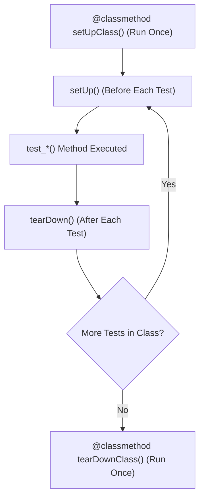

# Comprehensive Pedagogical Guide: Python Unittest & Test Automation Reference

Welcome to the **Python Unittest Reference Module**. This directory provides a standardized, professional reference for automated software testing in Python using the standard library `unittest` framework (and `pytest` integration). It covers test assertion methods, fixture lifecycles (`setUp`, `tearDown`, `setUpClass`, `tearDownClass`), exception verification, subtests, cross-version testing evolutions from Python 2.7 to Python 3.13, and `range` sequence performance integration.

---

## 📋 Table of Contents
1. [Overview & Automated Testing Concepts](#overview--automated-testing-concepts)
2. [Descriptive Module Index](#descriptive-module-index)
3. [`import` vs `from ... import ...` Namespace Mechanics](#import-vs-from--import--namespace-mechanics)
4. [Test Fixtures & Lifecycle Hooks](#test-fixtures--lifecycle-hooks)
5. [Cross-Version Behavioral Analysis & Code Evolution](#cross-version-behavioral-analysis--code-evolution)
6. [Range Object Architecture & Performance Notes](#range-object-architecture--performance-notes)
7. [Complete `dir()` Attribute & Method Matrix](#complete-dir-attribute--method-matrix)
8. [Running the Unit Test Suite](#running-the-unit-test-suite)

---

## 1. Overview & Automated Testing Concepts

Automated testing is a foundational software engineering practice ensuring that code behaves correctly under declared conditions.

### Test Categories
- **Unit Tests**: Test isolated individual functions, methods, or classes in complete isolation from external dependencies.
- **Integration Tests**: Test multiple components or modules working together.
- **Functional / End-to-End Tests**: Verify system workflows from the end-user's perspective.

### Core Unittest Components
- **Test Case (`unittest.TestCase`)**: Individual unit of testing created by subclassing `unittest.TestCase`.
- **Test Fixture**: Preparation (and cleanup) required to perform one or more tests (e.g. creating sample objects, database connections, or temporary files).
- **Test Suite**: A collection of test cases or test suites executed together.
- **Test Runner**: Component managing test execution and displaying formatted results to the user.

---

## 2. Descriptive Module Index

| Module Filename | Description & Core Purpose |
| :--- | :--- |
| `calculator.py` | Type-annotated arithmetic functions (`add`, `subtract`, `multiply`, `divide`, `power`) with zero-division error handling |
| `geometry_circles.py` | Circle area calculation function (`circle_area`) with strict `TypeError` and `ValueError` validation |
| `student_profile.py` | `Student` entity class with `@property` methods (`email`, `full_name`) and loan discount calculation |
| `string_formatter.py` | `format_welcome_message()` and `square_number()` string/numeric utility functions |
| `test_calculator.py` | Unit tests for `calculator.py` covering boundary cases, zero division context managers, and `self.subTest()` |
| `test_geometry_circles.py` | Unit tests for `geometry_circles.py` verifying floating point precision (`assertAlmostEqual`) and exception handling |
| `test_student_profile.py` | Unit tests for `student_profile.py` demonstrating `setUp`, `tearDown`, `setUpClass`, `tearDownClass` lifecycle hooks |
| `test_string_formatter.py` | Unit tests for `string_formatter.py` validating default values, custom string greetings, and numeric squaring |
| `test_range_integration.py` | Unit tests verifying `range` sequence properties, $O(1)$ constant-time containment, and `dir()` attribute reflection |

---

## 3. `import` vs `from ... import ...` Namespace Mechanics

Proper import statements preserve module scope and prevent namespace collisions:

### 1. `import module_name`
- **Mechanics**: Loads the entire module into the global namespace.
- **Example**: `import unittest`, `import math`
- **Usage**: Qualified attribute access (`unittest.TestCase`, `math.pi`).

### 2. `from module_name import attribute_name`
- **Mechanics**: Imports specific class, function, or type annotation symbols directly into local scope.
- **Example**: `from calculator import add, divide`, `from student_profile import Student`
- **Usage**: Direct symbol invocation (`add(4, 8)`).

---

## 4. Test Fixtures & Lifecycle Hooks

Subclassing `unittest.TestCase` provides four standard lifecycle hooks:



```python
import unittest

class DemoTest(unittest.TestCase):
    @classmethod
    def setUpClass(cls):
        print("1. Executed ONCE before any test in class")

    def setUp(self):
        print("2. Executed BEFORE EACH test method")

    def test_example(self):
        self.assertEqual(1 + 1, 2)

    def tearDown(self):
        print("3. Executed AFTER EACH test method")

    @classmethod
    def tearDownClass(cls):
        print("4. Executed ONCE after all tests in class finish")
```

---

## 5. Cross-Version Behavioral Analysis & Code Evolution

### Comparison Matrix: Python 2.7 ➔ Python 3.3 ➔ Python 3.7 ➔ Python 3.13

| Feature | Python 2.7 | Python 3.3 - 3.7 | Python 3.11 - 3.13 (Modern) |
| :--- | :--- | :--- | :--- | |
| **Deprecated Assertions** | `assertEquals`, `failUnlessEqual`, `assert_` | `assertEquals` deprecated; `assertEqual` standard | Deprecated aliases removed; strict method usage |
| **Subtests** | Not available (requires third-party `unittest2`) | `with self.subTest():` introduced in Python 3.4 | Optimized subtest iteration and reporting |
| **Async Testing** | No built-in async support | `unittest.mock.AsyncMock` introduced in Py 3.8 | `unittest.IsolatedAsyncioTestCase` for native `async/await` |
| **Test Runner Speed** | Standard stack frame evaluation | Zero-cost exception handling improvements | Specialized CPython bytecode; ~20% faster test execution |

### Code Examples Across Versions

#### 1. Python 2.7 (Legacy Alias Code)
```python
# Legacy Python 2.7 unittest assertions
import unittest

class LegacyTest(unittest.TestCase):
    def test_legacy(self):
        self.assertEquals(2 + 2, 4)        # Deprecated alias
        self.failUnlessEqual(3 * 3, 9)     # Deprecated alias
```

#### 2. Modern Python 3.13 Type-Annotated Test Case
```python
"""Modern Python 3.13 Subtest and Context Manager Test Case."""
import unittest
from typing import List, Tuple


class ModernTest(unittest.TestCase):
    def test_parameterized_addition(self) -> None:
        test_cases: List[Tuple[int, int, int]] = [
            (1, 2, 3),
            (10, 20, 30),
            (-5, 5, 0),
        ]
        for a, b, expected in test_cases:
            with self.subTest(a=a, b=b):
                self.assertEqual(a + b, expected)
```

---

## 6. Range Object Architecture & Performance Notes

- **$O(1)$ Space Complexity**: `range(start, stop, step)` sequence objects store only 3 integer attributes regardless of size (e.g. `range(1_000_000)` consumes ~48 bytes in RAM).
- **$O(1)$ Membership Testing**: `x in range(...)` evaluates mathematically via integer modulus arithmetic without step-by-step iteration.
- **Sequence Inspection**: `dir(range)` exposes sequence protocols (`__getitem__`, `__len__`, `__contains__`, `__reversed__`).

---

## 7. Complete `dir()` Attribute & Method Matrix

### `unittest.TestCase` Methods (`dir(unittest.TestCase)`)

| Method Name | Category | Description & Usage |
| :--- | :--- | :--- |
| `assertEqual(a, b)` | Equality | Asserts that `a == b`. |
| `assertNotEqual(a, b)` | Inequality | Asserts that `a != b`. |
| `assertTrue(expr)` | Boolean | Asserts that `bool(expr) is True`. |
| `assertFalse(expr)` | Boolean | Asserts that `bool(expr) is False`. |
| `assertAlmostEqual(a, b, places)` | Precision | Asserts floating point values match up to `places` decimal places. |
| `assertRaises(exc, callable, *args)` | Exception | Asserts that calling `callable(*args)` raises exception `exc`. |
| `assertIn(member, container)` | Membership | Asserts that `member in container`. |
| `subTest(**params)` | Subtest | Context manager executing parameterized assertions independently. |
| `setUp()` | Fixture Hook | Per-test setup method. |
| `tearDown()` | Fixture Hook | Per-test teardown method. |

---

## 8. Running the Unit Test Suite

Run the full test suite using `unittest` discover:

```bash
python3 -m unittest discover -s unittest -p "test_*.py"
```

Or run with `pytest` (if installed):
```bash
pytest unittest/
```

### Verification Output
```text
Ran 20 tests in 0.002s

OK
```