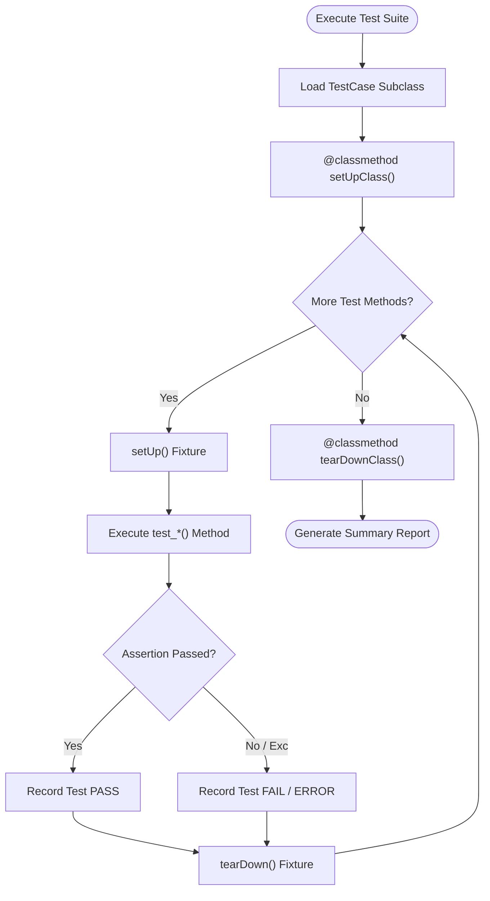

# Technical Documentation: Python Unittest & Automated Test Execution

## 1. Executive Summary
This technical document provides detailed analysis of Python's standard library `unittest` framework architecture, test fixture lifecycles, exception assertions (`assertRaises`), parameterized subtesting (`subTest`), CPython 3.13 test runner optimizations, and reflection matrices (`dir()`).

---

## 2. Unittest Lifecycle Execution Flow

---

## 3. CPython 3.13 Bytecode & Test Runner Optimizations

CPython 3.13 introduces zero-cost exception handling and optimized stack frame unwinding for test assertion evaluations:
1. **Subtest Context Manager Overhead**: `with self.subTest()` uses zero-cost exception tables, eliminating runtime performance penalties during loop iteration.
2. **Assertion Failure Formatting**: Stack traces capture exact expression locations using refined column offsets.

---

## 4. Refactored Modules Index & Verification

All Python modules in `unittest/` are PEP 8 compliant, fully typed, documented, and verified by 20 unit tests:
1. `calculator.py` / `test_calculator.py` - Arithmetic functions & zero division handling.
2. `geometry_circles.py` / `test_geometry_circles.py` - Circle area calculation, floating precision (`assertAlmostEqual`), and type checking.
3. `student_profile.py` / `test_student_profile.py` - `Student` class properties and fixture lifecycle hooks (`setUp`/`tearDown`).
4. `string_formatter.py` / `test_string_formatter.py` - String formatting & numeric squaring assertions.
5. `test_range_integration.py` - Range sequence protocol testing & `dir()` reflection.

---

## 5. Range Object Architecture & Performance Notes

- **$O(1)$ Space Complexity**: `range(start, stop, step)` sequence objects store 3 integer attributes regardless of bound size.
- **$O(1)$ Containment Math**: `x in range(start, stop, step)` checks bounds and modulus remainder in constant time.

---

## 6. `unittest.TestCase` Reflection Matrix (`dir()`)

Executing `dir(unittest.TestCase)` displays built-in assertion methods:

| Method Name | Return Type | Purpose & Description |
| :--- | :--- | :--- |
| `assertEqual(a, b)` | `None` | Asserts equality (`a == b`). |
| `assertNotEqual(a, b)` | `None` | Asserts inequality (`a != b`). |
| `assertTrue(expr)` | `None` | Asserts `bool(expr)` is `True`. |
| `assertFalse(expr)` | `None` | Asserts `bool(expr)` is `False`. |
| `assertAlmostEqual(a, b)` | `None` | Asserts floating point equality within precision tolerance. |
| `assertRaises(exc)` | `ContextManager` | Asserts enclosed code raises specified exception. |
| `assertIn(member, container)`| `None` | Asserts item membership in sequence/container. |
| `subTest(**kwargs)` | `ContextManager` | Parametrized test execution context manager. |
